## 1. Introduction

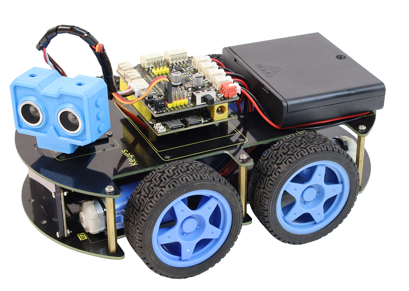

### 1.1 Description:

The newly developed 4WD multi-functional smart car by the Keyestudio team uses the ESP32S3 as the main control board. It is not only attractive in appearance but also powerful in functionality. In addition to common features such as line tracking, obstacle avoidance, following, and remote control, a front gripper and an AI camera module have been added as extended functions. The motor driver board provides a 3A current output, which is sufficient to drive multiple servos and other high-power sensor modules, adding greater expansion compatibility to the smart car.
	
Its installation is very simple, with most components connected via screws and copper pillars. You can build your own robot through a few simple assembly steps, and then gain a comprehensive understanding of the most fundamental concepts such as line tracking, obstacle avoidance sensors, ultrasonic ranging, motor driving, and wireless remote control. We have set up 15 robot courses, ranging from simple to complex, step-by-step, to learn how to make an Arduino robot.

### 1.2 Features

**Multiple Functions:** Obstacle avoidance, following, infrared remote control, Wi-Fi control, line tracking, dot matrix expression display, and more.

**Simple Assembly:** No circuit soldering required; the robot can be assembled in a few simple steps.

**Sturdy Structure:** The car body features a 4WD structure, equipped with 4 high-quality motors and premium wheels.

**High Expandability:** Equipped with a motor driver expansion board to connect other sensors and modules.

**Multiple Control Methods:** Infrared remote control, mobile phone remote control (compatible with both iOS and Android).

**Basic Programming Learning:** Supports C language programming using Arduino IDE and MicroPython programming, allowing users to get in touch with underlying code.

### 1.3 Parameters

**Working Voltage:** 3.3-5V

**Input Voltage:** 7-9V

**Maximum Output Current:** 3A

**Motor Driver IC:** DRV8835

**Ultrasonic Detection Distance:** 4cm-300cm

**Infrared Remote Control Distance:** 5 meters


### 1.4 Checklist

|  No  |                 Name                  |          Picture          | QTY  |
| :--: | :-----------------------------------: | :-----------------------: | :--: |
|  1   |     Keyestudio ESP32S3 Por Board      | 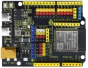  |  1   |
|  2   |             Acrylic Board             | 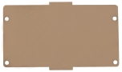  |  1   |
|  3   | Keyestudio ESP32S3 DRV8835 Motor Expansion Board | 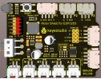  |  1   |
|  4   |            Ultrasonic Sensor          | 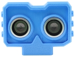  |  1   |
|  5   | Keyestudio 4WD Smart Car V2.0 PCB Board (Upper Board) | 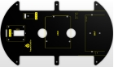  |  1   |
|  6   | Keyestudio 4WD Smart Car V3.0 PCB Board (Lower Board) | 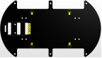  |  1   |
|  7   | Keyestudio IIC 5-Way Line Tracking Sensor Module | 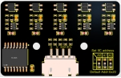  |  1   |
|  8   |        Keyestudio Red LED Module       | 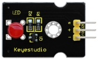  |  1   |
|  9   |        Keyestudio 8x16 LED Matrix Board | 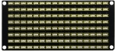  |  1   |
|  10  |           Keyestudio Servo            |  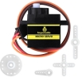   |  1   |
| 11 |          Fixing Components            | 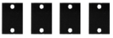 |  4   |
| 12 |                Wheels                 | 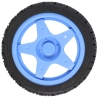 |  4   |
| 13 |         M3*10+6MM Single-pass Copper Pillar         | 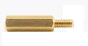 |  4   |
| 14 |         M3*40+6MM Single-pass Copper Pillar         | 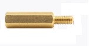 |  6   |
| 15 |        M3*30MM Round Head Phillips Screw        | 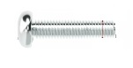 |  8   |
| 16 |        M3*6MM Round Head Phillips Screw         | 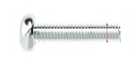 |  20  |
| 17 |               M3 Nuts                 | 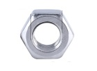 |  20  |
| 18 |           Phillips Screwdriver        | 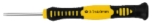 |  1   |
| 19 |        M2*8MM Round Head Phillips Screw         | 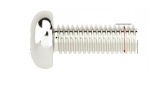 |  3   |
| 20 |                Motors                 | 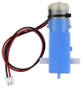 |  4   |
| 21 |             Remote Control            | 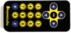 |  1   |
| 22 |             Velcro Tape               |  |  3   |
| 23 |     4P Double-ended XH2.54 Cable      | 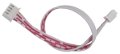 |  2   |
| 24 |      HX-2.54 4P Double-ended Cable    | 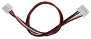 |  1   |
| 25 |    2.54 3-Pin Female-to-Female Cable  | 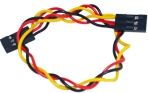 |  1   |
| 26 |               USB Cable               | 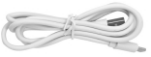 |  1   |
| 27 |              Cable Ties               | 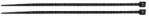 |  10  |
| 28 |            Spiral Wrap Tube           | 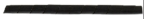 |  1   |
| 29 |         2-slot 18650 Battery Holder   | 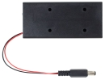 |  1   |
| 30 |          6-slot AA Battery Holder     | 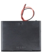 |  1   |
| 31 |               Tracking Track                | 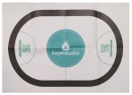 |  1   |
| 32 |                                       |                           |      |

​    

## 2. Expansion Board

### 2.1 Introduction to the Expansion Board

The Keyestudio ESP32S3 expansion board is a 4WD smart car expansion board specially designed for the Keyestudio ESP32S3 Pro development board. It mainly integrates motor drive functions, infrared reception functions, a buzzer module, and various interfaces required for 4WD smart cars, such as IIC interfaces, 4-channel motor interfaces, external power interfaces, and ultrasonic interfaces.      

### 2.2 Expansion Board Functional Diagram

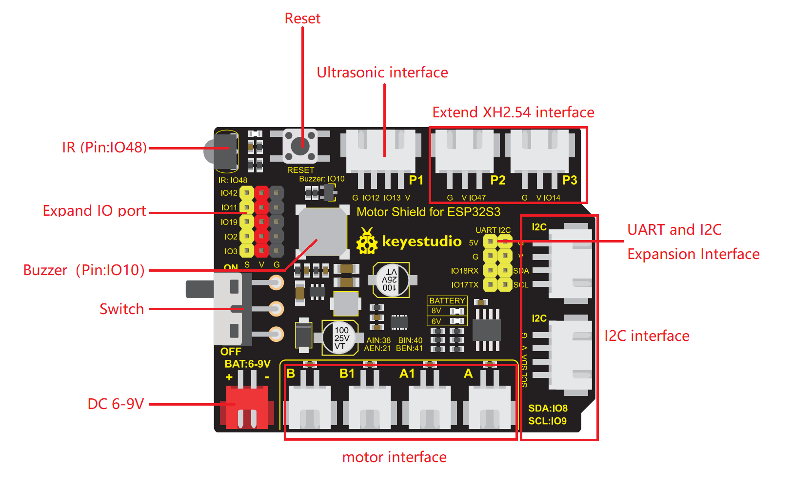
```
