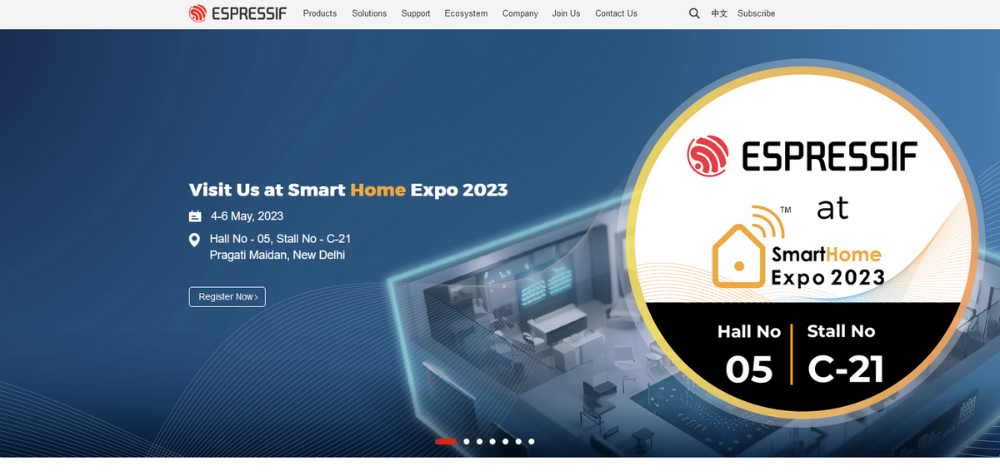
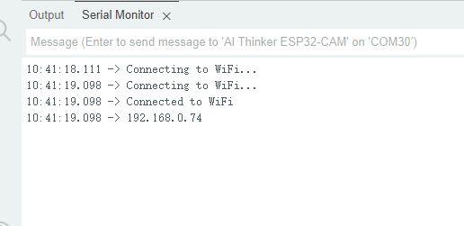

# 3.15 ESP32-S3 Wi-Fi Basics

## 3.15.1 Lesson Introduction

Have you ever wondered why phones can stream videos without plugging in any wires, or why smart speakers at home can understand what you say? The secret lies in the fact that they are all connected to an invisible network called "Wi-Fi". Today, we are going to give the ESP32S3 Pro development board in your hands this very superpower!

In this lesson, we will no longer just control blinking lights or rotating motors; instead, we will open a door to the internet world. We will learn how to make the development board search for surrounding Wi-Fi signals like a mobile phone, connect to the network, and obtain an IP address. This is akin to equipping your development board with a pair of "clairvoyant eyes" and "farsighted ears", enabling it to perceive and integrate into the surrounding wireless network environment.

After completing this lesson, you will master the core networking skill foundation of the ESP32-S3. Although we won't be sending complex web data just yet, this is the starting point for all smart home and remote control projects. Are you ready? Let's awaken the network potential of the development board together!

## 3.15.2 Lesson Objectives

*   Correctly configure the Arduino IDE and select the development environment corresponding to the ESP32S3 Pro development board.
*   Understand what an SSID (Wi-Fi name) is, and be able to connect to Wi-Fi or scan all surrounding Wi-Fi hotspots via code.
*   Learn to use the Serial Monitor to view the IP address assigned after connecting to Wi-Fi.
*   Master the basic invocation methods of the `WiFi.h` library, laying the foundation for subsequent network connections.
*   Understand simple webpage display code and the working principles of an HTTP server.

## 3.15.3 Lesson Equipment

| Equipment Name     | Specification/Model               | Quantity | Remarks                                             |
| :----------------- | :-------------------------------- | :------- | :-------------------------------------------------- |
| Main Control Board | ESP32S3 Pro Development Board     | 1        | Core brain, comes with built-in Wi-Fi functionality |
| Wi-Fi Antenna      | 2.4G Stick Antenna / IPEX Antenna | 1        | Enhances Wi-Fi signal, **must be connected**        |
| Data Cable         | Type-C Data Cable                 | 1        | Used for power supply and code uploading            |
| Computer | Windows / Mac | 1 | Install Arduino IDE and ESP32 drivers |

**Note**: This lesson does not require any additional sensors or jumper wires because the ESP32S3 Pro development board has an integrated Wi-Fi chip. However, please make sure to **snap the Wi-Fi antenna onto the antenna connector on the development board**; otherwise, the network signal will become extremely poor and cause connection failure! We only need a data cable to connect to the computer to start the experiment.

## 3.15.4 Lesson Principles

### 3.15.4.1 What is Wi-Fi?

Imagine Wi-Fi is like an invisible "air post office." In the past, sending messages required writing a letter, putting on a stamp, and dropping it into a mailbox (this is like a wired network, which requires plugging in an internet cable). Wi-Fi, on the other hand, turns letters into radio waves that fly directly through the air. As long as your device (such as a mobile phone or our development board) is within the coverage range of this "post office" and knows the "secret code" (password) of the post office, it can send and receive information.

### 3.15.4.2 Wi-Fi Capabilities of ESP32-S3

The ESP32S3 Pro development board we use is very powerful, featuring a built-in dedicated wireless communication module. The Arduino IDE provides the `<WiFi.h>` library file, which supports configuring and monitoring the Wi-Fi networking functions of the ESP32. This module supports the 2.4GHz frequency band, which is the same as most home routers. It can play several roles:

*   **Station Mode (STA Mode / Wi-Fi Client Mode)**: In this mode, the ESP32 acts as a client and connects to an existing Wi-Fi hotspot (AP), much like a mobile phone connecting to a home router.
*   **AP Mode (Soft-AP Mode / Wi-Fi Hotspot Mode)**: In this mode, the ESP32 itself acts as a hotspot, allowing other Wi-Fi devices (such as smartphones and computers) to connect to it.
*   **AP-STA Coexistence Mode**: The ESP32 acts as a Wi-Fi hotspot while simultaneously connecting to another Wi-Fi hotspot as a Wi-Fi device.
*   **Security Mode**: The above modes support various security encryption modes (such as WPA, WPA2, and WEP, etc.).
*   **Network Scanning**: Can search for Wi-Fi hotspots (including active and passive scanning).
*   **Promiscuous Mode**: Supports promiscuous mode for monitoring IEEE 802.11 Wi-Fi data packets.

For more technical details on Wi-Fi, please visit the official Espressif documentation: [ESP32 Wi-Fi API Guide](https://docs.espressif.com/projects/esp-idf/en/latest/esp32/api-reference/network/esp_wifi.html)
Espressif Official Website: [https://www.espressif.com.cn/en/home](https://www.espressif.com.cn/en/home)



## 3.15.5 Example Program for Connecting to Wi-Fi

### 3.15.5.1 Introduction

This example will set the Wi-Fi name (SSID) and password in the code. After uploading the code, the ESP32S3 will attempt to connect to the specified Wi-Fi network and print the assigned IP address via the serial monitor upon successful connection.

### 3.15.5.2 Code

First, you need to make sure the Wi-Fi connection for the ESP32S3 is properly configured. You can use the following code to connect your ESP32S3 to Wi-Fi:

```cpp
/*
  Project Name: Print Wi-Fi IP Address
  Author: Keyestudio
  Description: Introduces how to use ESP32S3 to connect to Wi-Fi and print the IP address of the ESP32S3
*/

// Import the Wi-Fi library file
#include <WiFi.h>

// Please modify "your_SSID" to your Wi-Fi name
const char* ssid = "your_SSID";
// Please modify "your_PASSWORD" to your Wi-Fi password
const char* password = "your_PASSWORD";

void setup() {
  // Initialize serial communication and set baud rate to 115200
  Serial.begin(115200);
  
  // Initialize Wi-Fi connection, passing in SSID and password
  WiFi.begin(ssid, password);
  
  // Periodically check the Wi-Fi connection status
  // If not connected successfully (status is not WL_CONNECTED), keep looping in the connecting state
  while (WiFi.status() != WL_CONNECTED) {
    delay(1000); // Delay for 1 second
    Serial.println("Connecting to WiFi..."); // Print connection prompt message
  }
  
  // Connection successful, exit the while loop
  Serial.println("Connected to WiFi"); // Print connection success message
  // Print the obtained local IP address
  Serial.println(WiFi.localIP()); 
}

void loop() {
  // The main loop is empty because the connection operation only needs to be executed once in setup
}
```

### 3.15.5.3 Code Explanation

Let's break down this magical piece of code to see how it works:

**1. `#include <WiFi.h>`**

> This line of code tells the compiler: "I am going to use Wi-Fi functions, please load the related toolkits." Without this line, subsequent functions like `WiFi.begin()` will throw an error because the compiler doesn't know what `WiFi` is.

**2. `Serial.begin(115200);`**

> We might have used a baud rate of 9600 previously, but on the ESP32, 115200 is more common and faster. This is like increasing the bandwidth of the "telephone line" between you and the development board to make data transmission smoother. Remember to also select **115200** in the bottom-right corner of the serial monitor!

**3. `WiFi.begin(ssid, password);` and the `while` loop**

> `WiFi.begin()` is responsible for initiating the connection request. Since connecting to a router takes time, we use `while (WiFi.status() != WL_CONNECTED)` to continuously check the status. If it's not connected yet, it delays for 1 second and prints a prompt until the status becomes `WL_CONNECTED`.

**4. `WiFi.localIP()`**

> When the connection is successful, the router assigns an IP address to the development board. This function is used to get and return this IP address.

**5. Empty `void loop()`**

> You might ask, why is the `loop` empty? Because connecting to Wi-Fi is an initialization operation, and we only need to execute it once upon startup. Placing it inside `loop` to run continuously could lead to a waste of system resources or affect other tasks. Of course, if you are curious, you can try cutting the connection code from `setup` into `loop` and adding a `delay(5000)` at the end, which will make it attempt to reconnect every 5 seconds!

### 3.15.5.4 Experimental Results

In this code, you need to replace `ssid` and `password` with your actual Wi-Fi name and password.

```cpp
const char* ssid = "your_SSID";
const char* password = "your_PASSWORD";
```

<p style="color:red;">Note: The ESP32 can only connect to 2.4GHz Wi-Fi networks. If your router is on the 5GHz frequency band, it will not be able to connect. Please make sure you are connecting to a 2.4G network.</p>

This code will connect to the Wi-Fi network and print the connection status and IP address in the serial monitor.



## 3.15.6 Web Page Display Code

### 3.15.6.1 Introduction

Use the ESP32-S3 HTTP server library to provide web services. In the following example, we will create a simple Web server. When accessing the development board's IP address through a browser, the webpage will display "Hello, World".

### 3.15.6.2 Code

```cpp
/*
  Project Name: Web Page Display
  Author: Keyestudio
  Description: Introduces how to use ESP32S3 to connect to Wi-Fi and set up a web page displaying "Hello World"
*/

#include <WiFi.h>
#include <esp_http_server.h> // Include the ESP32 HTTP server library

// Please replace the following information with your network credentials
const char *ssid = "your_SSID";          // Change to your Wi-Fi name
const char *password = "your_PASSWORD";  // Change to your Wi-Fi password

httpd_handle_t web_httpd = NULL;  // HTTP server handle for starting and managing the server

// Simplified HTML page containing only the title content
// Using R"rawliteral(...)rawliteral" preserves multi-line strings as-is without escaping quotes
static const char INDEX_HTML[] = R"rawliteral(
<html>
  <head>
    <meta charset="UTF-8">
    <title>ESP32 Web Server</title>
  </head>
  <body>
    <h1>Hello World</h1>  <!-- Title text in the page body -->
    <p>This web page is provided by ESP32S3 Pro.</p>
  </body>
</html>
)rawliteral";

// Callback function to handle requests for the root URL ("/")
static esp_err_t index_handler(httpd_req_t *req) {
  httpd_resp_set_type(req, "text/html");  // Set response content type to HTML
  // Send the HTML response containing the title
  return httpd_resp_send(req, INDEX_HTML, strlen(INDEX_HTML));  
}

// Start the HTTP server and register the request handler for the root path ("/")
void startWebServer() {
  httpd_config_t config = HTTPD_DEFAULT_CONFIG();  // Use default HTTP configuration
  config.server_port = 80;  // Set the HTTP server listening port to 80 (default HTTP port)

  // Configure request handling rules for the root path ("/")
  httpd_uri_t index_uri = {
    .uri = "/",               // Set the request URI path to "/"
    .method = HTTP_GET,       // Set the request method to GET
    .handler = index_handler, // Set the callback function for handling requests
    .user_ctx = NULL          // No extra context data
  };

  // Start the HTTP server
  if (httpd_start(&web_httpd, &config) == ESP_OK) {
    // Register the URI handler, binding the root path to the callback function
    httpd_register_uri_handler(web_httpd, &index_uri);  
  }
}

void setup() {
  Serial.begin(115200);  // Start the serial monitor and set the baud rate to 115200

  // Connect to the Wi-Fi network
  WiFi.begin(ssid, password);  // Start Wi-Fi connection
  // Wait continuously if Wi-Fi is not connected
  while (WiFi.status() != WL_CONNECTED) {  
    delay(500);  // Delay for 500ms each time
    Serial.print(".");  // Print a dot on the serial monitor to indicate connection attempt
  }
  Serial.println("");  // New line
  Serial.println("WiFi connected");  // Print message when Wi-Fi is successfully connected
  Serial.print("IP Address: ");
  Serial.println(WiFi.localIP());   // Print the assigned IP address
  
  // Start the HTTP server
  startWebServer();  // Start the web server and register handlers
  Serial.println("HTTP server started");
}

void loop() {
  // The main loop is empty because the HTTP server handles requests in the background via interrupts/tasks
}
```

### 3.15.6.3 Code Explanation

Building upon Wi-Fi connection, this code adds a miniature web server:

**1. Include the HTTP Server Library**

> `#include <esp_http_server.h>` includes the lightweight HTTP server library provided by ESP-IDF to handle web requests.

**2. HTML Page Definition**

> The `INDEX_HTML` array uses C++11 raw string literals (`R"rawliteral(...)rawliteral"`) to store the HTML code. This avoids tedious escaping of double quotes in the code and perfectly preserves line-break formatting.

**3. Callback Function `index_handler`**

> This function is triggered when a browser visits the development board. `httpd_resp_set_type` informs the browser that the returned content is in HTML format, and `httpd_resp_send` sends our written HTML code to the browser.

**4. Server Configuration and Startup `startWebServer`**

> Here, the server is configured to listen on port 80 (the default HTTP port), and `index_handler` is designated to be called when accessing the root path `/`. Finally, the server is started via `httpd_start`.

**5. `setup` and `loop`**

> Wi-Fi connection and server startup are completed in `setup`. `loop` remains empty because the HTTP server runs automatically in ESP32's background tasks, requiring no polling inside `loop`.

### 3.15.6.4 Code Results

In this code, you need to replace `ssid` and `password` with your actual Wi-Fi name and password.

```cpp
const char* ssid = "your_SSID";
const char* password = "your_PASSWORD";
```

<p style="color:red;">Note: The ESP32 can only connect to 2.4GHz Wi-Fi networks; it will fail to connect if the frequency is incorrect. Furthermore, you must attach the antenna when using Wi-Fi features, otherwise the network signal will be extremely poor, resulting in web pages failing to load.</p>

After successfully uploading the code, open the Arduino IDE Serial Monitor to view the IP address of the ESP32S3 Pro development board after it connects to Wi-Fi (if you don't see it, press the reset button on the development board). Using a device on the same local area network as the development board (such as a phone or computer), enter this IP address into a web browser to view the displayed web page.


## FAQ

**Issue: Serial Monitor displays garbled text or strange symbols**

*   **Cause**: Baud rate mismatch. The code sets it to 115200, but the Serial Monitor might default to 9600.
*   **Solution**: Change the baud rate in the bottom-right corner of the Serial Monitor to **115200**.

**Issue: Error prompt "WiFi.h: No such file or directory"**

*   **Cause**: The Arduino IDE does not have the ESP32 board support package installed, or the installation is incomplete.

*   **Solution**: Please refer to the environment setup guide prior to the lessons, and ensure that **esp32 by Espressif Systems** is installed in the "Board Manager" with a relatively recent version.

**Issue: Scan results are 0, or unable to connect to Wi-Fi**

*   **Causes**: There might be too much surrounding interference, the distance from the router is too far, a 5GHz Wi-Fi band is being used, or the development board antenna is not connected/blocked by metal objects.
*   **Solutions**:
    1. Ensure you are connecting to a **2.4GHz** Wi-Fi band.
    2. Check whether the antenna is securely plugged into the interface.
    3. Try moving the development board closer to the router.
    4. Ensure there are no other metal boxes completely enclosing the development board, as metal severely shields Wi-Fi signals.

### Safety Tips

*   **Avoid Short Circuits**: Although this lesson does not require additional wiring, during daily use, never use jumper wires to directly connect the 3.3V and GND pins of the development board, as this will instantly burn out the chip.
*   **Anti-Static Protection**: Before touching the development board in dry weather, you can touch a wall or metal table leg to discharge static electricity from your body, protecting the precision Wi-Fi chip and main control components.