# 3.1 Arduino IDE Integration Tutorial

## 3.1.1 Introduction to Arduino IDE

Arduino IDE is an integrated development environment specifically designed for Arduino hardware. It is renowned for its beginner-friendly interface and robust open-source code support. This tool not only simplifies the programming process and lowers the barrier to entry for development, but also provides an easy-to-use learning platform for beginners.

The Arduino IDE features a clean and intuitive user interface, supporting syntax highlighting, auto-completion, and other functions, making the programming process easy and enjoyable. More importantly, it is based on open-source code, which means users can freely access, modify, and distribute code, greatly expanding the possibilities for development.

For beginners, the Arduino IDE provides rich tutorials, sample codes, and community support to help them get started quickly and solve practical problems. At the same time, the open-source nature means that users can reference and learn from other people's code to accelerate their learning process.

In summary, with its beginner-friendly interface and powerful open-source support, the Arduino IDE has become an indispensable tool for Arduino developers. Both beginners and professionals can benefit greatly from it.

## 3.1.2 Windows System

**Special Reminder: The Arduino IDE version used in this tutorial is 2.3.6. For other versions, successful compilation and uploading of the sample code provided in this tutorial cannot be guaranteed.** 

### 3.1.2.1 Downloading Arduino IDE 

First, go to the official Arduino website: [Software | Arduino](https://www.arduino.cc/en/software/) to download the Arduino IDE.

There are many versions of the Arduino software available for Windows, Mac, and Linux systems (as shown in the image below), as well as older versions. You only need to download the version suitable for your computer system.

Here, we take downloading **Windows Win 10 or newer (64-bit)** as an example. You can also choose to download the **Windows ZIP file** according to your needs. The selection is shown in the image below.


Here we take the Windows system as an example to introduce the download and installation steps. There are two versions for Windows: one is the installer version: **Windows Win 10 or newer (64-bit)**; the other is the portable version: **Windows ZIP file**, which does not require installation—simply download the file to your computer, extract it, and use it.

### 3.1.2.2 Installing Arduino IDE

1. Save the `.exe` file downloaded from the software page to your hard drive, and then simply run the file.

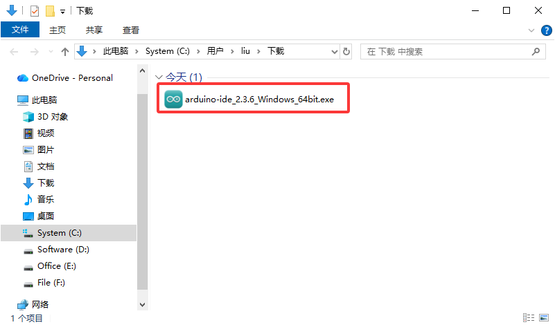

2. Read and agree to the license agreement.

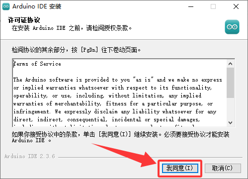

3. Choose installation options.

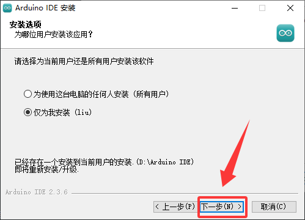

4. Choose the installation location (select your preferred software installation path).

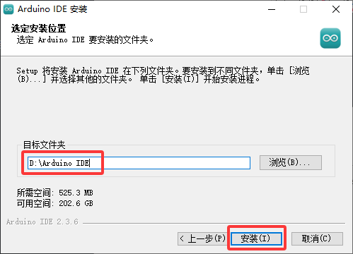

5. Click "Finish" and run the Arduino IDE.

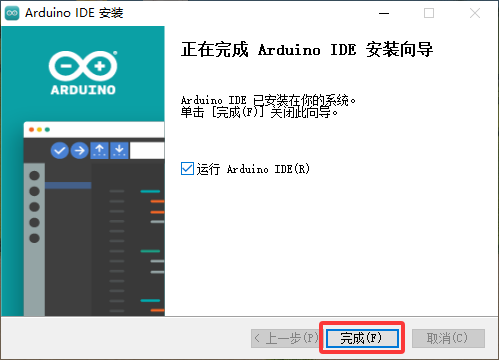

## 3.1.3 MacOS System

### 3.1.3.1 Downloading Arduino IDE

First, go to the official Arduino website: [Software | Arduino](https://www.arduino.cc/en/software/) to download the Arduino IDE.

Different systems require different versions of the Arduino IDE, but the download method is similar to Windows. Here, we take downloading **macOS Intel 10.15 Catalina or newer (64-bit)** as an example. You can also choose to download **macOS Apple Silicon 11 Big Sur or newer (64-bit)** according to your needs. The selection is shown in the image below.


### 3.1.3.2 Installing Arduino IDE

After downloading the Arduino IDE, double-click the downloaded `arduino_ide_xxxx.dmg` file and follow the instructions to copy and paste **Arduino IDE.app** into the **Applications** folder. After a few seconds, you will see that the Arduino IDE has been successfully installed.

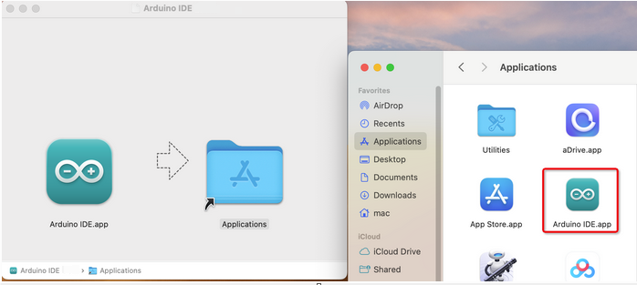

## 3.1.4 Setting the Arduino IDE Language

⚠️ **Special Reminder: The method for setting the language in the Arduino IDE is similar across different systems like Windows and macOS, and can be referenced mutually.**

1. First, open the Arduino IDE.


2. Click "**File** -> **Preferences...**". In the **Preferences** dialog box, click the option next to "**Language**", select your preferred language, and then click "**OK**".


## 3.1.5 Arduino IDE Interface Description

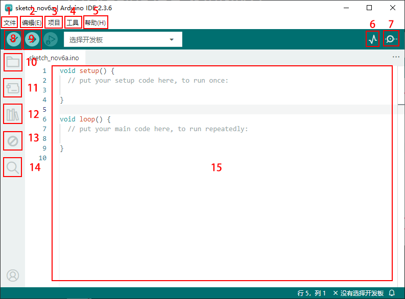

1. The "File" menu includes functions such as New Sketch, Open, Open Recent, Open Examples, Close IDE, Save, Preferences, and Advanced Settings.
2. The "Edit" menu includes functions like Copy, Paste, Auto Format, and Font Size. These are generally operated using keyboard shortcuts. (It is recommended to stick to shortcuts; it will become second nature the more you use them.)
3. Common functions in the "Sketch" menu include Verify/Compile, Upload, and Include Library.
4. Common functions in the "Tools" menu include Board selection and Port selection. These two are very important.
5. Click "Help" to view the IDE version and official reference documents.
6. "Serial Plotter" displays serial data in the form of a line graph.
7. "Serial Monitor" allows you to print and display data that you need to inspect.
8. Verify (Compile) button.
9. Verify and Upload button.
10. "Sketchbook / Cloud" allows you to create new projects, and synchronize and edit using Arduino Cloud.
11. "Board Manager" allows you to add or remove boards.
12. "Library Manager" is used to add and remove libraries.
13. "Debugger" allows code monitoring and breakpoint debugging.
14. Search box.
15. Code editing area.

This concludes the Arduino IDE tutorial. Please learn how to add library files to the Arduino IDE, as the IDE will throw an error if library files are missing.

3.1.6 Installing Library Files to the Arduino IDE (**Important**)

⚠️ **Special Reminder: The method for installing library files is similar across different systems like Windows and macOS and can be referenced mutually; here we use the Windows system as an example.**

## 3.1.6 What is a Library File?

A library is a collection of code that makes it easy for you to read or control sensor modules to perform the functions you want.

When compiling or uploading code, if an error message "No such file or directory" appears, it means the corresponding library file is missing. The image below shows an error caused by a missing library file when uploading code. Below, we take adding the rotary encoder library file as an example.

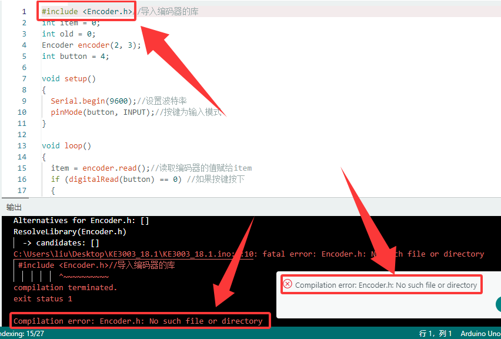

## 3.1.7 How to Install Library Files

Here, we will introduce the easiest way to add a library. We take adding the "Encoder" library file as an example.

1. First, click sequentially on the top-left menu: **"Sketch" --> "Include Library" --> "Add .ZIP Library..."**

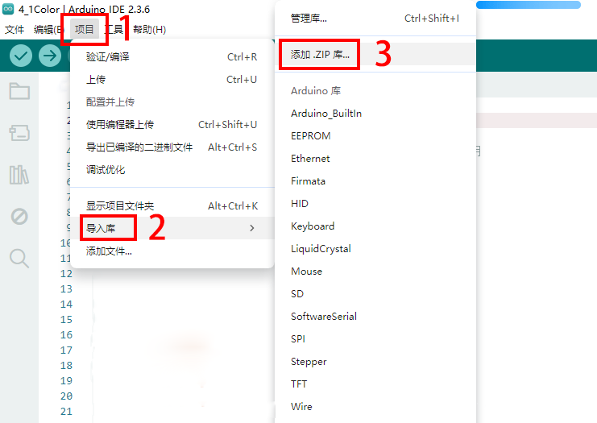

2. Navigate to the directory where the library file is located (unzip the ZIP file downloaded in `2.1 Code and Library File Download`), open the `Arduino Library Files` folder, and select the `Encoder.zip` file.

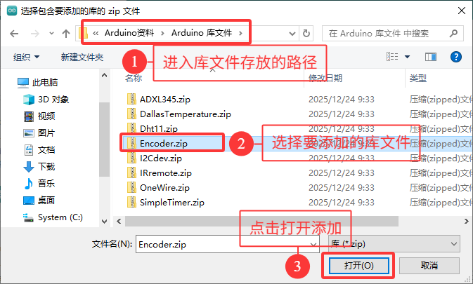

3\. After the installation is complete, you will receive a notification (Library successfully installed from `Encoder.zip` archive), and the output box will display "**Library installed**", confirming that the library has been successfully added to the Arduino IDE. The next time you need to use this library, you do not need to repeat the installation process.

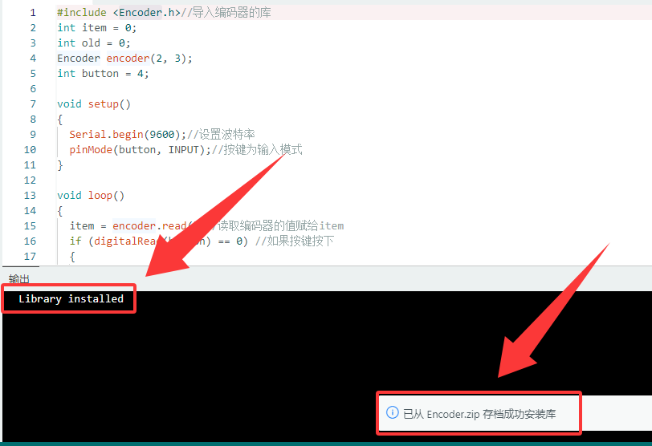

4\. All library files are installed in the same way. You just need to follow these steps to install the library files one by one.

**Operation Flow GIF:**

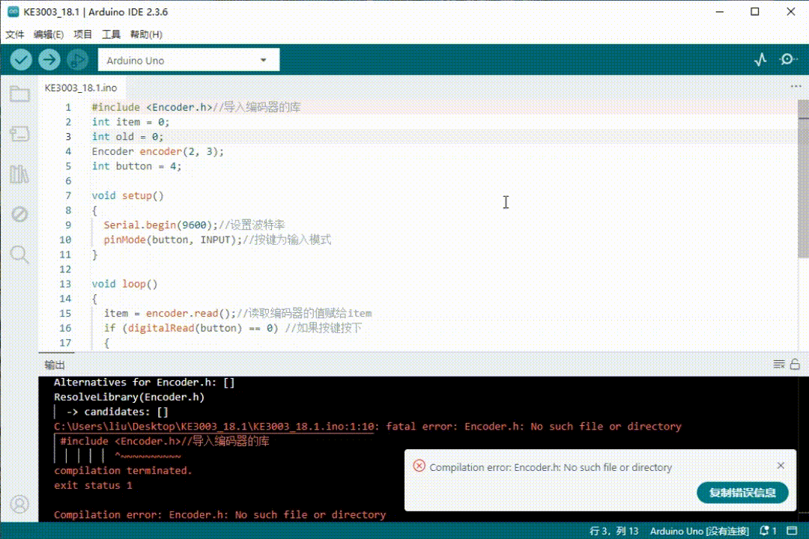

## 3.1.8 Uploading Your First Program Using Arduino IDE

First, connect the Keyes UNO R3 development board to your computer via a USB cable.

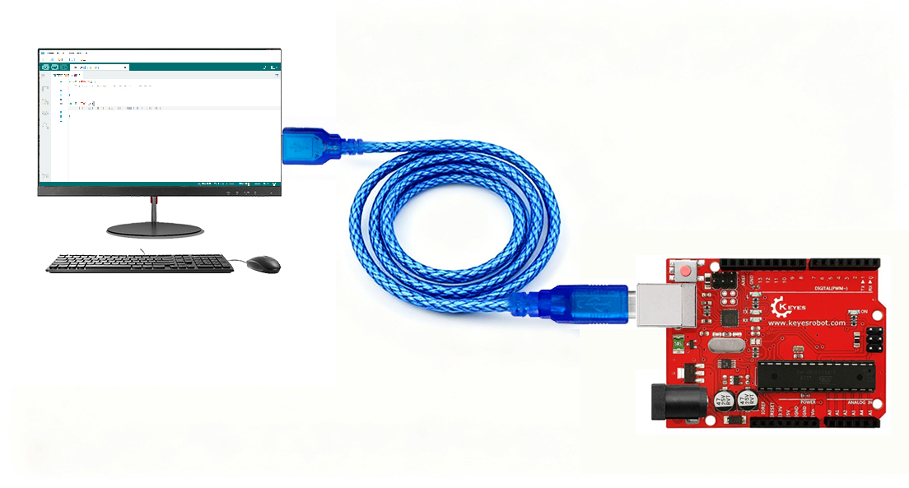

Open the Arduino IDE and select the corresponding Arduino UNO board model.

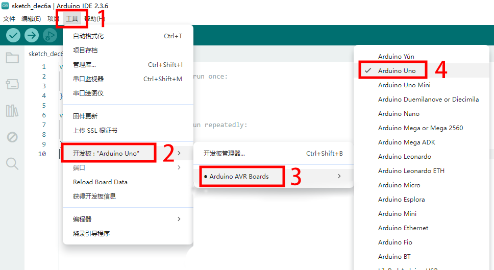

After selecting the development board, choose the USB port. In the "**Tools**" menu, select "**Port**" and then select "**COM30 (Arduino Uno)**".

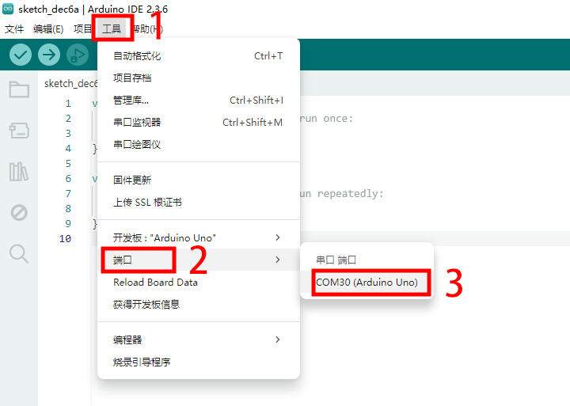

Once the development board is connected, both of these places will display the connected status. Next, add the code: here we provide sample code whose function is to print "Hello Keyes!" in the serial monitor every second.

Click `File` --> `New Sketch`, then copy and paste the following code into the Arduino IDE code area:

```c
/*
  keyes 
  “Hello Keyes!”
  http://www.keyesrobot.com
*/
void setup() {  
    Serial.begin(9600);
}

void loop() {  
    Serial.println("Hello Keyes!");
 	delay(1000); 
}
```


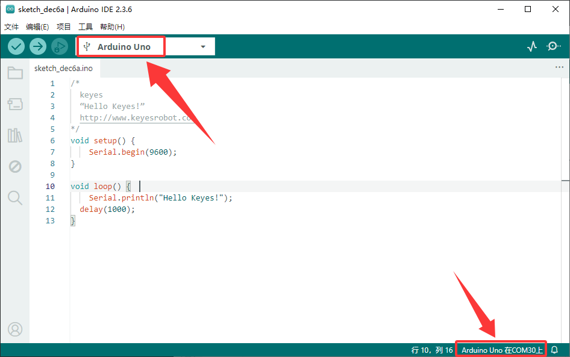

Then click  to compile and upload the code. After successful upload, the IDE will show two prompt messages, as shown in the figure:

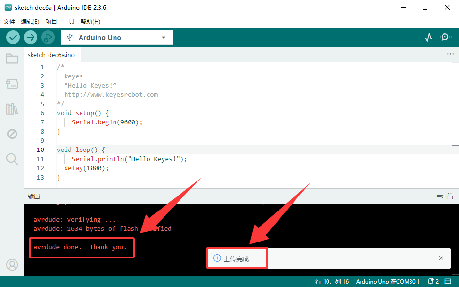

Next, click the "Serial Monitor" icon in the upper right corner  to open the serial monitor. Set the baud rate to **9600**, and you will see the serial port print the string "**Hello Keyes!**"

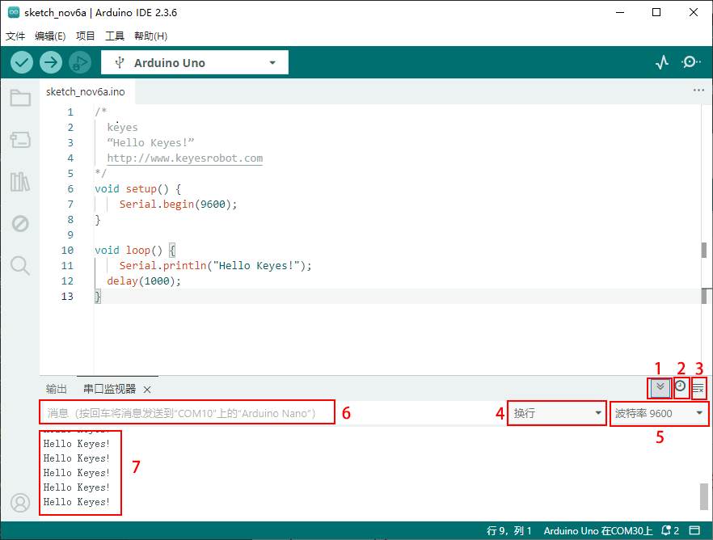

1. "Toggle autoscroll": Sets whether the print window follows the output.
2. "Toggle timestamps": Sets whether to display the print timestamp.
3. "Clear output": Clears the data in the print window.
4. Serial input box.
5. Serial sending format.
6. Set the baud rate; click to select the required baud rate.
7. Print window.


## 3.1.9 Introduction to Basic Arduino Code

For more detailed explanations, please refer to the official link: [Language Reference | Arduino Documentation](https://docs.arduino.cc/language-reference/)
