# 3.1 Arduino IDE

## 3.1.1 About Arduino IDE

Arduino IDE is an integrated development environment dedicated to Arduino which is an open-source electronics platform based on easy-to-read interface and simplified programming process, aimed at students without a background in electronics. 

Its clear interface, syntax highlighting and auto-completion functions make the programming process easy and enjoyable. It also offers a wealth of tutorials, sample codes, and community support to help beginners get started quickly and solve practical  problems.

Importantly, it is published as an open source tool. Therefore,  it not only accelerates users own learning process by utilizing and referring others’ works, it is also available for extension experienced programmers to freely access, modify and distribute codes.

In one word, Arduino IDE is easy-to-use for beginners, yet flexible enough for advanced users to take advantage of as well.

## 3.1.2 Download Arduino IDE

### 3.1.2.1 For Windows

Arduino official:[Software | Arduino](https://www.arduino.cc/en/software/)

Arduino boasts multiple versions such as Widows, mac and Linux(as shown below), please ensure that the one you download is compatible with your computer.

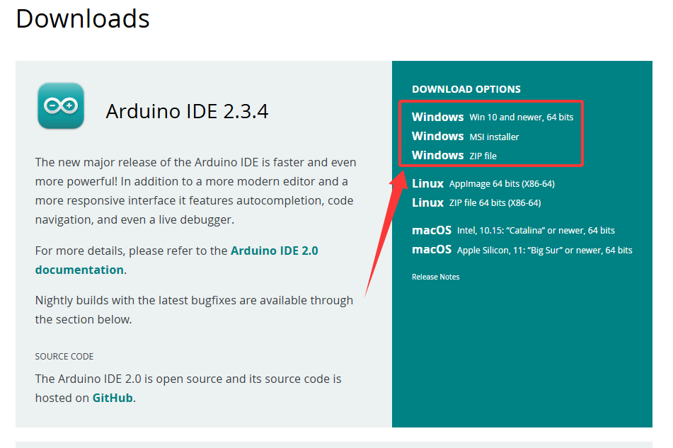

Here,  we will take Windows system as an example to introduce how to download and install it. Two versions are provided for Windows: for installing and for downloading(a zipped file, no need to install).


Click **JUST DOWNLOAD** to download the software. 

### 3.1.2.2 For MAC

Its download method is similar to the Windows.

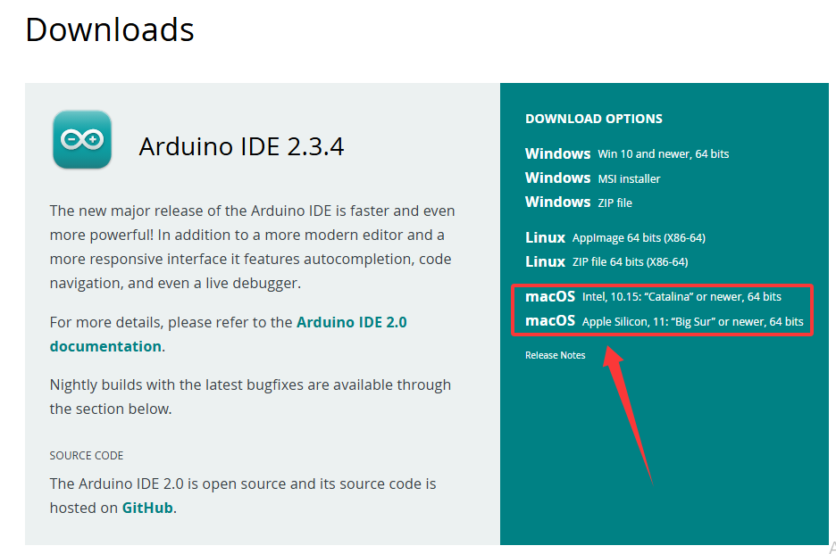

Follow the prompts to install.

### 3.1.2.3 Steps

1.Save the .exe file downloaded from the software page to your hard drive and simply run the file .

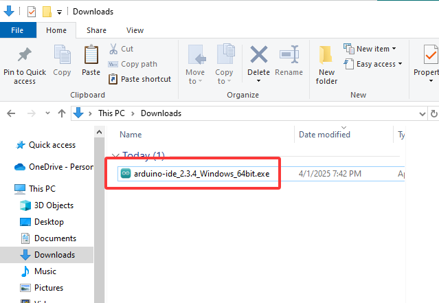

2.Read the License Agreement and agree it.

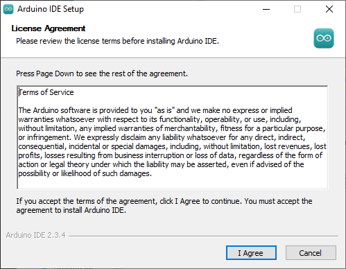

3.Choose the installation options.


4.Choose the install location.

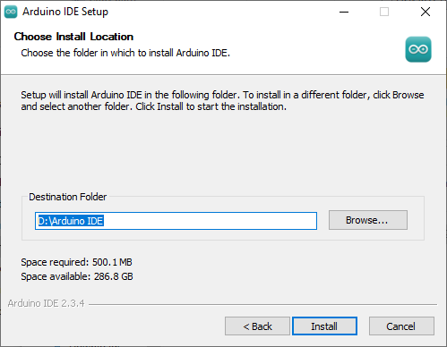

5.Click finish and run Arduino IDE


## 3.1.3 Install USB Driver

Note that please connect the ESP32 board to your computer via USB cable before installing the USB driver. Or else, the driver may fail to be installed.

### 3.1.3.1 For Windows

Click to download [Windows CH340 driver](./Windows.zip).


For Windows 10 and later versions, the driver will be automatically installed. 

Connect the control board to computer via USB, click Computer–Attributes–Device Manager. As is shown in the picture, the driver has already exist.


If there is a yellow exclamation mark, you should install it manually.


Tap 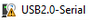 to choose “Update drive…” to update the driver.

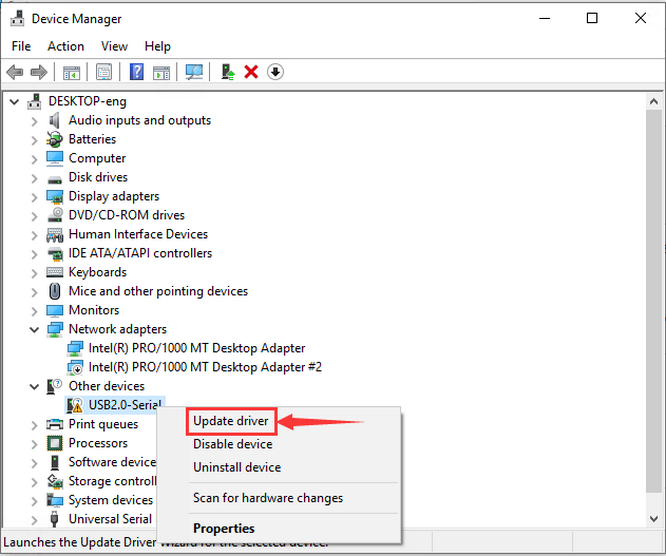

Click “Browse my computer for drivers”.

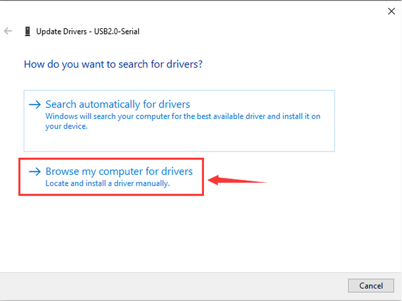

Enter“Browse…” to find the folder `usb_ch341_3.1.2009.06` , and then “Next”.


Close the page after installation, and then the serial port number appears.


Finally, click Computer–Attributes–Device Manager:


### 3.1.3.2 For MAC

Click to download [MAC CH340 driver](./MAC.zip).

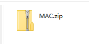

**Step 1:** Download the driver from the Website and extract the file to the local installation directory.

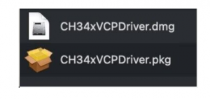

**Step 2:** For details about how to install the driver in pkg format by default, see Step 3. If OS X 11.0 or later does not support Rosetta, refer to Step 4 to install the dmg driver.

Before installation, please forward to “System Preferences”->“Security & Privacy”->“General” page, below the title “Allow apps downloaded from:” choose the choice 2->“Mac App Store and identified developers”, then the driver will work normally.

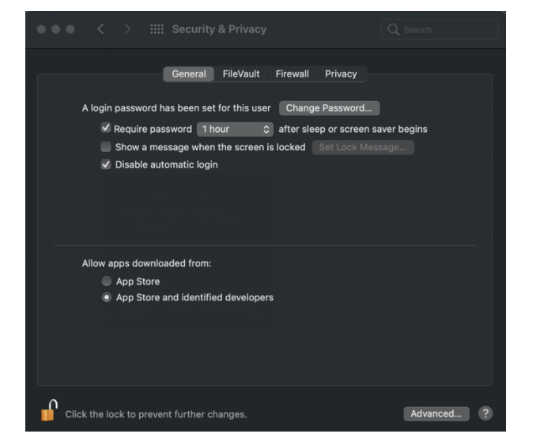

**Step 3:** To install the driver in pkg format, tap the driver file → Continue→ Install

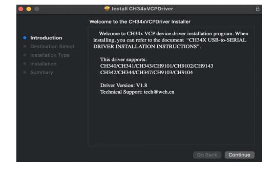

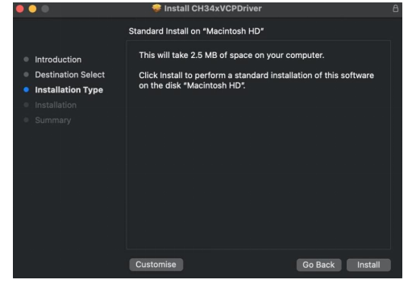

Then the installation will be successful

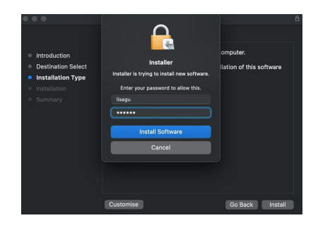

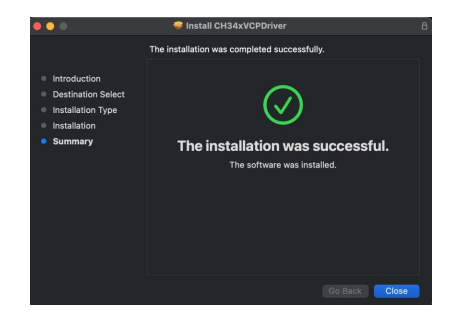

To install the pkg format driver on OS X 11.0 and later: Open “LaunchPad”→“CH34xVCPDriver”→Install

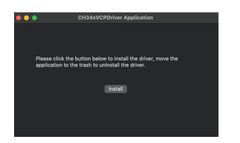

When using OS X 10.9 to OS X 10.15, click “Restart” to restart your computer, and perform the following steps after the restart.

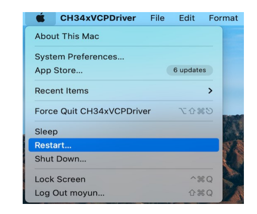

**Step 4:** To install the dmg driver, tap the dmg file and drag “CH34xVCPDriver” to enter the application folder in the operating system.

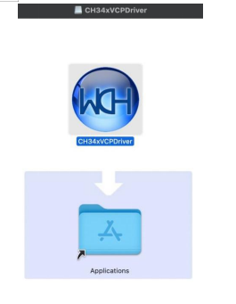

Then open “LaunchPad”→“CH34xVCPDriver”→Install

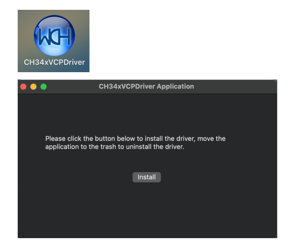

Then the installation will be successful


When inserting the CH340 control board into the USB port, open System Report -> Hardware ->USB. On the right is USB Device Tree. If the USB device is working properly, you will find a device whose “Vendor ID” is [0x1a86].

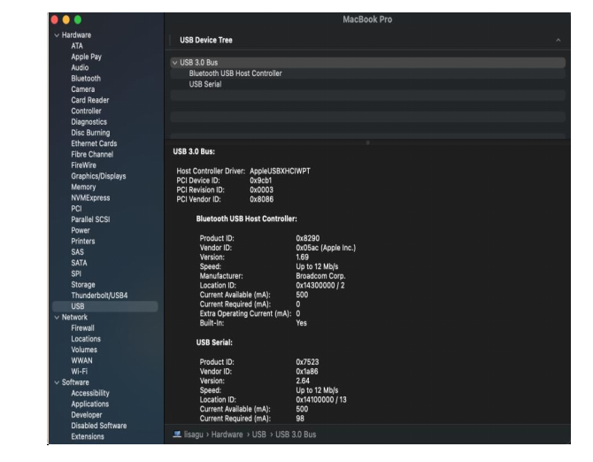

Open “Terminal” program under Applications-Utilities folder and type the command “ls /dev/tty*”.

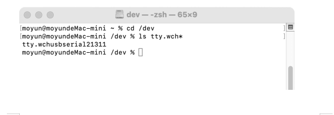

You should see the “tty.wchusbserialx” where “x” is the assigned device number similar to Windows COM port assignment.

## 3.1.4 Install ESP32 Board

Open Arduino IDE and click “Tools” → “Board”. But we cannot find ESP32, so we need to install it manually.


**Installation Steps of the ESP32:**

Open Arduino IDE.

Click “**File → Preferences**”, add the link `https://espressif.github.io/arduino-esp32/package_esp32_index.json` in Additional boards manager URLs and click **OK**.

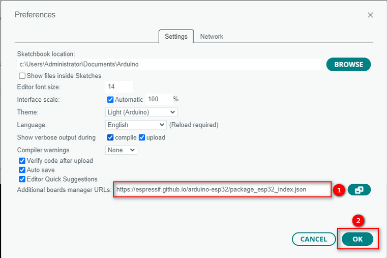

Select the icon of board manager to open the the board options.

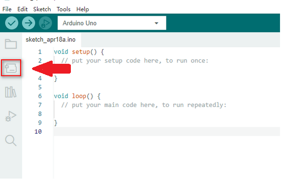

Search for **ESP32** in the search box and install the latest version. You can check its process in the lower right corner. **During installation, keep the network stable. If the installation fails, repeat the above steps.**

<span style="color:red; font-size:20px;">Note: We adopt ESP32 version 3.2.0 in this tutorial. Please keep it consistent to avoid code incompatibilities.</span>

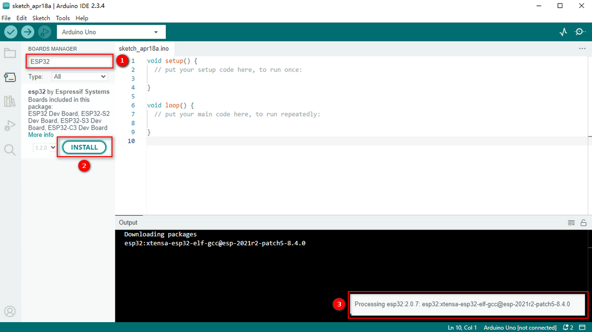

Installed:

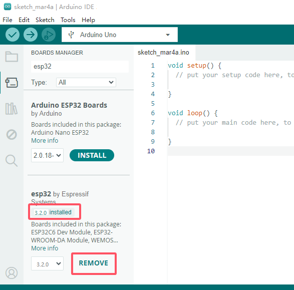

## 3.1.5 Use Arduino IDE

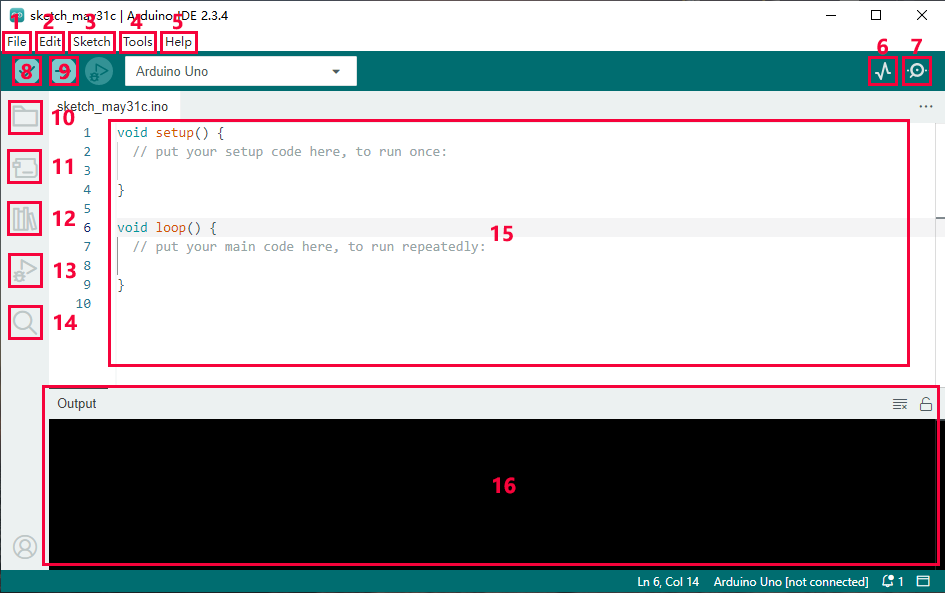

1. **File** - includes new Sketch, open Sketch, open recently used code, open sample code, close the IDE, save code, preferences, advanced Settings, etc.
2. **Edit** - includes copy, paste, automatic formatting, font size, etc. (shortcut keys are recommended).
3. **Sketch** - includes verify\compile, upload code, import library and so on.
4. **Tools** - The most important two are development board and port.
5. **Help** - Views the IDE version and official reference documents.
6. **Open Serial Plotter** - displays serial data in a method of line graph
7. **Open Serial Monitor** - opens the Serial Monitor tool, as a new tab in the console.
8. **Verify** - compiles your code to your Arduino Board.
9. **Verify / Upload** - compiles and uploads your code to your Arduino Board.
10. **Sketchbook** - here you will find all of your sketches locally stored on your computer. Additionally, you can sync with the Arduino Cloud, and also obtain your sketches from the online environment.
11. **Boards Manager** - install or remove Arduino Boards .
12. **Library Manager** - browse through thousands of Arduino libraries or import local libraries
13. **Debugger** - test and debug programs in real time.
14. **Search** - search for keywords in your code.
15. **Code editing area**
16. **IDE prompt area** (Uploading fails or succeeds) & **Serial monitor display area**

## 3.1.6 Upload Code on Arduino IDE

Connect the board to your computer via the USB cable.

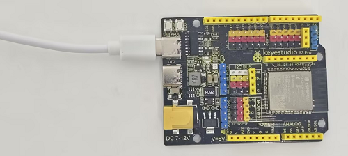


Connect the the corresponding ESP32 board model in Arduino IDE.

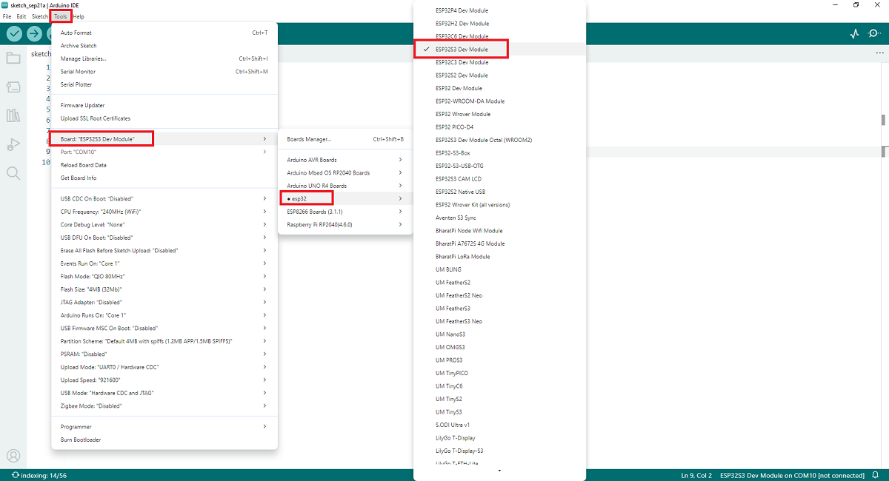


Choose COM port. You may check your port number at Device Manager. If there are many COM ports, unplug the cable of board to see which port disappears. Then that one is the port ready to use. If there is no COM port, please check whether driver is installed.


Herein, our COM port is COM3. Click “Tools” → “Port” → “COM3”.

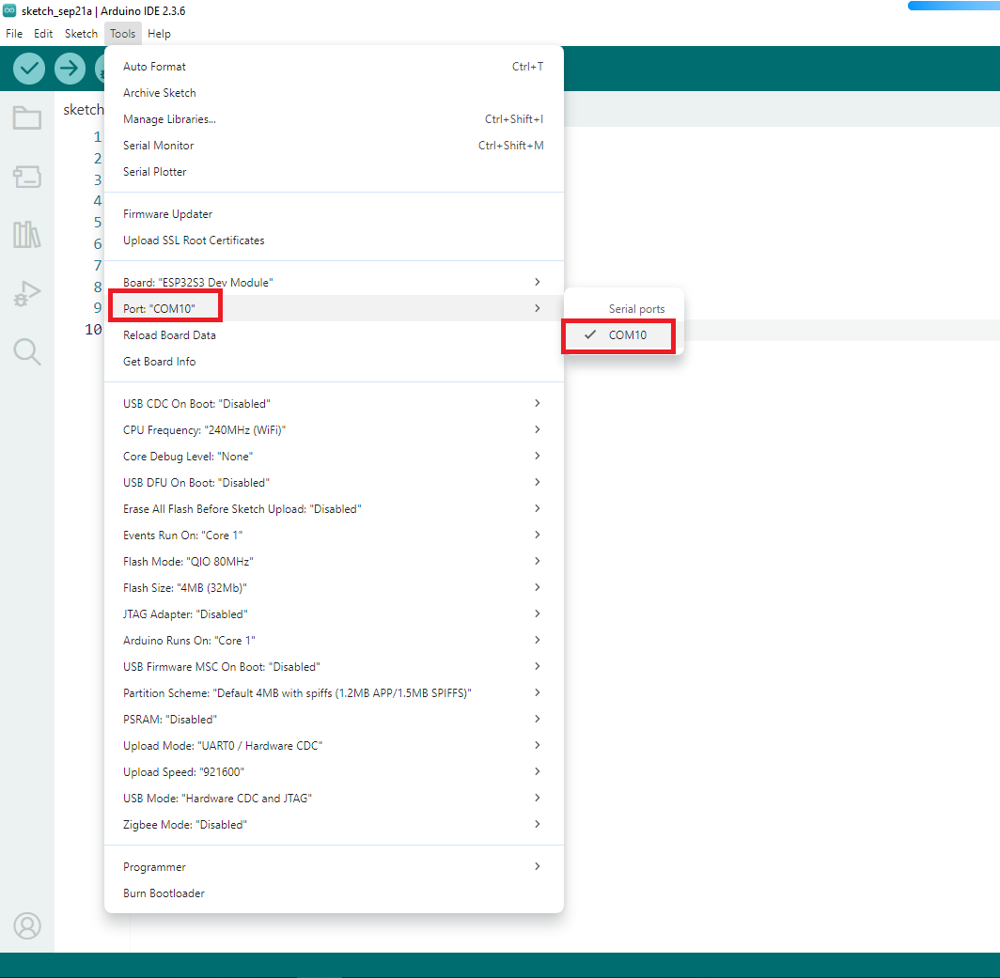


When the board is connected, both of these places appear its model. Here we provide a sample code that prints “Hello Keyestudio!” once per second in the serial monitor.

Copy and paste the following code to Arduino IDE.

```c
/*
  keyestudio 
  Print “Hello Keyestudio!”
  http://www.keyestudio.com
*/
void setup() {  
    // put your setup code here, to run once:
    Serial.begin(9600);  //Set the serial port baud rate to 9600
}

void loop() {  
    // put your main code here, to run repeatedly:
    Serial.println("Hello Keyestudio!");  //Serial port printing
 	delay(1000);  //Delay of 1 second
}
```

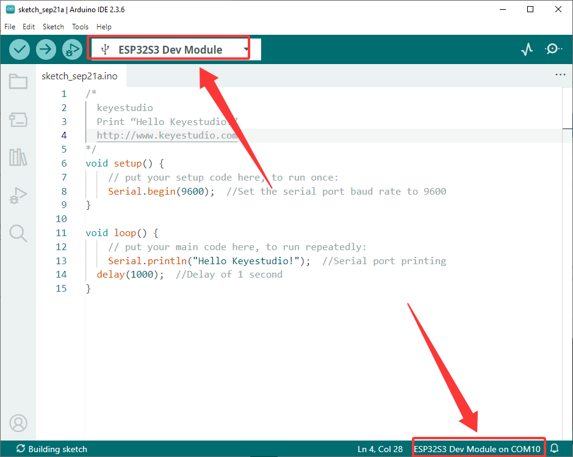

Click  to compile and upload code. Two prompts will appear after upload is successful:

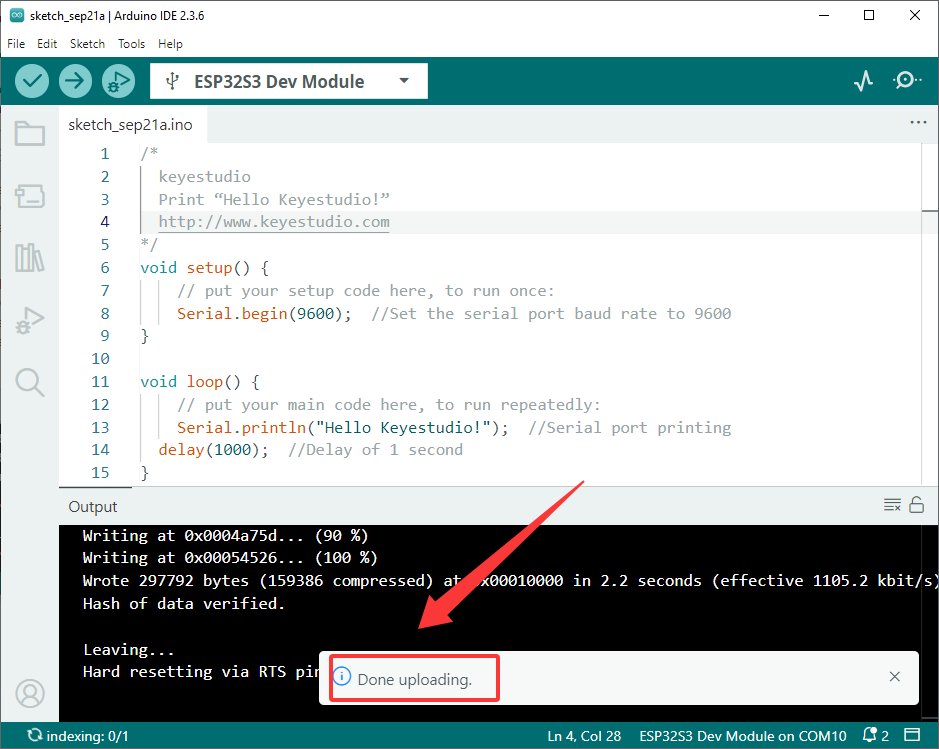

After that, click  to show serial monitor and set baud rate to 9600. You will see “Hello Keyestudio!” on the monitor.

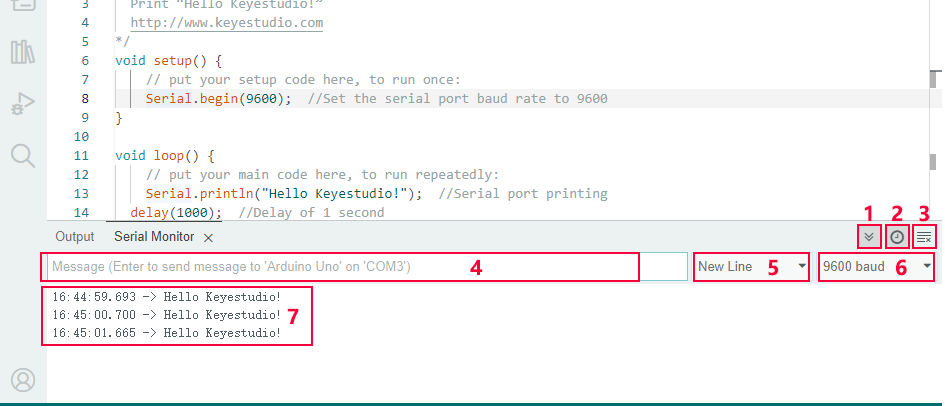

1. **Toggle Auto-scroll** - Sets whether the prints scroll automatically
2. **Toggle Timestamp** - Sets whether to display print time
3. **Clear Output** - Clears printed messages
4. **Serial Input**
5. **Serial Output Format**
6. **Baud Rate** - Sets the baud rate you need
7. **Printing Window**

Now that you’re familiar with the steps of uploading code, please continue to learn how to import libraries to Arduino IDE. They are indispensable, as the IDE will report an error if library files are not added.

## 3.1.7 Import Library

### 3.1.7.1 What are Libraries?

A library is a collection of codes, and it facilitates the connection of sensors, displays and modules. 

For instance, the LiquidCrystal_I2C library simplifies the communication with LCD1602 display. Moreover, hundreds of libraries are available on Internet. In the reference, in-built and manually-added libraries are listed.

When you see “No such file or directory”, oops, libraries are missing! For instance, we do not include LiquidCrystal_I2C before uploading related codes:

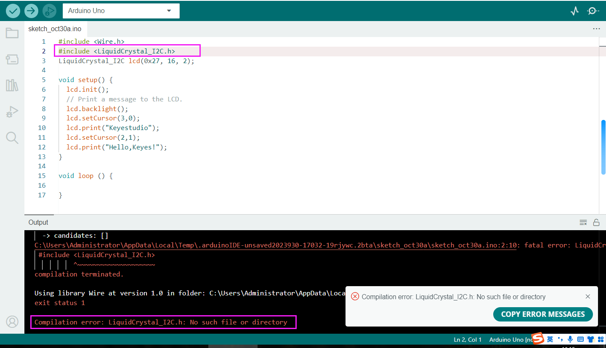

### 3.1.7.2 How to Install the Libraries?

We still take LiquidCrystal_I2C as an example.

Click **Skerch>Include Library>Add .Zip Library...**

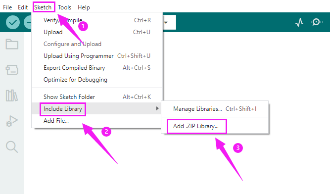

Select the zipped files you need and click ok to add a library. If success, the message bar will show “**Library installed**”.

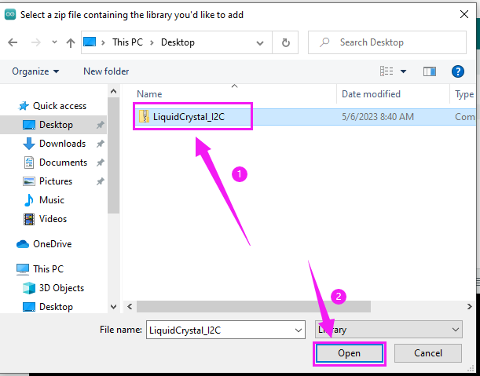

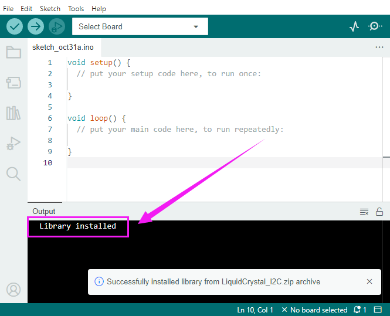

**Operation demo:**

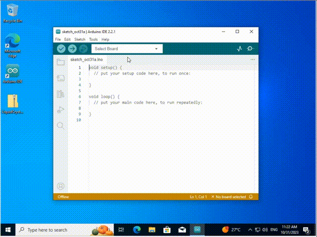

For how to install libraries, MAC and WINDOWS are the same.
