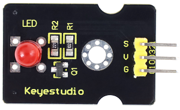

#     3.2 Lighting Up an LED

## 3.2.1 Lesson Introduction



Imagine the nightlight in your room or the traffic lights on the street—how do they light up? In fact, behind all lighting, there is a "commander" controlling them. Today, we are going to meet a new friend—the LED module. It acts like an obedient little soldier: as long as you give an order, it will obediently light up or turn off.

In this lesson, we will use the ESP32S3 Pro development board as the "brain," connect the LED module using a few simple wires, and write a magical piece of code. This code is like giving an order to the little soldier: "Hey, light up!" and "Hey, take a break!".

Once you complete this experiment, you will have officially stepped into the electronic world! You will learn how to make hardware obey your commands, which is the first step in making robots and smart cars. Ready? Let's get started!

## 3.2.2 Lesson Objectives

*   Correctly identify the positive and negative poles of the LED module and connect them to the correct pins of the ESP32S3 Pro development board.
*   Understand the roles of the `setup()` and `loop()` functions and know how code runs on the board.
*   Write and upload code to make the LED blink at 1-second intervals (on for 1 second, off for 1 second).
*   Learn to use the serial monitor to view the program's running status and confirm the success of the experiment.

## 3.2.3 Lesson Equipment

To complete today's experiment, please prepare the following items:

| Name               | Specification/Model               | Quantity | Remarks                                  |
| :----------------- | :-------------------------------- | :------- | :--------------------------------------- |
| Main Control Board | ESP32S3 Pro Development Board     | 1        | Our "brain"                              |
| Sensor Module      | LED Module                        | 1        | Usually has three pins: S, V, G          |
| Connection Wire    | Female-to-Female 3Pin Jumper Wire | 1        | Used to connect the board and module     |
| Data Cable         | Type-C Data Cable                 | 1        | Used for power supply and uploading code |
| Computer           | Installed with Arduino IDE        | 1        | Where code is written                    |

## 3.2.4 Lesson Principles

### 3.2.4.1 What is an LED?

The full name of LED is "Light Emitting Diode". You can think of it as a one-way "electronic valve". Current can only flow in from one end and out from the other for it to emit light. If connected backward, current cannot pass through, and it won't light up (don't worry though, reversing it usually won't break it, it just won't work).

### 3.2.4.2 Why Do We Need a Module?

Ordinary LED bulbs only have two thin pins, which easily break, and connecting them directly to a battery might burn them out due to excessive current. Therefore, we use an "LED module". This module has already integrated a resistor (used to limit current and protect the LED) and the LED together, and breaks out three convenient pins, making it very suitable for beginners.

### 2.2.4.3 How Does the Development Board Control the LED?

The ESP32S3 Pro development board is like a room with many switches. Each pin acts as a switch.

*   When we set a certain pin to "HIGH", it is equivalent to turning on the switch; current flows out, and the LED lights up.
*   When we set a certain pin to "LOW", it is equivalent to turning off the switch; current stops, and the LED turns off.

### 3.2.4.4 Programming Logic

In Arduino programming, we mainly use two functions:

*   `pinMode(pin, MODE)`: Tells the development board that this pin is used to output electrical energy (`OUTPUT`).
*   `digitalWrite(pin, VALUE)`: Controls whether this pin outputs high level (`HIGH`, on) or low level (`LOW`, off).
*   `delay(ms)`: Pauses the program for a while in milliseconds. 1000 milliseconds = 1 second. This is like shouting "On", pausing for a bit, and then shouting "Off".

## 3.2.5 Wiring Instructions

Wiring is the most crucial step in the experiment, so please be careful! First, disconnect the USB cable of the development board to ensure there is no power, so that even if a mistake is made during wiring, components will not be burned out.

The LED module typically has 3 pins, labeled **S** (Signal), **+** (VCC, Positive Power Supply), **-** (GND, Ground).

Please connect them according to the table below:

| LED Module Pin | ESP32S3 Pro Development Board Pin | Description                                               |
| :------------- | :-------------------------------- | :-------------------------------------------------------- |
| **-** (GND)    | **GND**                           | Ground, the circuit return path, must be connected        |
| **+** (VCC)    | **5V**                            | Supplies power so the LED can emit light                  |
| **S** (Signal) | **io11**                          | Signal pin, receives the "on/off" commands from the board |

⚠️ **Special Note**:

1.  **Color Matching**: Usually, the black jumper wire connects to GND, the red wire connects to 5V, and other colors (such as yellow or green) connect to the signal pin io11.
2.  **Pin Confirmation**: There are many pins on the ESP32S3 Pro development board. Please carefully locate the hole marked `io11`.
3.  **Double Check**: Before plugging in the USB cable, check the table again to ensure that each wire is firmly inserted and in the correct position.


## 3.2.6 Sample Program

This code will make the LED connected to the io11 pin blink once every 1 second. You can directly copy the code below into the Arduino IDE.

```cpp
// Define the pin number connected to the LED, here we use io11
const int ledPin = 11; 

void setup() {
  // Initialize serial communication with a baud rate of 9600, making it easy to see messages on the computer
  Serial.begin(9600);
  
  // Set ledPin (io42) to output mode because it needs to control the LED on and off
  pinMode(ledPin, OUTPUT);
  
  // Print a message to the serial monitor to tell us the program has started running
  Serial.println("LED Blink Experiment Started!");
}

void loop() {
  // 1. Turn on the LED
  digitalWrite(ledPin, HIGH); 
  Serial.println("LED is ON"); // Display "LED is ON" on the computer screen
  
  // 2. Wait for 1000 milliseconds (which is 1 second)
  delay(1000); 
  
  // 3. Turn off the LED
  digitalWrite(ledPin, LOW);  
  Serial.println("LED is OFF"); // Display "LED is OFF" on the computer screen
  
  // 4. Wait for another 1000 milliseconds (1 second)
  delay(1000); 
}
```

## 3.2.7 Code Explanation

Let's take apart this code like a toy to see how it works:

**Part 1: Preparation**

```cpp
const int ledPin = 11;
```

This line of code gives the number 11 a name called `ledPin`. The advantage of doing this is that if we later move the LED to the io15 pin, we only need to change this one number instead of searching for all 11s below to modify them, which is very convenient! `const` means that once this number is set, it will not change.

**Part 2: The setup() Function**

```cpp
void setup() {
  Serial.begin(9600);
  pinMode(ledPin, OUTPUT);
  Serial.println("LED Blink Experiment Started!");
}
```

`setup()` is like the preparation work we do after waking up; it only runs once.

*   `Serial.begin(9600)`: Opens the "telephone line" between the development board and the computer, allowing us to see what the development board says on the computer.
*   `pinMode(ledPin, OUTPUT)`: Tells the development board: "Hey, I'm going to use the io42 pin to output current to control the LED, please get ready!" If you don't write this sentence, the LED might not light up.

**Part 3: The loop() Function**

```cpp
void loop() {
  digitalWrite(ledPin, HIGH); 
  delay(1000); 
  digitalWrite(ledPin, LOW);  
  delay(1000); 
}
```

`loop()` is the main loop, and the code inside will repeat over and over again, never stopping.

*   `digitalWrite(ledPin, HIGH)`: Sends a high level to io42, which is equivalent to pressing a switch, and the LED turns on.
*   `delay(1000)`: The program "daydreams" here for 1000 milliseconds (1 second). Without this sentence, the LED would switch on and off too fast, and the human eye would perceive it as being constantly on.
*   `digitalWrite(ledPin, LOW)`: Sends a low level to io42, which is equivalent to turning off the switch, and the LED turns off.
*   Another `delay(1000)`: Keeps the LED off for 1 second.

Awesome! You just used code to control real hardware!

## 3.2.8 Experimental Phenomena

1. **Upload the Code**: Click the "Upload" button in the upper left corner of the Arduino IDE (the right-arrow icon). Wait for "Upload successful" to appear at the bottom.

2. **Observe the LED**: You should see the small light on the LED module **turn on for 1 second**, then **turn off for 1 second**, and then turn on again, repeating this cycle rhythmically like breathing.

3. **Check the Serial Monitor**: Click the "Serial Monitor" icon in the upper right corner (magnifying glass shape). Make sure the baud rate selected in the lower right corner is **9600 baud**. You will see the screen continuously scrolling with:

   ```text
   LED is ON
   LED is OFF
   LED is ON
   LED is OFF
   ...
   ```

   This shows that the code is not only controlling the light, but also "chatting" with you!

If the LED does not flash, but stays constantly on or off, please check whether the wiring is secure, or whether the pin number `42` in the code matches the pin you actually connected to.

## 3.2.9 FAQ

**Problem: The LED light does not turn on at all**
Cause: The wiring may be loose, or the positive and negative poles are reversed, or the wrong pin was selected.
Solution:

1. Check if the jumper wires are firmly inserted.
2. Confirm that the `+` of the LED module is connected to `5V` of the development board, and `-` is connected to `GND`.
3. Confirm that the signal wire `S` is connected to `io42`.

**Problem: The LED stays on all the time and doesn't flash**
Cause: The `delay()` time in the code is too short, or `digitalWrite` was written incorrectly.
Solution: Check if there is `delay(1000);` in the code. If the delay is 10 or 100, the blinking will be so fast that the naked eye cannot see it. Try changing it to 1000 to see the effect.

**Problem: Code upload fails, prompting "Connection Error"**
Cause: The USB cable is not plugged in properly, the driver is not installed, or the wrong development board model is selected.
Solution:

1. Unplug and replug the USB cable.
2. In the "Tools" menu of the Arduino IDE, confirm that the development board selected is "ESP32S3 Dev Module" or a similar option.
3. Confirm that the correct COM port is selected under Port.

**Problem: The serial monitor displays garbled text**
Cause: The baud rate of the serial monitor does not match the one set in the code.
Solution: The code says `Serial.begin(9600);`, so the lower right corner of the serial monitor must be set to **9600 baud**. If 115200 is selected, garbled characters will appear.

## 3.2.10 Safety Tips

*   **Strictly Prohibit Short Circuits**: Never use a wire to directly connect the `5V` and `GND` of the development board together. This will instantly generate a large current, which may burn out the development board or the computer's USB port.
*   **Pay Attention to Polarity**: Although the LED module has protection, it is very important to develop the good habit of "red is positive, black is negative".
*   **Power-Off Operation**: When modifying wiring, it is best to unplug the USB cable first to ensure safety.

Congratulations! You have completed your first embedded experiment and taken an important step toward becoming a junior engineer! Keep it up!

