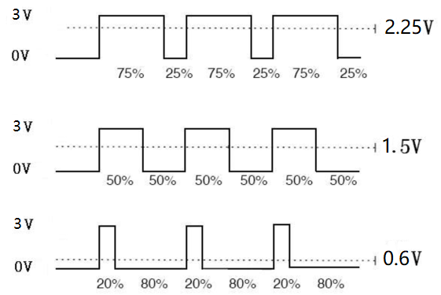
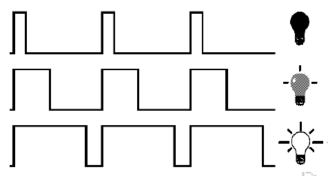
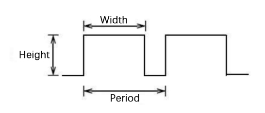
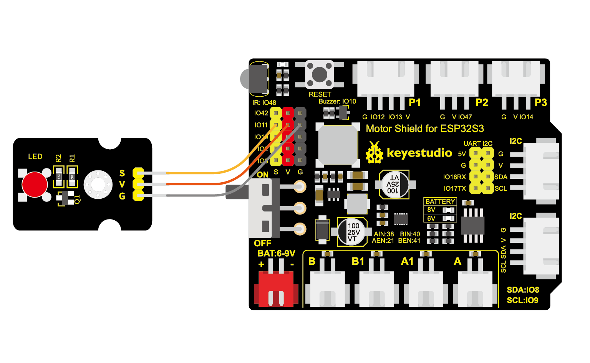

# 3.3 Breathing Light

## 3.3.1 Course Introduction

Hey kids! Have you ever noticed that the indicator lights of some electronic devices don't suddenly turn "pop" on, but instead gradually brighten and slowly dim, just like breathing? This effect is called a "breathing light." It looks very gentle and technological, just like the steady breathing sound of an electronic device while sleeping.

Today, we will use the ESP32S3 Pro development board to create a magical breathing light. Although we already learned how to make an LED light "turn on" and "turn off" in the previous lesson, this time we are going to challenge a more difficult task: controlling the change in light brightness. This is like installing a faucet with adjustable flow on a bulb, letting the current flow in and out slowly.

After completing this lesson, you will master a black technology called PWM (Pulse Width Modulation), which allows you to use code to precisely control the "strength" of the hardware. Are you ready to bring your LED light to "life"? Let's get started!

## 3.3.2 Course Objectives

*   Correctly connect the LED module to a PWM pin of the ESP32S3 Pro development board.
*   Understand what PWM (Pulse Width Modulation) is and how it controls brightness.
*   Write code using the `analogWrite()` function to make the LED cycle from dim to bright and back from bright to dim.
*   Learn how to use variables to control the transition speed and modify the code to adjust the breathing rhythm.

## 3.3.3 Course Equipment

| Name               | Specification/Model                          | Quantity | Remarks                                                |
| :----------------- | :------------------------------------------- | :------- | :----------------------------------------------------- |
| Main Control Board | ESP32S3 Pro Development Board                | 1        | Our core brain                                         |
| LED Module         | 5mm Red LED (with current-limiting resistor) | 1        | If using a bare LED, connect a 220Ω resistor in series |
| Connection Wire    | Female-to-Female 3Pin Jumper Wire            | 1        | Used to connect the board and module                   |
| USB Data Cable     | Type-C                                       | 1        | Used for power supply and uploading code               |

## 3.3.4 Course Principles

### 3.3.4.1 Why Can LEDs Become Brighter and Dimmer?

Imagine you have a flashlight in your hand, and its switch only has two states: "ON" and "OFF". If you want to make the light dimmer, the traditional method is to replace it with a smaller battery, but that is too troublesome.

In the world of electronics, we have a smarter method: **rapid switching**.

Certain pins on the ESP32S3 Pro development board (which we call PWM pins) can turn the current on and off at an extremely high speed (thousands of times per second).

*   If it is turned on for half the time and off for the other half within 1 second, your eyes will perceive it as "half bright".
*   If the ON time is very short and the OFF time is very long, you will perceive it as very "dim".
*   If it is almost always on and occasionally turns off, you will perceive it as very "bright".

This technique is called **PWM (Pulse Width Modulation)**. Although it sounds like a long name, you only need to remember: **By controlling the ratio of "ON" time, you can control the brightness.**







### 3.3.4.2 Key Parameter: Duty Cycle

In Arduino programming, we use numbers from 0 to 255 to represent brightness:

*   **0**: Represents completely off (0% ON time), the light is off.
*   **128**: Represents half the time on (50% ON time), the light is at half brightness.
*   **255**: Represents always on (100% ON time), the light is at maximum brightness.

This 0-255 range exists because the ESP32's PWM resolution is typically set to 8 bits, and 2 to the 8th power equals 256 levels (counting from 0 gives 0-255).

### 3.3.4.3 Programming Logic: `analogWrite()`

Previously we used `digitalWrite()`, which can only output HIGH (high level/on) or LOW (low level/off). Now we are going to use a new function: `analogWrite(pin, value)`.

*   `pin`: The pin number you want to control.
*   `value`: The brightness value, ranging from 0 to 255.

Note: On the ESP32S3 Pro, almost all GPIO pins support PWM functionality, which is much more powerful than the traditional Arduino UNO! In this experiment, we will use the **io11** pin.

## 3.3.4.4 Wiring Instructions

Before wiring, make sure the ESP32S3 Pro development board is disconnected from computer power, or unplug the USB cable first, so that even if there is a wiring error, the components will not be burned out.

We will use the LED module (assuming the module has a built-in resistor; if it is a bare LED, be sure to connect a 220Ω resistor in series).

| Module Pin | ESP32S3 Pro Development Board Pin | Description                                                  |
| :--------: | :-------------------------------: | :----------------------------------------------------------- |
|     S      |               io11                | This is a pin supporting PWM output, preferably marked with a ~ symbol, but most ESP32 pins are capable |
|     V      |                VCC                | Power pin                                                    |
|     G      |                GND                | Must be grounded to form a complete circuit                  |

⚠️ **Special Notes**:

1.  **Do not reverse polarity**: LEDs have direction. If you are using a module with pin headers, usually the one marked "G" is ground, "V" is VCC, and "S" is the signal pin.
2.  **Pin Selection**: Although many ESP32 pins can be used, we uniformly use **io11** for easy reference with the code.



## 3.3.5 Sample Program

This code makes the LED connected to the io11 pin slowly brighten like breathing, reach maximum brightness, and then slowly dim, repeating in a continuous loop.

```cpp
// Define the LED connection pin as io11
const int ledPin = 11; 

// Define the brightness variable with an initial value of 0 (dimmest)
int brightness = 0;    

// Define the step size for each change; smaller values mean smoother changes but slower speed
int fadeAmount = 5;    

void setup() {
  // Set ledPin as an output mode
  pinMode(ledPin, OUTPUT);
}

void loop() {
  // 1. Set the brightness of the current pin
  // analogWrite can output a PWM signal, with a value range of 0-255
  analogWrite(ledPin, brightness);

  // 2. Change the brightness value for the next iteration
  brightness = brightness + fadeAmount;

  // 3. Check if the boundary of maximum or minimum brightness has been reached
  // If brightness reaches 0 or 255, reverse the direction of change
  if (brightness <= 0 || brightness >= 255) {
    fadeAmount = -fadeAmount; 
  }

  // 4. Wait for 30 milliseconds so the human eye can see the changing process clearly
  // If this time is too short, the light will flicker too fast; if too long, the breathing effect will feel disconnected
  delay(30);          
}
```

## 3.3.6 Code Explanation

Let's break down this magical piece of code step by step to see how it commands the LED to "breathe".

> ```cpp
> const int ledPin = 11; 
> int brightness = 0;    
> int fadeAmount = 5;    
> ```
>
> Here we define three "little boxes" (variables):
>
> *   `ledPin` stores the pin number 11, so changing the pin later only requires modifying this single line.
> *   `brightness` stores the current brightness, starting from 0.
> *   `fadeAmount` stores the amount of brightness to add or subtract each time. Setting it to 5 means the brightness increases or decreases by 5 per loop. If you change it to 1, the breathing will become very slow and delicate; if you change it to 20, the breathing will become rushed.

> ```cpp
> void setup() {
> pinMode(ledPin, OUTPUT);
> }
> ```
>
> This part is the same as the previous lesson, telling the development board: "io11 pin, get ready to output electrical signals to light up the LED!"

> ```cpp
> analogWrite(ledPin, brightness);
> ```
>
> This is the protagonist of this lesson! Unlike `digitalWrite` which only has on and off, `analogWrite` can output PWM waves with different duty cycles based on the value of `brightness` (0-255). When `brightness` is 128, it outputs half-energy power.

> ```cpp
> brightness = brightness + fadeAmount;
> ```
>
> This line of code changes the brightness. On the first loop, `brightness` is 0, adding `fadeAmount` (5) makes it 5. The next time it becomes 10, 15... and the light gets brighter and brighter.

> ```cpp
> if (brightness <= 0 || brightness >= 255) {
> fadeAmount = -fadeAmount; 
> }
> ```
>
> This is a smart decision-making logic:

> *   When the brightness increases to 255 (maximum brightness), we need to make it start dimming. Therefore, we change `fadeAmount` from 5 to -5.
> *   The next time `brightness = brightness + (-5)` is executed, the brightness begins to decrease.
> *   When the brightness decreases to 0 (minimum brightness), change `fadeAmount` back to 5 to make it brighten again.
> *   This creates an infinite "breathing" loop!

> ```cpp
> delay(30);
> ```
>
> Without this delay, the ESP32 runs too fast (240MHz) and completes the change from 0 to 255 in an instant. You wouldn't notice a gradient at all, and would only see the light stay fully lit. A 30-millisecond pause allows the human eye to catch the subtle changes in brightness.

## 3.3.7 Experimental Results

Congratulations! When you click the "Upload" button and wait for the progress bar to finish, the magic happens:

1.  **Visual Observation**: The red LED connected to the io42 pin does not turn on suddenly, but starts from a completely off state and gradually, smoothly, and evenly becomes brighter.
2.  **Reaching the Peak**: The LED slowly brightens until it reaches its maximum state, lingering for a split second.
3.  **Gradual Fading**: Then, it begins to gently and evenly dim until it turns completely off.
4.  **Continuous Loop**: This process continues indefinitely, just like smooth breathing in your sleep—inhaling and exhaling with a strong sense of rhythm.

**How to determine success?**

*   If the light goes straight to fully on or off without a gradual transition, please check whether `analogWrite` was used instead of `digitalWrite`, and whether the pin is correct.
*   If the light flickers severely instead of transitioning smoothly, try increasing the value inside `delay()` or decreasing the value of `fadeAmount`.

## 3.3.8 Troubleshooting

**Problem: The LED light does not turn on at all.**
Cause: The wiring may be loose, or the positive and negative terminals of the LED might be reversed.
Solution: First, check whether the jumper wires are plugged in securely. Next, try swapping the two wires of the LED (since LEDs are polarized, they won't conduct electricity if reversed). Make sure the positive terminal is connected to io42 and the negative terminal to GND.

**Problem: The LED light is very bright, but there is no "breathing" effect; it just stays on.**
Cause: You might have mistakenly used `digitalWrite` in the code, or the `delay` time is too short for the human eye to distinguish the change.
Solution: Check whether `analogWrite(ledPin, brightness)` is used in the code. Additionally, try changing `delay(30)` to `delay(100)` to see if you can observe the change.

**Problem: The LED light flickers violently like a disco ball.**
Cause: `fadeAmount` is set too large, or `delay` is set improperly, causing noticeable jumps in brightness.
Solution: Change `int fadeAmount = 5;` to `int fadeAmount = 1;` so that it changes only a little bit each time, making the transition smoother.

**Problem: An error occurs when uploading the code, indicating a pin error.**
Cause: The pin naming of the ESP32S3 Pro may require a specific format, or the wrong board model was selected.
Solution: Make sure "ESP32S3 Dev Module" or the corresponding SunFounder option is selected under "Tools" -> "Board" in the Arduino IDE. The pin definition `const int ledPin = 42;` in the code is a generic GPIO number and is usually fine.

## 3.3.9 Safety Tips

*   **Do Not Short Circuit**: Never directly connect the 3.3V/5V and GND pins with a wire. This will instantly generate a high current, which may damage the development board or your computer's USB port.
*   **Pay Attention to Voltage**: This experiment uses low-voltage direct current, which is very safe. However, do not attempt to connect the development board to a household 220V AC power outlet, as that is extremely dangerous!
*   **Handle with Care**: Pinch the plug part when plugging and unplugging jumper wires; do not pull hard on the wire itself to avoid breaking it.