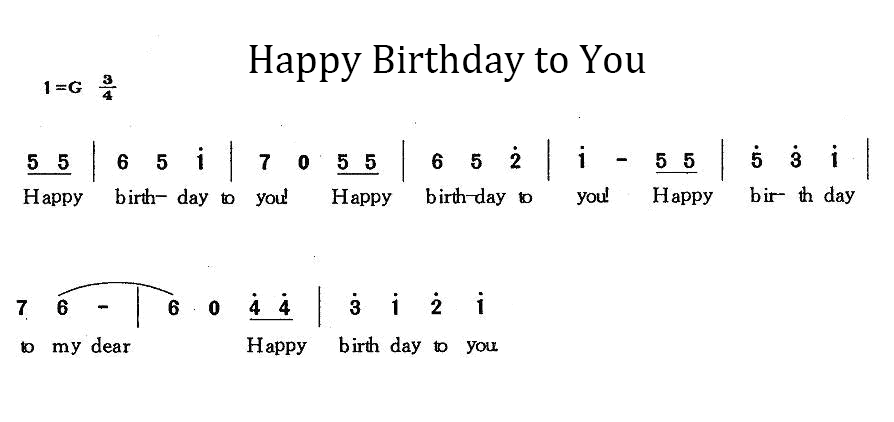

# 3.4 Buzzer

## 3.4.1 Lesson Introduction

Have you ever noticed the microwave "beep" telling you your food is ready, or your alarm clock going "beep beep beep" to wake you up? These sounds are all produced by a small component called a **buzzer**. Just like our mouths can speak, the buzzer is the "little loudspeaker" of the electronic world, dedicated to making sounds to alert us.

Today, we are going to make the ESP32-S3 Pro development board learn to "sing"! We will connect a buzzer module and write simple code to make it emit sounds of different frequencies. You can think of it as teaching your development board how to whistle; as long as you control the rhythm and pitch, it can play simple melodies.

After completing this lesson, you will not only be able to make the buzzer sound, but also control it to produce high and low pitches. Congratulations, you are about to master the magic of making hardware "speak"! Are you ready? Let's get started!

## 3.4.2 Lesson Objectives

*   Correctly connect the buzzer module to the ESP32-S3 Pro development board.
*   Understand what "frequency" is and know how to change the pitch of the sound through code.
*   Write a program to make the buzzer emit a "beep-beep" alarm sound.
*   Write a program to make the buzzer play a simple musical scale (such as Do Re Mi).

## 3.4.3 Lesson Equipment

| Name               | Specification/Model             | Quantity | Notes                                              |
| :----------------- | :------------------------------ | :------- | :------------------------------------------------- |
| Main Control Board | ESP32-S3 Pro Development Board  | 1        | Based on the ESP32-S3 chip                         |
| Expansion Board    | ESP32-S3 Pro Motor Driver Board | 1        | This expansion board has an onboard passive buzzer |
| USB Data Cable     | Type-C                          | 1        | Used for power supply and uploading code           |

## 3.4.4 Lesson Principles

### 3.4.4.1 How Does a Buzzer Make Sound?

Imagine holding a ruler in your hand, pressing it against the edge of a table, and plucking the extended part. The ruler will vibrate and make a "humming" sound. There is a similar metal piece inside a buzzer (a piezoelectric ceramic piece or an electromagnetic coil). When we power the buzzer, the internal metal piece vibrates rapidly, pushing the air, and we hear sound.

### 3.4.4.2 Active vs. Passive: What is the Difference?

Buzzers come in two types: **active** and **passive**. The "source" here does not refer to a power source, but rather an "oscillation source."

*   **Active Buzzer**: Comes with an internal oscillation circuit. As long as you supply power to it (HIGH level), it will continuously emit sound at a fixed frequency (usually a long "beep—" sound). It is very simple, but can only produce one sound.
*   **Passive Buzzer**: Does not have an internal oscillation circuit. If you just supply steady power to it, it will not make a sound; you need to send rapidly changing signals (square waves) to it for it to sound. **The key point: By changing the speed at which the signal changes (frequency), we can control it to produce sounds of different pitches!** Just like playing a piano, pressing different keys produces different pitches.

In this lesson, we use a passive buzzer to let you experience the fun of controlling pitch.

### 3.4.4.3 Programming Logic: The tone() Function

In Arduino/ESP32 programming, there is a very magical function called `tone()`.

*   `tone(pin, frequency)`: This command tells the development board: "Please generate sound waves on the specified pin at a specific frequency (Hz)."
*   **Frequency**: Measured in Hertz (Hz). The larger the value, the faster the vibration, and the sharper/higher the sound (high pitch); the smaller the value, the slower the vibration, and the lower/deeper the sound (low pitch). For example, Middle C (Do) has a frequency of about 262 Hz, while High C is about 523 Hz.

In the ESP32, the `tone()` function relies under the hood on **LEDC (LED Control) timers** to generate PWM (Pulse Width Modulation) signals. When we call `tone(pin, frequency)`, the ESP32 configures the corresponding hardware timer to output a square wave with a 50% duty cycle on the pin at the specified frequency. This square wave signal drives the piezoelectric ceramic or electromagnetic coil inside the buzzer to vibrate, thereby producing sound. When `noTone()` is called, the timer stops outputting, the pin returns to a low level, and the buzzer stops making sound.

## 3.4.5 Wiring Instructions

The passive buzzer used in this experiment is already integrated onto the motor driver board (expansion board), so **no extra buzzer wiring is required**. You only need to ensure that the main control board and the expansion board are correctly plugged together.

To make it easier for everyone to understand, here is the pin assignment and wiring description table related to the buzzer:

| Module Name        | Pin/Interface       | Main Control Board Pin | Description                                                  |
| ------------------ | ------------------- | ---------------------- | ------------------------------------------------------------ |
| Main Control Board | Pin Header Interfac | IO10                   | Align and insert the main control board into the corresponding female header interface on the expansion board |
| Expansion Board    | Onboard Buzzer      | IO10                   | The positive terminal of the buzzer (control end) is connected to the IO10 pin of the ESP32-S3 |
| Expansion Board    | Buzzer GND          | GND                    | The negative terminal of the buzzer is internally connected to the expansion board's GND |

**Precautions:**

1. Please ensure that the main control board is aligned with the expansion board before inserting. Do not insert it backward or misalign it to avoid damaging the pins.
2. The buzzer is powered by the expansion board. Please ensure that the expansion board is powered on (via USB or DC power interface) before conducting the experiment.

## 3.4.6 Example Code

This code will implement two functions: first, make the buzzer sound an alarm-like "beep-beep-beep" sound, and then play a simple "Do-Re-Mi-Fa-Sol-La-Si" scale.

```cpp
// Define the buzzer control pin as IO10
const int buzzerPin = 10; 

// Custom function to play notes, encapsulating sound generation, delay, and stop logic to make the code cleaner
void playNote(int pin, int frequency, int duration) {
  tone(pin, frequency);       // Generate sound at the specified frequency
  delay(duration);            // Sustain for the specified duration
  noTone(pin);                // Stop sound generation
  delay(50);                  // Short pause between notes to make the sound clearer
}

void setup() {
  // Initialize serial communication with a baud rate of 115200 for debugging output
  Serial.begin(115200);
  // Set the buzzer pin to output mode
  pinMode(buzzerPin, OUTPUT);
}

void loop() {
  Serial.println("Playing Alarm...");
  // 1. Alarm stage: Produce short, sharp "beep-beep-beep" sounds
  for (int i = 0; i < 3; i++) {
    playNote(buzzerPin, 1000, 200); // 1000Hz sharp sound, lasting 200ms
    delay(200);                     // Pause for 200ms
  }
  
  // 2. Rest stage
  Serial.println("Resting...");
  delay(1000); // Quiet for 1 second

  Serial.println("Playing Scale...");
  // 3. Music stage: Play the Do-Re-Mi-Fa-Sol-La-Si scale
  playNote(buzzerPin, 262, 500); // Low Do
  playNote(buzzerPin, 294, 500); // Low Re
  playNote(buzzerPin, 330, 500); // Low Mi
  playNote(buzzerPin, 349, 500); // Low Fa
  playNote(buzzerPin, 392, 500); // Low Sol
  playNote(buzzerPin, 440, 500); // Low La
  playNote(buzzerPin, 494, 500); // Low Si
  
  // 4. Long rest before looping
  delay(2000); // Quiet for 2 seconds before restarting
}
```

## 3.4.7 Code Explanation

Let's break down this code to see how it commands the buzzer to "sing".

```cpp
const int buzzerPin = 10;
```

We store the pin number `10` to which the buzzer is connected into the variable `buzzerPin`, and use `const` to define it as a constant. This way, if you change the pin later, you only need to change this one line of numbers instead of searching for a needle in a haystack in your code. Clever, right?

```cpp
tone(buzzerPin, 1000);
```

This is the core magic! The `tone()` function takes two parameters: the first is the pin number, and the second is the frequency. Here we make IO10 output a 1000Hz signal. 1000Hz means vibrating 1000 times per second, which is a relatively sharp sound.

```cpp
noTone(buzzerPin);
```

Where there is a start, there is an end. The `noTone()` function stops the specified pin from outputting a signal, and the buzzer falls silent. If you don't add this line, the buzzer might keep buzzing continuously until you unplug the power or call a new `tone()`.

```cpp
void playNote(int pin, int frequency, int duration) { ... }
```

This is a "utility" function we created ourselves. Because playing each note requires writing three lines of code (`tone`, `delay`, `noTone`), it is too cumbersome. So we packaged it into a function. When you call `playNote(buzzerPin, 262, 500)`, it automatically completes the whole process of "sound-wait-stop" for you. This keeps the main program `loop()` very neat and as easy to read as sheet music.

**Try modifying it:**
If you change the frequency value in `playNote` from 262 to 523, do you think the pitch will go higher or lower? (Answer: It goes higher because the frequency is doubled!)

## 3.4.8 Experimental Results

After successfully uploading the code, please observe and listen carefully:

1.  **Alarm Stage**: You will hear the buzzer emit three short, sharp "Beep! Beep! Beep!" sounds, with a short pause between each sound. This is just like a fire alarm.
2.  **Rest Stage**: After the alarm ends, it will be quiet for about 1 second.
3.  **Music Stage**: Next, the buzzer will emit seven tones in sequence, from low to high: Do, Re, Mi, Fa, Sol, La, and Si. Each note lasts for half a second, sounding like a small piano testing its keys.
4.  **Loop**: After playing the scale, it will be quiet for 2 seconds, and then restart the loop from the alarm sound.

If you hear a continuous long buzzing sound "Beep————" instead of a rhythmic sound, please check whether the code was uploaded successfully, or whether the buzzer module is an active buzzer (active buzzers cannot change pitch via `tone()`, they can only be turned on and off).

Open the Serial Monitor (with the baud rate set to 115200), and you should see text prompts like "Playing Alarm...", "Resting...", and "Playing Scale...", which helps you know where the program is currently running.

## 3.4.9 Extended Tutorial

### 3.4.9.1 Introduction to Extended Tutorial

Now that you have learned how to use the buzzer to produce Do, Re, Mi, Fa, Sol, La, and Si tones, let's use it to play a song! I have decided to play "Happy Birthday".

### 3.4.9.2 Finding Corresponding Tone Frequencies Based on Numbered Musical Notation

**Numbered Musical Notation (Jianpu):**



**Low, Mid, and High Pitch Comparison Chart:**

Compare with the numbered musical notation to find out whether the corresponding tone is a low, middle, or high pitch.


**C Major Notes and Frequencies Comparison Table:**

Use the chart above to identify the low, middle, and high pitches, and then use the numbers along with the low, middle, and high indicators to find the corresponding tone frequency.

|    Note     | Frequency(Hz) |      Note      | Frequency(Hz) |     Note     | Frequency(Hz) |
| :---------: | :-----------: | :------------: | :-----------: | :----------: | :-----------: |
| Flat  1  Do |      262      | Natural  1  Do |      523      | Sharp  1  Do |     1047      |
| Flat  2  Re | 294  | Natural  2  Re | 587  | Sharp  2  Re | 1175 |
| Flat  3  Mi | 330  | Natural  3  Mi | 659  | Sharp  3  Mi | 1319 |
| Flat  4  Fa | 349  | Natural  4  Fa | 698  | Sharp  4  Fa | 1397 |
| Flat  5  So | 392  | Natural  5  So | 784  | Sharp  5  So | 1568 |
| Flat  6  La |      440      | Natural  6  La |      880      | Sharp  6  La |     1760      |
| Flat  7  Si |      494      | Natural  7  Si |      988      | Sharp  7  Si |     1967      |

### 3.4.9.3 Code

```cpp
// Define the buzzer control pin as IO10
const int buzzerPin = 10; 

// Define the note frequency array (including low, medium, and high pitches)
// Indices 0-6 are low notes, 7-13 are medium notes, 14-20 are high notes
int doremi[] = {
  262, 294, 330, 349, 392, 440, 494,       // Low Do to Si 
  523, 587, 659, 698, 784, 880, 988,       // Medium Do to Si
  1047, 1175, 1319, 1397, 1568, 1760, 1967 // High Do to Si
};

// Note indices corresponding to the numbered musical notation of Happy Birthday (position numbers in the array, starting from 1)
int happybirthday[] = {
  5, 5, 6, 5, 8, 7, 
  5, 5, 6, 5, 9, 8, 
  5, 5, 12, 10, 8, 7, 6, 
  11, 11, 10, 8, 9, 8
};   

// Rhythm array, values represent relative note lengths
int meter[] = {
  1, 1, 2, 2, 2, 4, 
  1, 1, 2, 2, 2, 4, 
  1, 1, 2, 2, 2, 2, 2, 
  1, 1, 2, 2, 2, 4
};    

void setup() {
  // Set the buzzer pin to output mode
  pinMode(buzzerPin, OUTPUT); 
}

void loop() {
  // Iterate through the score, array length is 25, indices from 0 to 24
  for (int i = 0; i <= 24; i++) {       
    // Get the frequency of the current note (array index needs to minus 1)
    int frequency = doremi[happybirthday[i] - 1];
    
    // Use the tone() function to output a square wave signal of the specified frequency
    tone(buzzerPin, frequency);
    
    // Calculate the delay time based on the rhythm (base rhythm 200ms)
    delay(meter[i] * 200); 
    
    // Stop sound, prepare to play the next note
    noTone(buzzerPin);
    
    // Add a very short pause between notes to make the rhythm clearer
    delay(20); 
  }
  
  // After playing the whole song, pause for 2 seconds before looping
  delay(2000);
}
```

### 3.4.9.4 Code Results

After uploading the code, the buzzer will play "Happy Birthday" in a loop.

## 3.4.10 FAQ

**Q: The buzzer keeps making a single continuous long beep with no rhythm changes.**

*   **Cause**: You might be using an **active buzzer**, or the code only uses `digitalWrite` instead of `tone()`. An active buzzer has an internal oscillating source; it beeps when powered and stops when unpowered, making it impossible to change pitch.
*   **Solution**: Confirm your module type. If it is a passive buzzer, ensure you use the `tone()` function. If it is an active buzzer, you can only control the "beep" and "stop" rhythm via `digitalWrite(HIGH/LOW)` combined with `delay()`, but you cannot change the pitch.

**Q: No sound.**

*   **Cause**: It could be that you didn't turn on the expansion board switch, or the expansion board is not powered. Since the buzzer is integrated onto the expansion board, its power supply is also handled by the expansion board.
*   **Solution**: Connect an external DC power supply and turn on the expansion board switch, or ensure Type-C power supply is working properly.

**Q: The buzzer doesn't sound after changing pins.**

*   **Cause**: Certain pins on the ESP32-S3 (such as Strapping Pins or pure input pins) may not support hardware PWM output, causing the `tone()` function to fail.
*   **Solution**: Try to use recommended general GPIO pins of the ESP32-S3 (such as IO10, IO11, etc.) to connect the buzzer. If you must change pins, check the ESP32-S3 datasheet to confirm that the pin supports LEDC/PWM output.

**Safety & Operation Tips**:

*   Do not let the buzzer work continuously at maximum volume for a long time to avoid overheating the module.
*   Although the buzzer's working voltage is very low, it is very important to form a good habit of "powering off before wiring or rewiring" to protect your ESP32-S3 Pro development board from accidental short circuits.
*   If you are sensitive to sound, it is recommended to gently cover the buzzer with your hand during the initial experiment, or lower the sound frequency in the code to protect your hearing.