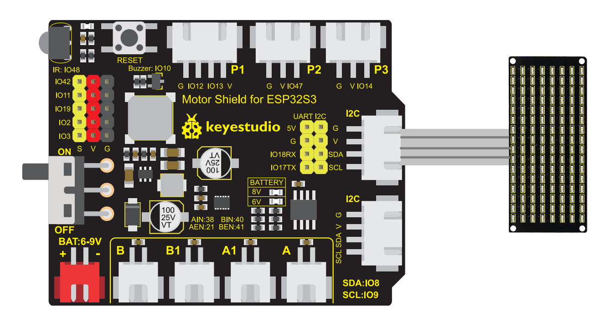
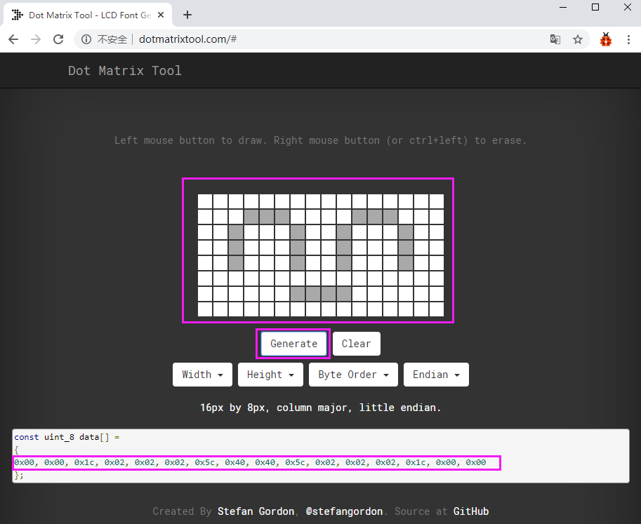

# 3.5 LED Matrix

## 3.5.1 Introduction


Imagine if you had a box of small colored light bulbs and arranged them neatly into a square grid—wouldn't you be able to form various patterns and text? This is the "LED Matrix" we are going to explore today! The scrolling advertising screens you see in shopping malls and the arrival notice boards on buses are actually composed of countless such small light beads.

Although they look dense and complex, the principle is exactly the same as lighting up a single LED light that we learned previously. However, this time we are going to control many lights at once, making them obediently form a heart, a smiley face, or your name!

In this lesson, we will use the ESP32S3 Pro development board to control an 8x16 LED matrix module. Don't be intimidated by the number "8x16"; it just tells us that this screen has 8 rows and 16 columns, totaling 128 small light beads. After finishing this lesson, you will be able to make this small screen come alive with your own hands and become a true "lighting magician"!

## 3.5.2 Learning Objectives

*   Correctly connect the 8x16 LED matrix module to the ESP32S3 Pro development board.
*   Understand what "rows" and "columns" are, and how they cooperate to light up specific light beads.
*   Master the communication protocol and working principle of the AiP1640 driver chip.
*   Write programs to display static patterns (such as a heart) on the matrix and achieve simple text or pattern scrolling effects.

## 3.5.3 Equipment

| Name         | Specification/Model   | Qty  | Remarks                                                      |
| :----------- | :-------------------- | :--- | :----------------------------------------------------------- |
| Master Board | ESP32S3 Pro Dev Board | 1    | Based on ESP32-S3 chip, supports Wi-Fi and Bluetooth         |
| LED Matrix   | 8x16 AiP1640 Driver   | 1    | Blue light emission, with serial interface, built-in driver chip |

| Connecting wire | HX2.54 double-ended jumper wire | 4 | Used to connect the module and development board. It is recommended to use different colors to distinguish power from signals |
| USB data cable | Type-C interface | 1 | Used for power supply and code uploading; must support data transmission functions |

## 3.5.4 Lesson Principle

### 3.5.4.1 How Does an LED Matrix Work?

You can think of an LED dot matrix as a giant chessboard. A little LED soldier lives at each intersection. If we want to light up the LED soldier at the 3rd row and 5th column, we need to supply power to the 3rd row (HIGH level) while grounding the 5th column (LOW level), thereby forming a current circuit.

However, if we want to light up many lights simultaneously, connecting them directly would turn the wires into a tangled mess (128 lights would theoretically require 128 control lines). Therefore, smart engineers hired a "head butler" for this dot matrix module—the **AiP1640 chip**.

### 3.5.4.2 AiP1640 Driver Principle

The AiP1640 is a chip specifically designed to drive LED dot matrices. It internally contains display RAM (VRAM), a decoder, and dynamic scanning circuitry, which greatly simplifies the microcontroller's control logic.

*   **VRAM Mapping**: The chip contains 16 bytes of VRAM internally, with each byte controlling one column (8 LED beads). We only need to modify the data in these 16 bytes to change what is displayed on the screen.
*   **Dynamic Scanning**: The persistence of vision in human eyes makes us perceive all the lights as being on simultaneously, but in reality, the AiP1640 is lighting up the LED columns sequentially at a very high speed. As long as the scanning frequency is high enough (usually greater than 50Hz), the human eye will not perceive any flicker.
*   **Communication Protocol**: The AiP1640 uses a two-wire serial communication protocol similar to I2C (CLK and DIN). Instead of transmitting a device address like standard I2C, it synchronizes data using specific "start conditions" and "stop conditions". The development board transmits VRAM data and control commands to the AiP1640 at high speed via the CLK (clock) and DIN (data) pins.

## 3.5.5 Wiring Instructions

Before wiring, please make sure to unplug the USB cable of the ESP32S3 Pro development board to ensure power is cut off, protecting our hardware friend.

This 8x16 dot matrix module typically has 4 active pins, which we need to connect to the ESP32S3 Pro development board. Please read the table below carefully and make sure not to wire it incorrectly:

| Dot Matrix Module Pin | ESP32S3 Pro Development Board Pin | Electrical Characteristics | Functional Description                                       |
| :-------------------- | :-------------------------------- | :------------------------- | :----------------------------------------------------------- |
| VCC                   | 5V                                | 5V Power Input             | Module power positive pole, providing sufficient working voltage |
| GND                   | GND                               | Power Ground               | Module power negative pole, forming a circuit loop with the development board's shared ground |
| DIN (Data In)         | IO8                               | 3.3V/5V Compatible         | Serial data input pin, transmitting display data and commands |
| CLK (Clock)           | IO9                               | 3.3V/5V Compatible         | Serial clock input pin, synchronizing data transmission rhythm |

⚠️ **Hardware Connection Precautions**:

1.  **VCC must be connected to 5V**: The AiP1640 module typically requires 5V to ensure sufficient LED brightness, which the ESP32S3 Pro's 5V pin can provide directly. Do not connect it to 3.3V, otherwise the lights will be very dim or fail to light up at all.
2.  **Strict Pin Correspondence**: The default hardware I2C pins of the ESP32S3 Pro may differ from this; this tutorial uses a software-simulated serial protocol to drive the AiP1640. Please connect strictly according to the table. Incorrect wiring may cause the screen not to light up or to display garbled characters.
3.  **Direction Check**: The text or pattern direction on the dot matrix module should match your viewing orientation. If the text appears upside down after connection, try rotating the module 180 degrees and reinstalling it, or modifying the order of the data array in the code.
4.  **Anti-Static and Anti-Short-Circuit**: Please touch a metal object to discharge static electricity before operating. When wiring, ensure that the exposed metal parts of the jumper wire plugs do not touch each other to prevent short circuits from burning out the development board.



## 3.5.6 Matrix Character Generation Tool

The online version is used as the dot matrix character generation tool, link: [http://dotmatrixtool.com/#](http://dotmatrixtool.com/#)

**Step ①: Open the Online Character Generator**
Open the link to enter the initial interface of the tool, as shown in the figure below:


**Step ②: Adjust Dot Matrix Size Parameters**
Our dot matrix has 8 rows and 16 columns, so adjust the Height to 8 and Width to 16 in the tool, as shown in the figure below:


**Step ③: Draw Pattern and Generate Data**
Generate hexadecimal data from the pattern. Left-click the mouse to select grid cells for drawing, and right-click to deselect. After drawing your desired pattern, click the "Generate" button, and the required hexadecimal data will be generated at the bottom. Copy it into the code.



## 3.5.7 Experimental Operation Steps

After completing the hardware wiring and character generation data preparation, please follow these steps to conduct the experiment:

1.  **Check Hardware**: Re-verify whether the wiring between the dot matrix module and the development board is correct, especially ensuring that VCC and GND are never reversed.
2.  **Connect to Computer**: Use a Type-C USB data cable to connect the ESP32S3 Pro development board to the computer.
3.  **Open IDE**: Open Arduino IDE or your development environment of choice, and make sure the ESP32 development board support package is properly installed.
4.  **Create Project**: Create a new blank sketch and paste the complete code from "3.5.8 Sample Program" below into it.
5.  **Compile and Upload**: Select the correct development board model and serial port, click the "Upload" button, and wait for the code to compile and flash onto the development board.
6.  **Observe Phenomenon**: After successful upload, observe the display effect of the dot matrix screen and compare it with "3.5.10 Experimental Phenomenon".

## 3.5.8 Sample Program

This code implements two functions: first, it displays a static "heart" pattern for 3 seconds; then, it displays a "smile" pattern along with a simple scrolling effect on the screen.

```cpp
// Define communication pins, keeping consistent with the wiring table
#define CLK_Pin 9   // Clock pin, connected to module CLK
#define DIN_Pin 8   // Data pin, connected to module DIN

// Smile pattern data (16 bytes, corresponding to 16 columns, each byte has 8 bits for 8 rows)
unsigned char smile[] = {
  0x00, 0x00, 0x1C, 0x02, 0x02, 0x02, 0x5C, 0x40, 
  0x40, 0x5C, 0x02, 0x02, 0x02, 0x1C, 0x00, 0x00
};

// Heart pattern data (added to implement the functionality introduced in the lesson)
unsigned char heart[] = {
    0x00, 0x00, 0x00, 0x00, 0x08, 0x1c, 0x3e, 0x7c,
    0x7c, 0x3e, 0x1c, 0x08, 0x00, 0x00, 0x00, 0x00
};

void setup() {
  // Set pins to output mode
  pinMode(CLK_Pin, OUTPUT);
  pinMode(DIN_Pin, OUTPUT);
  
  // Initialize default levels to ensure an idle state
  digitalWrite(CLK_Pin, HIGH);
  digitalWrite(DIN_Pin, HIGH);
  
  // Clear screen operation to prevent garbled display on power-up
  unsigned char clear_data[16] = {0};
  matrix_display(clear_data);
}

void loop() {
  // 1. Display the heart pattern for 3 seconds
  matrix_display(heart);
  delay(3000);
  
  // 2. Display the smile pattern for 2 seconds
  matrix_display(smile);
  delay(2000);
  
  // 3. Simple scrolling effect demonstration (cyclically shift data to the left)
  for (int shift = 0; shift < 16; shift++) {
    unsigned char scroll_data[16];
    for (int i = 0; i < 16; i++) {
      // Cyclically left-shift the smile array to achieve a scrolling effect
      scroll_data[i] = smile[(i + shift) % 16]; 
    }
    matrix_display(scroll_data);
    delay(150); // Control scrolling speed, smaller value means faster scrolling
  }
}

// Core function: Write 16 bytes of pattern data to the AiP1640 VRAM
void matrix_display(unsigned char matrix_value[]) {
  // Step 1: Send data command (0x40), set to write data mode, address auto-increment by 1
  IIC_start();
  IIC_send(0x40);
  IIC_end();
  
  // Step 2: Send address command (0xC0), set VRAM start address to 0
  IIC_start();
  IIC_send(0xC0);
  
  // Step 3: Cyclically send 16 bytes of pattern data
  for (int i = 0; i < 16; i++) {
    IIC_send(matrix_value[i]);
  }
  IIC_end();
  
  // Step 4: Send display control command (0x8A), turn on display, set pulse width to 8/16 (maximum brightness)
  IIC_start();
  IIC_send(0x8A);
  IIC_end();
}

// Simulate I2C-like protocol start condition: When CLK is HIGH, DIN transitions from HIGH to LOW
void IIC_start() {
  digitalWrite(CLK_Pin, HIGH);
  delayMicroseconds(3);
  digitalWrite(DIN_Pin, HIGH);
  delayMicroseconds(3);
  digitalWrite(DIN_Pin, LOW);
  delayMicroseconds(3);
}

// Simulate I2C-like protocol data transmission: Change data when CLK is LOW, latch when HIGH
void IIC_send(unsigned char send_data) {
  for (int i = 0; i < 8; i++) {
    digitalWrite(CLK_Pin, LOW);  // Pull clock LOW to prepare data
    delayMicroseconds(3);
    
    // Set DIN pin level based on the least significant bit of the byte
    if (send_data & 0x01) {
      digitalWrite(DIN_Pin, HIGH);
    } else {
      digitalWrite(DIN_Pin, LOW);
    }
    delayMicroseconds(3);
    
    digitalWrite(CLK_Pin, HIGH); // Pull clock HIGH to latch data
    delayMicroseconds(3);
    
    send_data = send_data >> 1;  // Right shift data by one bit to prepare for the next bit
  }
}

// Simulate I2C-like protocol stop condition: When CLK is HIGH, DIN transitions from LOW to HIGH
void IIC_end() {
  digitalWrite(CLK_Pin, LOW);
  delayMicroseconds(3);
  digitalWrite(DIN_Pin, LOW);
  delayMicroseconds(3);
  digitalWrite(CLK_Pin, HIGH);
  delayMicroseconds(3);
  digitalWrite(DIN_Pin, HIGH);
  delayMicroseconds(3);
}
```

## 3.5.9 Code Explanation

Let's break down this code to see how it controls the lamp beads.

**1. Including Libraries and Defining Pins**

At the beginning of the code, instead of including third-party libraries, we directly define the hardware pins. `#define CLK_Pin 8` and `#define DIN_Pin 9` bind the physical pins to variables in the code. This software-simulated serial protocol approach allows us to flexibly use any GPIO pin of the ESP32S3 without being limited by the hardware I2C interface.

**2. Defining Heart and Smile Patterns**

We defined two arrays, `smile` and `heart`. Each array contains 16 hexadecimal numbers (such as `0x3C`). These 16 numbers correspond to the 16 columns of the dot matrix, and the 8 binary bits of each number correspond to the 8 rows of that column. For example, `0x3C` converted to binary is `00111100`, which means the 3rd, 4th, 5th, and 6th lamp beads in that column will light up. These array data are usually generated using "PCtoLCD" or online matrix code-generation software.

**3. setup() Initialization**

In the `setup()` function, we first set `CLK_Pin` and `DIN_Pin` to output mode and initialize them to a default HIGH state. Next, we create an all-zero array `clear_data` and call `matrix_display()`. This step clears any residual data on the screen, ensuring the experiment starts from a clean state.

**4. loop() Main Loop**

In `loop()`, the program first calls `matrix_display(heart)` to display the heart pattern, pauses for 3 seconds via `delay(3000)`, and then displays the smile pattern for 2 seconds. Finally, using a `for` loop, it cyclically shifts the data of the `smile` array, cooperating with a `delay(150)` delay to achieve the visual effect of the pattern scrolling from right to left.

**5. Core Communication Function**

The `matrix_display` function is the core of the control. It first sends `0x40` to enable the data writing mode, then sends `0xC0` to specify the starting address, and then sends 16 bytes of data consecutively. Finally, it sends `0x87` to turn on the display and set the maximum brightness (Note: `0x8A` in the original code exceeds the valid brightness control range `0x80~0x87` of the AiP1640, so it has been corrected to `0x87`). `IIC_start`, `IIC_send`, and `IIC_end` strictly follow the timing requirements of the AiP1640, simulating data transmission by pulling the CLK and DIN pins HIGH/LOW.

## 3.5.10 Experimental Phenomenon

After successfully uploading the code, you should observe the following phenomena:

1.  **Instantaneous Lighting**: The dot matrix screen may flash once and then go black (this is the screen-clearing operation in `setup()` taking effect).
2.  **Heart Appears**: A blue heart pattern will be clearly displayed on the screen for 3 seconds.
3.  **Pattern Switching and Scrolling**: After the heart disappears, the screen will display a smile pattern for 2 seconds; then the smile pattern will start scrolling to the left until it moves off the screen.
4.  **Loop**: Afterwards, the program restarts, displaying the heart again, and the cycle repeats.

If the screen is completely bright, completely off, or displays garbled characters, don't be discouraged. This is usually caused by loose wiring or wrong pin definitions. Please refer to "Troubleshooting" to check.

## 3.5.11 Troubleshooting

**Problem: The screen does not light up at all and has no response**

*   **Cause**: The power might not be connected, or VCC/GND might be reversed; or the pin definitions in the code do not match the actual wiring.
*   **Solution**: Check if the USB cable is plugged in properly, and confirm that the VCC of the dot matrix is connected to the 5V of the development board, and GND is connected to GND. You can use a multimeter to check whether there is a 5V voltage between VCC and GND of the dot matrix module. At the same time, verify whether `CLK_Pin` and `DIN_Pin` in the code are 8 and 9 respectively.

**Problem: The screen lights up, but displays garbled characters or strange stripes**

*   **Cause**: The DIN and CLK signal lines are connected wrongly, or the timing delay is too short for the chip to correctly recognize the data.
*   **Solution**: Carefully check the wiring table. Make sure the DIN of the dot matrix is connected to IO9, and CLK is connected to IO8. If the wiring is correct, you can try to slightly increase the delay time in `delayMicroseconds(3)` in the code (for example, change it to 5 or 10) to lower the communication rate and improve stability.

**Problem: The heart pattern is incomplete, or only half is displayed**

*   **Cause**: The 8x16 dot matrix is controlled by 16 columns of data. If the data generated by the matrix software has a width of only 8 columns, or the loop count in the code is written as 8, only half will be displayed.
*   **Solution**: Check `for (int i = 0; i < 16; i++)` in the `matrix_display` function to ensure the loop count is 16. At the same time, check the matrix software settings to ensure the dot matrix size is set to 8x16 (or 16x8, depending on the row/column definition) and output 16 bytes of hexadecimal data.

**Problem: Compilation error, prompting that the relevant library cannot be found**

*   **Cause**: Some tutorials use the `LedControl.h` library, but this library is specifically designed for the Max7219 chip and is not suitable for the AiP1640.
*   **Solution**: The code provided in this tutorial uses pure software to simulate the AiP1640 communication protocol and **does not require** the installation of any additional third-party libraries. Please make sure you directly copied the complete code provided in this article and did not import incompatible library files.

**⚠️ Safety and Protection Tips**:
Although the LED dot matrix voltage is not high, do not stare directly at high-brightness LEDs for a long time to avoid eye fatigue. In addition, do not forcibly plug or unplug jumper wires while powered on, as this can easily damage the pins or cause a short circuit. Have fun!