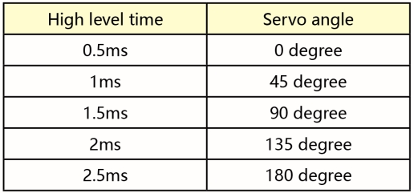
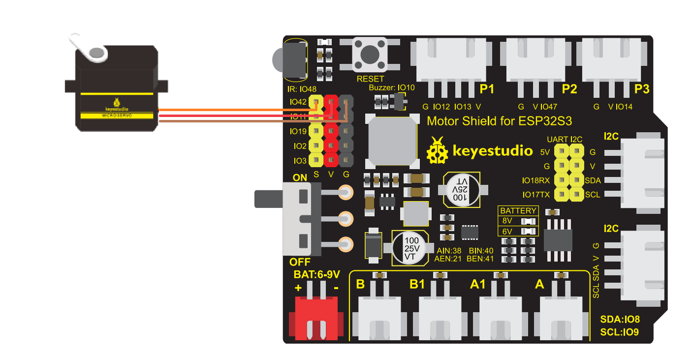

# 3.6 Servo Control

## 3.6.1 Lesson Introduction


Hey, little inventor! Have you ever played with remote-controlled racing cars or robots? When they turn or wave their mechanical arms, are their movements exceptionally precise and obedient? Behind this, there is usually a magical little helper lending a hand—it is the "Servo Motor" we are about to learn about.

If ordinary motors are like fans that only know how to spin desperately, then servos are like obedient "angle housekeepers." You tell it to turn to 90 degrees, and it obediently stops at 90 degrees; you tell it to turn to 180 degrees, and it turns and stops right there. It doesn't keep spinning in circles, but can accurately stop at any position you want.

In this lesson, we will learn how to use the ESP32S3 Pro development board to control this "angle housekeeper." We will write code to make the servo swing left and right like a pendulum, or point in different directions according to your instructions. Once you master this trick, you can make robot arms, automatic watering devices, or smart door locks move when you build them in the future! Ready? Let's get started!

## 3.6.2 Lesson Objectives

After completing this lesson, you will be able to:

*   **Understand Servo Motors**: Know the difference between a servo motor and a ordinary motor, and understand its feature of precise angle control.
*   **Wire Correctly**: Learn how to correctly and safely connect the three wires of the servo (power, ground, signal) to the ESP32S3 Pro development board.
*   **Use Library Functions**: Master how to use the `ESP32Servo` library to control the servo, avoiding writing complex low-level pulse code manually.
*   **Write Swing Programs**: Write a complete control program that allows the servo to turn from 0 degrees to 180 degrees and smoothly return back.

## 3.6.3 Lesson Materials

We need to prepare the following materials, please check your toolbox:

| Component Name         | Specification/Model                                          | Quantity | Remarks and Description                             |
| :--------------------- | :----------------------------------------------------------- | :------- | :-------------------------------------------------- |
| **Main Control Board** | ESP32S3 Pro Development Board                                | 1        | Our core control brain                              |
| **Servo Motor**        | SG90 or MG90S (9g Micro Servo)                               | 1        | Usually an orange or blue small square box          |
| **USB Data Cable**     | Type-C                                                       | 1        | Used for power supply and uploading code            |
| **Jumper Wires**       | Male-to-Female or Female-to-Female (depending on servo interface) | 3        | Used to connect the development board and the servo |

*Note: If your servo is a blue metal gear servo (like the MG90S), the wiring method is the same, except that its torque (strength) is a bit larger.*

## 3.6.4 Lesson Principles

### 3.6.4.1 How Does a Servo Motor Work?

Imagine that inside the servo motor, there lives a very hardworking little worker. This little worker holds a potentiometer in their hand (much like a rotatable volume knob), along with a small motor and a set of reduction gears.

When you tell the ESP32S3 Pro development board via code: "Please turn the servo to 90 degrees!", the development board sends out a special electrical signal (we call it a PWM signal).

**PWM Signal Principle Supplement**:
Specifically, the servo requires a PWM (Pulse Width Modulation) signal with a frequency of 50Hz (i.e., a period of 20 milliseconds). Within this period, the duration for which the signal remains high (the pulse width) determines the target angle of the servo:
* **Pulse width 0.5 ms** -> Corresponds to **0 degrees**

* **Pulse width 1.5 ms** -> Corresponds to **90 degrees** (center position)

* **Pulse width 2.5 ms** -> Corresponds to **180 degrees**

  

  

After receiving the signal, the "little worker" inside the servo compares it with the current position of the potentiometer. If it is currently pointing to 0 degrees, but the command is 90 degrees, the little worker will start the motor to rotate. While turning, they keep their eyes on the potentiometer. As soon as the potentiometer points to the 90-degree position, the little worker will immediately shout "Stop!", and the motor will come to a standstill, holding firmly to this position. Even if you gently try to push it with your hand, it will resist back. This is why a servo can "lock" at a certain angle.


### 3.6.4.2 Key Parameter: Angle Range

The physical rotation range of most common micro servos (such as the SG90) is **0 to 180 degrees**.

*   **0 degrees**: Usually the starting position, with the servo arm tilted to one side.
*   **90 degrees**: The middle position, with the servo arm centered.
*   **180 degrees**: The maximum position, with the servo arm tilted to the other side.

⚠️ **Important Tip**: Never attempt to use code to force the servo to rotate beyond 180 degrees or below 0 degrees (such as turning to 200 degrees). This is like asking a human to twist their arm behind their back to an impossible angle; it will damage the internal gears of the servo, and hearing a "clicking" gear-stripping sound means it is crying out for help!

### 3.6.4.3 Programming Logic: Using the Servo Library

In Arduino or ESP32 programming, if we had to calculate those complex microsecond-level pulse signals ourselves, it would be extremely tedious and error-prone. Fortunately, there is a ready-made toolkit available—the **ESP32Servo library**.

This is much like wanting to eat pizza: you don't need to grow wheat, grind flour, or build an oven yourself; you just need to place an order at a pizza shop. The `ESP32Servo` library is that "pizza shop." It encapsulates the underlying timers and PWM outputs for us, so we only need to call simple commands:

*   `myServo.attach(pin)`: Tells the system which pin the servo is connected to.
*   `myServo.write(angle)`: Tells the servo to rotate to a specific angle.

## 3.6.5 Wiring Instructions

Wiring is where beginners make mistakes most easily, so please check carefully! Servos usually have three wires; their colors may vary, but their functions are the same.

**Overall Concept**:
We need to provide power to the servo (VCC and GND) and give it a command signal (Signal). The GPIO42 pin of the ESP32S3 Pro development board is very well-suited to act as the signal pin.

**Detailed Wiring Table**:

| Servo Wire Color/Label | Function      | ESP32S3 Pro Dev Board Pin | Wiring Precautions                     |
| :--------------------- | :------------ | :------------------------ | :------------------------------------- |
| **Brown** (or Black)   | GND (Ground)  | **GND**                   | Must share a common ground, otherwise signals cannot be recognized and the system will behave erratically |
| **Red**                | VCC (Power)   | **5V**                    | The servo has a high startup current, connecting to 5V provides more power |
| **Orange** (or Yellow/White) | Signal | **GPIO42**                | Data line for sending angle commands; do not misconnect to the power supply |

⚠️ **Special Note**:

1.  **Color Confirmation**: Servo wire colors may vary slightly across different brands. Always remember the general rule: **the dark wire is negative (GND), the middle red wire is positive (VCC), and the remaining light-colored wire is the signal line**.
2.  **Power Selection**: Although the ESP32 also has a 3.3V pin, the servo may lack sufficient torque or experience jitter at 3.3V, so please make sure to connect it to the **5V** pin.
3.  **Check Sequence**: After wiring, do not plug in the USB cable yet. Trace the wires with your finger to confirm that the red wire goes to 5V, the brown wire goes to GND, and the orange wire goes to GPIO42. Power it on only after confirming everything is correct!



## 3.6.6 Example Program

This code will make the servo slowly rotate from 0 degrees to 180 degrees, pause for a moment, and then slowly rotate back from 180 degrees to 0 degrees, repeating this cycle continuously, just like shaking its head to say "no, no, no."

Note that you need to install the `ESP32Servo` library in the Arduino IDE. If it is not installed, an error will be reported indicating that no library named ESP32Servo was found.

```cpp
#include <ESP32Servo.h>  // Include the ESP32 servo control library

Servo myServo;           // Create a servo object named myServo

// Define the pin connected to the servo signal line as GPIO42 (please modify according to actual wiring)
const int SERVO_PIN = 42; 

void setup() {
  // Initialize the servo
  myServo.attach(SERVO_PIN);
  myServo.write(90);        // Initialize the servo angle to 90 degrees
  delay(1000);              // Wait for 1000 milliseconds (1 second) for the servo to stabilize
}

void loop() {
  // Phase 1: Smoothly rotate from 0 degrees to 180 degrees
  for (int angle = 0; angle <= 180; angle += 1) { 
    myServo.write(angle);   // Command the servo to turn to the current angle
    delay(15);              // Wait for 15 milliseconds to give the servo time to move
  }

  delay(1000);              // Pause for 1 second upon reaching 180 degrees

  // Phase 2: Smoothly rotate back from 180 degrees to 0 degrees
  for (int angle = 180; angle >= 0; angle -= 1) { 
    myServo.write(angle);   // Command the servo to turn to the current angle
    delay(15);              // Wait 15 milliseconds as well
  }

  delay(1000);              // Pause for another 1 second after returning to 0 degrees
}
```

## 3.6.7 Code Explanation

Let's break down this code like taking apart a toy to see how it works:

**1. Including the Library and Creating an Object**

```cpp
#include <ESP32Servo.h>
Servo myServo;
```

The first line is "borrowing a tool," telling the compiler that we want to use the ESP32-specific servo library. The second line is "building a robot," where `myServo` is the name we gave to this servo. You can change it to `robotArm` or `headMotor`, as long as the name remains consistent throughout the rest of the code.

**2. Initialization Settings (`setup`)**

```cpp
myServo.attach(servoPin, 500, 2400);
myServo.write(90);
```


`attach()` is like connecting a telephone line, telling the library function which pin the servo is connected to, and setting the upper and lower limits of the pulse width. `write(90)` is for safety: right after power-on, if the servo was originally at 0 degrees, running the program directly might cause it to jerk violently. Having it move to the middle position at 90 degrees first makes the movement much gentler.

**3. The `for` Loop in Loop Control (`loop`)**

```cpp
for (int angle = 0; angle <= 180; angle += 1) { ... }
```

This is a very classic loop structure.

*   `int angle = 0`: At the start, the angle variable is initialized to 0.
*   `angle <= 180`: As long as the angle has not reached 180, continue executing the code inside the loop body.
*   `angle += 1`: After each iteration, the angle increases by 1 degree.

**4. Executing the Action**

```cpp
myServo.write(angle);
delay(15);
```

`write(angle)` is the core command; it converts the current `angle` value into a PWM signal and sends it to the servo. `delay(15)` is crucial! Because physical movement of the servo takes time. Without this delay, the loop would run super fast, instantly sending all commands from 0 to 180, and the servo wouldn't be able to react at all, ultimately only stopping at the final angle. 15 milliseconds is a relatively appropriate speed, making it smooth without being too slow.

**💡 Mini Challenge**: If you change `delay(15)` to `delay(5)`, will the servo rotate faster or slower? (Answer: Faster, because the pause time for each step becomes shorter, and the commands are sent more densely!)

## 3.6.8 Experimental Phenomenon

After successfully uploading the code, observe your servo:

1.  **Initial State**: When the USB cable is just plugged in, the servo might twitch slightly, then quickly rotate to the exact middle position (90 degrees) and stay still for 1 second. This is the code in `setup()` taking effect.
2.  **Clockwise Sweep**: Next, the servo will start to slowly rotate in one direction, from the far left (0 degrees) all the way to the far right (180 degrees). The whole process takes about 3 seconds, with smooth and even movement.
3.  **Pause**: Upon reaching the far right, it will stay there without moving for 1 second.
4.  **Counter-Clockwise Sweep**: Then, the servo will rotate in reverse, slowly turning back from the far right (180 degrees) to the far left (0 degrees).
5.  **Loop**: After returning to the far left, it pauses for another 1 second, and then restarts the next round of swinging.

**How to determine success?**

*   If the servo keeps spinning in circles continuously (spinning past 180 degrees), it means you might have accidentally bought a 360-degree continuous rotation servo, or your wiring/code is incorrect.
*   If the servo makes a buzzing sound without turning, it might be mechanically jammed or the angle has exceeded its physical limits.
*   If the servo swings smoothly left and right, congratulations! You have successfully controlled the hardware's angle! 🎉

## 3.6.9 Troubleshooting

**Problem: The servo keeps twitching, or makes a clicking/grinding sound, but does not rotate.**

*   **Cause**: Usually caused by insufficient power supply. The USB power supply of the ESP32S3 Pro might experience voltage drops when driving a servo, or the servo load is too heavy.
*   **Method**: Check if the red wire is indeed connected to 5V. If it still twitches, try reducing the rotation angle range (e.g., only rotating from 30 degrees to 150 degrees) to avoid the extreme limits at both ends of the servo, where internal resistance is usually highest.

**Problem: The servo only turns in one direction and does not return.**

*   **Cause**: The code logic might be incorrect, or the second `for` loop is not executing.
*   **Method**: Check if the condition of the second `for` loop in the code is `angle >= 0` and the step size is `angle -= 1`. You can also add `Serial.println(angle);` inside the loop and open the Serial Monitor to check if the value of `angle` is decreasing normally.

**Problem: An error occurs during code upload, prompting that `ESP32Servo.h` or `Servo.h` cannot be found.**

*   **Cause**: The ESP32 core libraries usually include related libraries, but if your Arduino IDE version is too old or the ESP32 board package is not installed correctly, it might be missing.
*   **Method**: Make sure you have installed the latest ESP32 support package in the Arduino IDE's "Board Manager". If it still throws an error, search for and install the `ESP32Servo` library via "Tools" -> "Manage Libraries".

**Problem: The servo stops halfway, or the angle is incorrect.**

*   **Cause**: Different brands and batches of servos may have slight differences in the actual physical positions of 0 degrees and 180 degrees (i.e., zero-point drift).
*   **Method**: You can perform software calibration by adjusting the values in `write()`. For example, if you find that the servo is still exerting slight force (making an abnormal noise) at 0 degrees, you can try changing it to `write(5)` as the actual starting point.

## 3.6.10 Safety Tips

*   **Do not force it**: When the servo is powered on and holding a certain angle, do not forcibly bend its horn by hand. This will damage the internal plastic gears or even burn out the motor driver circuit.
*   **Watch out for heat**: If a servo is stalled for a long time (i.e., blocked from turning while remaining powered on), it will heat up rapidly. Once you notice it is hot to the touch, disconnect the power immediately and check.
*   **Power off for wiring changes**: Although low-voltage DC power is relatively safe, developing the good habit of "disconnecting power when wiring, and powering on after checking" will protect your development board from being short-circuited and burned out.

## 3.6.11 Post-Class Extension and Reflection

Awesome! You have mastered the magic of angle control. To consolidate what you've learned, try completing the following mini-challenges:

1.  **Speed Control Challenge**: Modify `delay(15)` in the code, and try letting the servo swing at extremely slow speeds (like a crawling snail) and extremely fast speeds (like lightning). Observe and record the impact of different delay times on the servo's motion state.
2.  **Specific Angle Positioning**: Write a new program to make the servo point to 0°, 45°, 90°, 135°, and 180° sequentially after powering on, staying at each position for 2 seconds, simulating a multi-position selector switch.
3.  **Creative Application**: Try sticking the servo onto a piece of cardboard to make a simple radar scanner, or make a nodding head for a doll! Use your imagination and apply a servo to your next invention!

