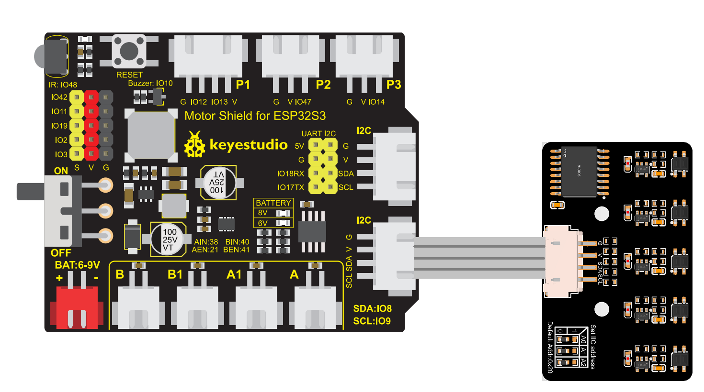

# 3.8 5-Channel Line Tracking Sensor

## 3.8.1 Lesson Introduction


Imagine you are driving a super cool remote-control racing car, but the track is black and surrounded by white. If the racing car goes off track, how does it know to turn back? At this time, we need to equip the racing car with "eyes"! The **5-channel line tracking sensor** we are going to learn today is the robot's "eyes".

This sensor is like a row of neat little detectives, capable of distinguishing whether the ground is black or white. When this row of little detectives finds that the left side has turned black, it knows the car body is leaning to the right and needs to turn left; if it finds that the right side has turned black, it knows the car body is leaning to the left and needs to turn right. With it, your robot can steadily move forward along a drawn black line like a real autonomous driving car!

In this lesson, we will connect this "five-eyed little detective" to the ESP32S3 Pro development board and write code to let it tell us what it sees. After learning this lesson, you have mastered the secret weapon for robots to automatically find their way, bringing you one step closer to making a fully automatic patrol robot. Awesome, let's get started!

## 3.8.2 Lesson Objectives

*   Be able to correctly identify the pins of the IIC 5-channel line tracking sensor and connect them correctly to the ESP32S3 Pro development board.
*   Understand the basic concept of IIC (I2C) communication and know how it allows multiple devices to communicate and exchange data through "addresses".
*   Be able to write code to read sensor data and intuitively view the real-time status of the 5 probes in the Serial Monitor.
*   Be able to determine whether the sensor is working properly by observing serial data, and accurately distinguish between black and white areas.

## 3.8.3 Lesson Equipment

| Component Name     | Specification/Model                 | Quantity | Remarks                                          |
| :----------------- | :---------------------------------- | :------- | :----------------------------------------------- |
| Main Control Board | ESP32S3 Pro Development Board       | 1        | The brain of our robot                           |
| Sensor             | IIC 5-Channel Line Tracking Sensor  | 1        | Module with 5 infrared probes                    |
| Connection Wire    | XH2.54 Double-ended Connection Wire | 1        | Used to connect the sensor and development board |
| Tracking Map       | White paper with black lines        | 1        | Used for line tracking function testing          |

## 3.8.4 Lesson Principles

### 3.8.4.1 How Does the Sensor "See" the Road?

There are 5 small dots at the bottom of this sensor, each hiding an infrared emitting tube and a receiving tube. You can imagine them as 5 miniature flashlights and 5 photosensitive eyes.

*   **When encountering white ground**: White has a strong reflection capability, and the infrared light emitted by the flashlight is reflected back and received by the "eyes". The sensor will then tell the development board: "It is very bright here!" (Outputs a high level or a specific numerical value).
*   **When encountering a black line**: Black absorbs light, the infrared light is absorbed, and almost no light is reflected back, so the "eyes" cannot see it. The sensor will then tell the development board: "It is very dark here!" (Outputs a low level or a specific numerical value).

Because there are 5 such "eyes" arranged in a row, it can see a wider range simultaneously, making it smarter than a single sensor and less likely to lose track.


**Diagram Explanation**: On the left, the white ground reflects light strongly, and the sensor returns a HIGH level; on the right, the black ground absorbs light, and the sensor returns a LOW level, resulting in different signals received by the receiving end.

### 3.8.4.2 What is IIC (I2C) Communication?

In the past, every sensor required several pins on the development board, making the wiring extremely messy. However, this sensor is more advanced; it uses a communication method called **IIC (also known as I2C)**.

IIC is like a dedicated "telephone line." Many different devices (such as thermometers, displays, and sensors) can be connected to this line, but each has its own unique "phone number" (device address). The ESP32S3 Pro development board only needs to dial this number to communicate with the designated sensor.

IIC only requires two wires to work:

*   **SDA (Serial Data Line)**: Responsible for transmitting specific content (e.g., "I see black").
*   **SCL (Serial Clock Line)**: Responsible for controlling the rhythm and ensuring everyone speaks in an orderly manner (like a conductor's baton).


**Diagram Explanation**: The master device (ESP32) communicates bidirectionally with the slave device (sensor) through two wires, SDA and SCL.

### 3.8.4.3 Programming Logic

In the code, we need to do two things:

1.  **Initialize the PCF8574 Library**: This is the toolkit for communication between the PCF8574 chip and the development board via IIC. PCF8574 is an I2C-to-GPIO chip that helps the sensor bundle the states of the 5 probes together.
2.  **Read Data**: Send a request to the sensor's I2C address, and then receive the data it returns. Although we have 5 probes, the data is usually packed into a single byte (8 bits). Using the functions provided by the PCF8574 library, we can extract the states of these 5 probes individually.

## 3.8.5 Wiring Instructions

Before wiring, make sure the ESP32S3 Pro development board is disconnected from computer power to avoid short circuits caused by incorrect wiring.

This IIC 5-channel line-tracking sensor usually has 4 pins: VCC, GND, SDA, and SCL. We connect them correspondingly to the dedicated IIC pins of the ESP32S3 Pro development board. According to the specifications of the ESP32S3 Pro, the default hardware IIC pins are io8 (SDA) and io9 (SCL).

| Sensor Pin | ESP32S3 Pro Development Board Pin | Description |
| :--------- | :-------------------------------- | :---------- |
| VCC | 5V | Positive power supply, provides energy |
| GND | GND | Negative power supply, ground |
| SDA | io8 | Data line, transmits sensor readings |
| SCL | io9 | Clock line, synchronizes communication rhythm |

⚠️ **Special Notes**:

1.  **VCC Connects to 5V**: Although the ESP32 is a 3.3V logic device, most IIC line-tracking modules have internal voltage regulators or level shifters. For such general IIC sensor modules, it is usually recommended to connect to 5V to ensure sufficient infrared emission power. If connecting to 3.3V results in unstable readings, be sure to switch to 5V.
2.  **Do Not Reverse SDA and SCL**: SDA must be connected to io8, and SCL must be connected to io9. Reversing them will not burn out the module, but it will result in a failure to read data.
3.  **Check Connections**: Dupont wires must be plugged in tightly. Loose wires can cause intermittent data or communication failure.



## 3.8.6 Example Code

This code will initialize IIC communication, read data from the sensor every 500 milliseconds, and print it to the serial monitor. You can clearly see the state changes of the 5 probes.

```cpp
#include <Wire.h>       // Include Arduino's built-in I2C (Wire) communication library
#include <PCF8574.h>    // Include the driver library for the PCF8574 I2C expansion chip

// Instantiate the PCF8574 object and set its I2C address to 0x20 (the default address for this module)
PCF8574 pcf8574(0x20);

// Define the output pins for the 5-channel line-tracking sensor, corresponding to P0-P4 of the PCF8574
#define OUTA P4  // Probe A (far left)
#define OUTB P0  // Probe B (left)
#define OUTC P1  // Probe C (middle)
#define OUTD P2  // Probe D (right)
#define OUTE P3  // Probe E (far right)

void setup()
{
    // Initialize serial communication and set the baud rate to 115200
    Serial.begin(115200);
    Serial.println("5-channel line-tracking sensor initialization complete!");

    // Configure the 5 pins of the PCF8574 as input mode to read sensor states
    pcf8574.pinMode(OUTA, INPUT);
    pcf8574.pinMode(OUTB, INPUT);
    pcf8574.pinMode(OUTC, INPUT);
    pcf8574.pinMode(OUTD, INPUT);
    pcf8574.pinMode(OUTE, INPUT);

    // Start I2C communication
    pcf8574.begin();
}

void loop()
{
    // Read the states of the 5 probes sequentially and print them via serial, separated by spaces
    Serial.print(pcf8574.digitalRead(OUTA));
    Serial.print(" ");
    Serial.print(pcf8574.digitalRead(OUTB));
    Serial.print(" ");
    Serial.print(pcf8574.digitalRead(OUTC));
    Serial.print(" ");
    Serial.print(pcf8574.digitalRead(OUTD));
    Serial.print(" ");
    Serial.println(pcf8574.digitalRead(OUTE)); // Print the last probe with println and wrap to a new line

    // Delay for 500 milliseconds to control the data refresh frequency for easy visual observation
    delay(500);
}
```

## 3.8.7 Code Explanation

To help everyone better understand how the code works, we will break it down into the following core parts for a detailed explanation:

1.  **Include Dependency Libraries**:
    *   `#include <Wire.h>`: This is the official underlying I2C communication library provided by Arduino, responsible for handling SDA and SCL timings.
    *   `#include <PCF8574.h>`: This is a third-party driver library for the PCF8574 chip. Because the 5-channel line-tracking sensor uses the PCF8574 chip internally to convert I2C signals into 5 independent GPIO pins, we need this library to operate it.

2.  **Object Instantiation and Pin Definition**:
    *   `PCF8574 pcf8574(0x20);`: Creates an object named `pcf8574` and specifies its I2C address as `0x20`. This is the factory default address of the module.
    *   Macro definitions like `#define OUTA P3`: Map the physical pins (P0~P4) on the PCF8574 chip to easy-to-understand probe names (`OUTA`~`OUTE`) in our code, improving code readability.

3.  **Initialization Settings (`setup` Function)**:
    *   `Serial.begin(115200);`: Starts serial communication, sets the baud rate to 115200, and ensures consistency with the serial monitor settings.

    *   `pcf8574.pinMode(..., INPUT);`: Sets the pins corresponding to the 5 probes to input mode, preparing to receive high and low level signals from the sensors.
    *   `pcf8574.begin();`: Formally starts I2C communication, establishing a connection between the ESP32 and the sensors.

4.  **Main Loop Reading (`loop` function)**:
    *   `pcf8574.digitalRead(OUTx)`: Sends a read command to the sensor via the I2C bus to obtain the level status of the specified pin (1 represents high level/white, 0 represents low level/black, depending on the module design).
    *   `Serial.print` and `Serial.println`: Prints the 5 read status values separated by spaces, with the last value using `println` to start a new line, making it easy to view row by row in the Serial Monitor.
    *   `delay(500);`: Pauses for 500 milliseconds after each read. Without this delay, the serial monitor would refresh instantly, making it impossible to see data changes clearly.

## 3.8.8 Experimental Phenomenon

After uploading the code, open the **Serial Monitor** in the upper right corner of the Arduino IDE and set the baud rate to **115200**.

1.  **Initial State**: You should see the prompt "5-channel line tracking sensor initialization complete!".
2.  **Waving in the Air**: When you wave the sensor in the air, you will see the "raw data" constantly changing, and the binary status sequence consisting of 0s and 1s jumping around. This is because the ambient light is changing, or the lack of a reference object makes the reflected light unstable.
3.  **Black and White Test**:
    *   Prepare a piece of white paper and stick a piece of black electrical tape on it.
    *   Place the sensor vertically above the **white area**: You might see data like `1 1 1 1 1` (all 1s) or `0 0 0 0 0` (all 0s), depending on whether your sensor module outputs 1 or 0 when encountering black.
    *   Move the sensor above the **black tape**: You will find that certain corresponding bits change to the opposite state. For example, if the middle probe (OUTC) is on the black line, the digit in the middle will flip.
4.  **Success Sign**: If you move the sensor and the numbers in the serial monitor change sensitively, congratulations! You have successfully made the ESP32S3 Pro "see" black and white lines! You are a little programmer now!

## 3.8.9 FAQ

**Issue 1: Serial monitor shows "Error: Sensor not detected" or data is all abnormal values**

*   **Cause**: Incorrect wiring, or incorrect sensor I2C address.
*   **Solution**:
    1.  Check whether SDA is connected to io8 and SCL is connected to io9.
    2.  Check whether VCC and GND are reversed.
    3.  Use the `I2C_Scanner` example code from the Arduino IDE's `Wire` library to scan the I2C bus and confirm whether the actual address of the sensor is `0x20`.

**Issue 2: Data remains all 0s or all 1s, and does not change with black and white**

*   **Cause**: The sensor is too far or too close to the ground, or ambient light is too strong causing interference.
*   **Solution**:
    1.  Adjust the sensor height; usually, 1-2 centimeters away from the ground works best.
    2.  Avoid testing under direct sunlight. Strong sunlight contains a lot of infrared rays, which will severely interfere with the sensor.
    3.  Check if the black tape is black enough. Black printed with ordinary printers may have a higher reflectivity. It is recommended to use electrical tape with good light absorption.

**Issue 3: Binary data display is messy and no pattern can be seen**

*   **Cause**: The sensor is moving too fast, or the serial port refreshes too quickly causing visual persistence.
*   **Solution**:
    1.  Move the sensor slowly and steadily.
    2.  You can appropriately increase the `delay(500)` in the code, such as `delay(1000)`, to make the data jump more slowly and facilitate observation.

**Issue 4: Compilation error "Wire.h: No such file or directory"**

*   **Cause**: Arduino IDE version is too old or the ESP32 board support package is not correctly installed.
*   **Solution**: Make sure you are using a newer version of the Arduino IDE and that the ESP32 board support package has been correctly installed in the "Board Manager". `Wire.h` is a built-in library and usually does not require additional installation.    
