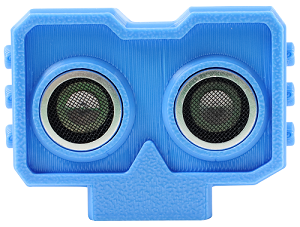
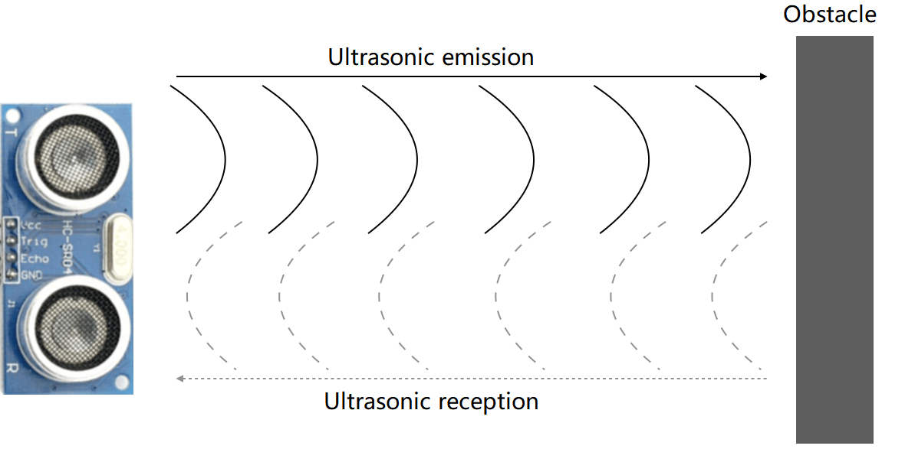
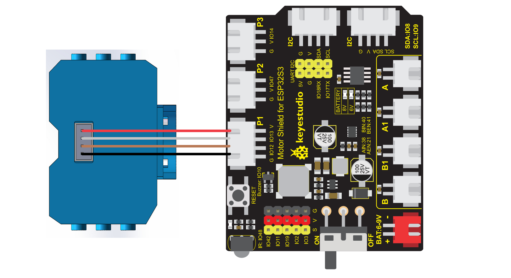

# 4.10 Ultrasonic Sensor

## 4.10.1 Lesson Introduction



Have you ever wondered why bats never crash into walls when flying in the pitch dark? Or how dolphins swim so fast and know where fish schools are ahead? Actually, they all possess a superpower called "echolocation"! They emit a sound we cannot hear, and when the sound bounces back after hitting an object, they can determine the distance of the object.

Today, we are going to equip the ESP32S3 Pro development board (the "brain" of our robot) with such a "super ear" — the HC-SR04 ultrasonic sensor. It acts like a miniature radar, helping us measure the distance of objects ahead. Once you learn this, you can build an "anti-collision car" that stops automatically when it's about to hit a wall, or an "intelligent trash can" that opens its lid automatically when your hand approaches.

Congratulations! After completing this lesson, not only will you master a magical sensor, but you will also learn how to make a machine "see" the world around it. Are you ready? Let's start this journey of exploration!

## 4.10.2 Lesson Objectives

*   Correctly connect the HC-SR04 ultrasonic sensor to the ESP32S3 Pro development board.
*   Understand the basic principles of ultrasonic ranging (transmit-receive-calculate time).
*   Write code to read sensor data and view real-time distance values (in centimeters) in the "Serial Monitor" (a data chat window on the computer).
*   Change the measuring frequency or range by modifying parameters in the code.

## 4.10.3 Lesson Equipment

| Name                  | Specification/Model                 | Quantity | Remarks (Layperson's Explanation)                            |
| :-------------------- | :---------------------------------- | :------- | :----------------------------------------------------------- |
| Main Controller Board | ESP32S3 Pro Development Board       | 1        | The "core brain" of the robot, responsible for thinking and giving orders. |
| Expansion Board       | ESP32S3 Pro Expansion Board         | 1        | The "neural hub" of the brain, featuring many ports for easy wiring. |
| Ultrasonic Sensor     | HC-SR04                             | 1        | Our "super ear", used to measure distance.                   |
| Connection Wire       | XH2.54 Double-Ended Connection Wire | 1        | Also known as "Dupont wire", a cable with plastic connectors on both ends, used to transmit electricity and signals. The anti-reverse insertion design on both ends effectively prevents incorrect wiring from burning out the sensor. |

## 4.10.4 Lesson Principles

### 4.10.4.1 Component Working Principle: "Listening" to Distance Like a Bat

The HC-SR04 ultrasonic sensor looks a bit like two big eyes; actually, they are the "mouth" (transmitter) and the "ear" (receiver).

Its working process is very interesting. We can imagine it as shouting out loud in a valley:

1.  **Transmit**: The "mouth" of the sensor emits a burst of high-frequency sound waves (40kHz, inaudible to human ears), much like you shouting "Hey—".
2.  **Propagation**: The sound wave travels forward in the air until it hits a wall or an object ahead.
3.  **Reflection**: The sound wave bounces back after hitting the object, just like an echo in a valley.
4.  **Receive**: The "ear" of the sensor hears this echo.
5.  **Calculate**: The ESP32S3 Pro development board records the time elapsed from "shouting" to "hearing". Because the speed of sound in air is constant (about 340 meters per second), as long as the time is known, the distance can be calculated!

The formula is simple: Distance = (Speed of Sound × Time) ÷ 2. Why divide by 2? Because the sound makes a round trip (outward journey + return journey), and we only want to know the one-way distance.



### 4.10.4.2 Key Pin Descriptions

**Pin**: The small metal legs extending from the edge of the module, used to connect with wires and transmit electricity or signals.
The HC-SR04 has four pins, each with a specific task:

*   **VCC**: Power positive pole, connects to 5V voltage, supplying power to the sensor (providing energy).
*   **Trig (Trigger)**: Trigger pin. When we give this pin a "high level signal" (i.e., powered state, with voltage), the sensor will emit an ultrasonic wave.
*   **Echo**: Echo pin. When the sensor receives the echo, this pin outputs a "high level signal". The duration of the high level is the time the sound wave takes for the round trip.
*   **GND**: Ground, power negative pole. (Current is like water flow; it flows in from VCC and must flow out from GND to form a complete circuit).

### 4.10.4.3 Programming Logic: The `pulseIn()` Function

In underlying code, we need to use a magical function called `pulseIn()`. Its role is like a precise stopwatch:

*   When a high level (powered state) is detected on the Echo pin, it starts timing.
*   When the high level ends (turns back to low level/unpowered), it stops timing.
*   Finally, it tells us how many microseconds (us, 1 second = 1 million microseconds) the high level lasted.

With this time, we can calculate the distance using mathematical formulas. In our Python code today, this complex timing and calculation process has been encapsulated, and we only need to call ready-made commands directly, which is very convenient, isn't it?

## 4.10.5 Wiring Instructions

Before wiring, **please make sure that the ESP32S3 Pro development board is not connected to the computer USB (i.e., disconnected from power)**. Why do this? Because plugging and unplugging wires while powered on may cause a short circuit and burn out components if you accidentally touch the wrong place. Operating while powered off is the safest habit!

We will use 4 Dupont wires to connect the sensor to the development board. Note that the IO (Input/Output) pins of the ESP32S3 Pro are usually 3.3V logic compatible, but the HC-SR04 requires 5V power. To keep things simple, we follow this standard connection method:

**Wiring Steps and Reasons:**

1.  **Connect VCC to 5V**: Supply 5V power to the sensor so it can work properly.
2.  **Connect GND to GND**: Form a complete current circuit so the current has a way out and back.
3.  **Connect Trig to io13**: Enable the development board to command the sensor to "transmit" ultrasonic waves through this interface.
4.  **Connect Echo to io12**: Enable the development board to "receive" the echo time signal sent back by the sensor through this interface.

| Ultrasonic Sensor Pin | ESP32S3 Pro Development Board Pin | Description                                                  |
| :-------------------- | :-------------------------------- | :----------------------------------------------------------- |
| VCC                   | 5V                                | Provides 5V power. Be careful not to connect it to 3.3V, otherwise it may work unsteadily. |
| Trig                  | io13                              | Trigger signal, controlled by the development board to emit ultrasonic waves. |
| Echo                  | io12                              | Echo signal, the development board reads the high-level duration here. |
| GND                   | GND                               | Ground, forms the circuit loop.                              |

⚠️ **Special Notes**:

1.  **VCC must be connected to 5V**: Although the ESP32 is a 3.3V system, the HC-SR04 module has an internal voltage regulator circuit. It is recommended to connect it directly to the 5V pin of the development board for best performance.
2.  **Do not mix up Trig and Echo**: Trig is input (sent from the development board to the sensor), and Echo is output (sent from the sensor to the development board).
3.  **Check Connections**: Before uploading the code, check the table again to see if every wire is firmly plugged in and the colors match.



## 4.10.6 Sample Program

This code makes the ESP32S3 Pro emit an ultrasonic wave every 1 second, measure the distance of the object in front, and print it out through the serial monitor. If there is no object in front or it exceeds the measurement range, it will prompt "Out of range".

```python
# Import the Keyes_ESP32S3_4WD toolkit from the ESP32S3_4WD_Car file, which contains various functions to control the car
from ESP32S3_4WD_Car import Keyes_ESP32S3_4WD
# Import the time module to pause and delay the program
import time

# Define the pins (telling the program which numbered interface our wires are plugged into)
TRIG_PIN = 13   # Trigger pin (Trig) connected to the IO13 interface of the development board
ECHO_PIN = 12   # Echo pin (Echo) connected to the IO12 interface of the development board

# Create an object named ultrasonic, which is equivalent to activating the sensor function
ultrasonic = Keyes_ESP32S3_4WD()

# Initialize the ultrasonic sensor, telling it that Trig and Echo are connected to pins 13 and 12 respectively
ultrasonic.Ultrasonic_init(TRIG_PIN, ECHO_PIN)

# Main loop: while True means "when the condition is true", since True is always true, the code below will repeat endlessly like a clock
while True:
    # Call the measurement function to make the sensor measure the distance once, and store the result in the distance variable
    distance = ultrasonic.Ultrasonic_measure_distance()

    # Print the measurement result through the serial port (chat window on the computer) with the unit cm (centimeters)
    print("Distance:", distance, "cm")

    # Let the program rest (wait) for 1 second before the next measurement to prevent the data from refreshing too fast for the eyes to see
    time.sleep(1)
```

## 4.10.7 Code Explanation

To help you fully understand this code, we will break it down piece by piece:

1.  **`from ... import ...` and `import time`**:
    This is like taking the required "tools" and "ingredients" out of the cabinet before cooking. We pulled out the special toolkit for controlling the car and the `time` tool used to manage time.
2.  **`TRIG_PIN = 13` and `ECHO_PIN = 12`**:
    This is like "labeling" the pins. The program doesn't know where your wires are plugged in initially, so we tell it: "The trigger wire is plugged into port 13, and the echo wire is plugged into port 12."
3.  **`ultrasonic = Keyes_ESP32S3_4WD()`**:
    This is "waking up" the sensor. We created an assistant named `ultrasonic` and got it ready to work.
4.  **`ultrasonic.Ultrasonic_init(...)`**:
    This is "assigning a task" to the assistant. We tell it: "You are responsible for monitoring interfaces 13 and 12."
5.  **`while True:`**:
    This is an "infinite loop". Without it, the program would finish executing once and then quit. With it, the program will keep measuring tirelessly.
6.  **`distance = ultrasonic.Ultrasonic_measure_distance()`**:
    This is the core action! It tells the assistant to measure the distance once, and the resulting number (such as 15) is placed into the "small box" (variable) called `distance` for storage.
7.  **`print(...)`**:
    This displays the number from the small box onto the computer's serial monitor so you can see it.
8.  **`time.sleep(1)`**:
    This makes the program "sleep" for 1 second. If it didn't sleep, it could measure hundreds of times per second, and the numbers on the screen would flash so fast they'd make your eyes dizzy.

## 4.10.8 Experimental Phenomena

1.  **Upload the Code**: Click the "Run" or "Upload" button in the programming software (such as Thonny or the MicroPython plugin for Arduino IDE) and wait for the progress bar to finish.
2.  **Open the Serial Monitor**: Click the "Serial Monitor" or "REPL" window in the software, and make sure the "Baud rate" in the lower right corner is set to **115200**. (*Fun fact: Baud rate is the speaking speed between the computer and the development board. Both sides must set the same speaking speed, otherwise what the other person says will turn into garbled text*).
3.  **Observe the Data**:
    *   If you place your palm about 10 cm in front of the sensor, you should see a value of around `Distance: 10 cm` displayed on the screen.
    *   Slowly move your palm away from the sensor, and the value will gradually increase.
    *   If there is no object in front (or the object exceeds 3 meters), you may see `Distance: 0 cm` or a large random number. This happens because the sound wave is not reflected back, causing a timeout.
4.  **Success Indicator**: When you move your hand and the numbers on the screen change responsively, it means your "super ears" have been successfully installed! Awesome, you are now a junior programmer!

## 4.10.9 Common Issues, Errors, and Solutions

### Common Errors and Solutions (Beginner's Guide to Avoiding Pitfalls)

**Error 1: After uploading the code, the serial monitor has no response at all**

*   **Cause**: You may have forgotten to click "Save" on the code, or selected the wrong run button.
*   **Solution**: Before uploading or running, make sure to press `Ctrl+S` to save the code. Ensure you click the "Run/Upload" button rather than just "Check/Verify".

**Error 2: The wires are plugged in, but the sensor doesn't respond and the lights don't light up**

*   **Cause**: The Dupont wire is not plugged all the way in, or there is an internal break (poor contact).
*   **Solution**: Unplug the wire and push it back in firmly until you hear a "click" or feel it reach the bottom. If it still doesn't work, try a new Dupont wire.

**Error 3: The serial monitor displays entirely garbled text (like `@#￥%`)**

*   **Cause**: The "baud rate" (speaking speed) between the computer and the development board does not match.
*   **Solution**: Check the settings in the bottom right corner of the serial monitor and change it to **115200**.

### Original FAQ

**Question: The serial monitor displays all 0s or garbled text**

*   Cause: The baud rate setting might be incorrect, or the wiring is loose.
*   Solution: First, check if 115200 is selected in the bottom right corner of the serial monitor. If it still doesn't work, check if VCC is connected to 5V and if GND is properly connected.

**Question: The distance values jump around a lot and are unstable**

*   Cause: Ultrasonic waves are easily absorbed by soft objects (such as clothes, curtains), or there is other ultrasonic interference in the environment.
*   Solution: Try testing against hard, flat surfaces (like walls, books). You can also add a simple filtering algorithm to the code (such as taking the average of 5 measurements), but this is advanced content and beginners can ignore it for now.

**Question: No matter how you move your hand, the distance always shows the same fixed value**

*   Cause: The Trig or Echo pins might be swapped, or the pin numbers in the code are written incorrectly.
*   Solution: Check the wiring table to confirm that Trig is connected to io13 and Echo is connected to io12. Check whether the definitions of `TRIG_PIN` and `ECHO_PIN` in the code match the wiring.

**Question: The sensor gets very hot or even burns your hands**

*   Cause: VCC (positive) and GND (negative) were connected backwards, causing a short circuit!
*   Solution: **Immediately unplug the USB cable to cut off the power!** Check if the red wire is connected to VCC and the black wire is connected to GND. Reapply power only after confirming everything is correct.

### 4.10.10 Safety Tips

*   **Strictly Prevent Short Circuits**: Be very careful when wiring; do not let the metal parts of VCC and GND touch directly, otherwise it will cause a short circuit.
*   **Do Not Look Directly**: Although ultrasonic waves are invisible to the human eye, do not point them close to your ears for long periods of time. Even though the power is very low, keeping good habits is important.
*   **Power-Off Operation**: When modifying wiring, please unplug the USB cable first to protect your ESP32S3 Pro development board and yourself.