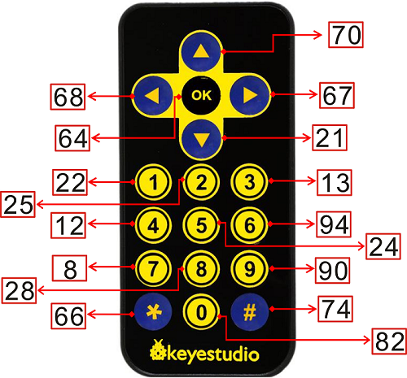

# 4.13 Infrared Remote Control Receiving Sensor

## 4.13.1 Lesson Introduction

Have you ever wondered why when you press a button on your TV remote, the TV can immediately change channels? Or why pressing the air conditioner remote adjusts the temperature? Hidden behind this is actually a magical "invisible messenger"—infrared light! Although our eyes cannot see it, it acts like invisible light, transmitting commands through the air at lightning speed.

Today, we are going to do a super cool experiment: turn the ESP32S3 Pro development board (equivalent to the "core brain" of our project) into a "little ear" that can understand remote controls. We will use an infrared receiving module, connect it to the development board, and then write code to let it read the signals sent by a common TV or air conditioner remote in your hand.

After learning this lesson, you will not only know how a remote control works, but also master a brand new input method. In the future, when you make smart car or smart home projects, you can use old remote controls from home to control them! Doesn't that sound amazing? Hurry up and prepare your materials, let's get started!

## 4.13.2 Lesson Objectives

- Be able to correctly connect the infrared receiving module to the ESP32S3 Pro development board, and accurately distinguish the **VCC** (power positive, equivalent to the water inlet of a water pipe), **GND** (power negative/ground, equivalent to the water outlet of a water pipe), and **Signal OUT** (interface for outputting data, the small metal feet at the edge of the chip or development board used to connect to the outside world) pins.
- Understand the basic principles of infrared communication, knowing that it transmits information by "flashing" invisible light.
- Be able to write a program to read the key values of the infrared remote control, and print the corresponding hexadecimal code (a shorthand way of representing numbers using 0-9 and A-F, which computers love to use and looks shorter) in the serial monitor (the "WeChat chat box" where the computer and development board chat with each other).
- Be able to identify the differences between different buttons based on the printed codes, laying a solid foundation for subsequently controlling other hardware.

## 4.13.3 Lesson Equipment

| Name               | Specification/Model           | Quantity | Remarks                                                      |
| :----------------- | :---------------------------- | :------- | :----------------------------------------------------------- |
| Main Control Board | ESP32S3 Pro Development Board | 1        | The core brain, responsible for data processing and issuing commands |
| Expansion Board    | ESP32S3 Pro Expansion Board   | 1        | An accessory board plugged into the main board; in this experiment, it integrates an infrared receiving sensor |
| Remote Control     | Infrared Remote Control       | 1        | The "starting pistol" that emits infrared signals            |

## 4.13.4 Course Principles

### 4.13.4.1 What is Infrared Light?

Imagine the light emitted by a flashlight is something we can see. However, if there is a light whose frequency is lower than that of red light (with a wavelength longer than red light)—so low that the human eye cannot see it at all—that is infrared light. Although invisible, it truly exists and carries energy and information. There is a small infrared transmitting tube inside the remote control. When you press a button, it blinks at an extremely high speed, emitting specific infrared light pulses (much like using a flashlight to quickly blink out Morse code).

### 4.13.4.2 How Does the Infrared Receiving Module Work?

The infrared receiving module acts like a "sentinel" specially waiting for infrared signals. Its surface features a black window hiding a photosensitive element inside. When the infrared light emitted by the remote control shines onto this window, the internal circuit of the module converts the light signal into an electrical signal.

This module is very clever; it integrates a **preamplifier** (a "small speaker" that amplifies weak signals) and a **bandpass filter** (a "sieve" that allows only specific frequencies to pass) internally, and it is sensitive only to infrared signals of a specific frequency (usually 38kHz, which means blinking 38,000 times per second). This effectively filters out infrared interference from sunlight, fluorescent lamps, or other ambient light. Once it receives the correct 38kHz modulated signal, it **demodulates** (translating the complex code back into the original message) the **baseband signal** (the most primitive code data) and tells the ESP32S3 Pro development board via the signal pin (OUT): "Hey, I've received data!"

### 4.13.4.3 Programming Logic: Detailed Explanation of the NEC Protocol

Infrared remote controls have many "languages" (i.e., **protocols**, agreed-upon secret code rules), and one of the most common is the NEC protocol. You can think of it as Morse code, which uses pulses of different lengths to represent 0 and 1.

A standard NEC protocol infrared frame consists of the following parts:

1. **Lead Code (Start Code)**: 9ms low level + 4.5ms high level, equivalent to a "knock on the door" used to wake up the receiving end.
2. **Address Code**: 8-bit device address (and its 8-bit inverse code for verification). Equivalent to the "recipient's name", ensuring the signal is intended for this device.
3. **Command Code**: 8-bit key data (and its 8-bit inverse code for verification). Equivalent to the "content of the letter", telling you which specific key was pressed. The inverse code is a "review mechanism" set up to prevent misinterpretation.

The ESP32S3 Pro development board needs to use a specialized library (such as `ir_rx` in the code, equivalent to a "dictionary" specially designed to translate secret codes) to "translate" these complex pulse timings and turn them into numerical codes that we can understand (such as the command code `0xA2` or the complete `0xFFA25D`). Thus, when we press "Volume +", the code will clearly tell us which key this is.

## 4.13.5 Hardware Wiring

The infrared receiving sensor is already integrated onto the ESP32S3 motor drive expansion board, requiring no additional wiring. The pin used is `IO48` (metal interface number 48).

## 4.13.6 Remote Control Key Values



*Note: Different brands and models of remote controls may have completely different hexadecimal codes corresponding to their keys (such as `0xFFA25D`). The above figure is for reference only; in actual development, please refer to the code decoded from your actual remote control.*

## 4.13.7 Sample Program

This code will initialize the infrared receiving function and continuously listen for whether a remote control button is pressed. If so, it will print the hexadecimal code of the button in the serial monitor.

**Prerequisites**: Since the code we provide is written in the MicroPython language, you need to ensure that the development board has been flashed with the MicroPython firmware and use a Python editing software like Thonny IDE. At the same time, you need to download the `ir_rx` infrared decoding library file in advance and upload it to the development board via the editing software. This way, the code can find the "dictionary" to translate infrared signals.

```python
# main.py - ESP32-S3 Infrared Reception (NEC Protocol)
# Import the Pin class from the machine module to control the metal interfaces on the development board
from machine import Pin
# Import the NEC_8 class from the ir_rx.nec module, which is a "dictionary" specially used to translate NEC protocol (8-bit address) infrared signals
from ir_rx.nec import NEC_8
# Import the time module to pause or delay the program
import time

# Define a variable IR_RX_PIN with a value of 48. This tells the program: the infrared receiver is plugged into interface number 48
IR_RX_PIN = 48

# Define a "callback function" (which is a backup assistant). When an infrared signal is successfully understood, the program will automatically call it to work
def ir_callback(data, addr, ctrl):
    # data represents "command data" (which key you pressed)
    # addr represents "device address" (whose remote control signal this is)
    # ctrl represents "control flag" (used to determine whether you pressed it briefly or held it down)
    
    # If data is less than 0, it usually means you are holding down the remote control without releasing it (a repeat code is received)
    if data < 0:
        # Print "Holding down..." on the computer screen
        print("Holding down...")
    else:
        # If it is not a long press, print the "key value" you pressed on the computer screen
        print("Key value: ", data)

# Initialize the infrared receiving object (formally hiring this translation assistant)
# Pin(IR_RX_PIN, Pin.IN) means: set interface number 48 to "input mode" (receive signals only, do not send signals)
# ir_callback means: once translation is successful, automatically call the assistant function defined above
ir = NEC_8(Pin(IR_RX_PIN, Pin.IN), ir_callback)

# Print a prompt on the computer screen to let you know that infrared reception is ready
print("Infrared reception started, please press a remote control button...")

# Start an infinite loop (while True) to keep the program running continuously without stopping halfway
while True:
    # Make the program rest for 100 milliseconds (0.1 seconds) each time.
    # Why is a rest needed? Because infrared reception is automatically handled in the background, letting the main program rest slightly saves brain (CPU) processing power
    time.sleep_ms(100)
```

## 4.13.8 Code Analysis

To help you fully understand this code, let's break it down piece by piece:

1. **Preparing Tools (Importing Libraries)**: The first three lines of code are like taking out needed tools from a toolbox. `Pin` is used to control interfaces, `NEC_8` is used to translate NEC protocol infrared signals, and `time` is used to control time.
2. **Designating the Interface (Defining Pins)**: The line `IR_RX_PIN = 48` attaches a label to interface number 48 for convenient subsequent use.
3. **Arranging the Assistant (Defining the Callback Function)**: `def ir_callback(...)` defines a small assistant. We tell it: "Once you understand what the remote control says, print the key value (`data`) on the screen." If it is a long press (`data < 0`), print "Holding down...".
4. **Starting the Translator (Initializing the Object)**: The line `ir = NEC_8(...)` officially assigns the assistant to interface number 48 and sets it to an input-only mode (`Pin.IN`).
5. **Keeping it Running (Main Loop)**: `while True:` is an always-true loop that keeps the program running continuously. Inside it, `time.sleep_ms(100)` makes the program rest for 0.1 seconds per iteration, preventing the brain (CPU) from overworking.

## 4.13.9 Experimental Phenomenon

1. After uploading the code to the development board and running it, open the **Serial Monitor** (chat dialog box) on your computer.
2. You will first see a prompt line: `Infrared reception started, please press a remote control button...`

3. Pick up the remote control, point it at the infrared receiver on the expansion board (the small black window), and press any button.
4. Text such as `Key value:  69` or `Key value:  70` will immediately pop up in the serial monitor (the exact numbers depend on which button you press and the brand of the remote).
5. If you press and hold a button without releasing it, `Holding down...` will be printed continuously on the screen.

## 4.13.10 Common Issues and Troubleshooting

**Issue 1: The serial monitor shows no response, and pressing the remote control produces no output.**

- **Cause**: There might be a wiring error (if using a standalone module), especially if VCC and GND are reversed, or if the OUT pin is incorrectly connected. Alternatively, the remote control battery may be dead.
- **Solution**:
  1. Check the pin definitions on the back of the module, and confirm that VCC is connected to 5V (or 3.3V, depending on the module specifications) and GND is connected to GND.
  2. Point your phone's camera at the transmitter of the remote control and press a button. Check if there is a purple-white light flashing on the phone screen (phone cameras can capture some infrared light) to determine whether the remote control is transmitting properly.
  3. Confirm that the `IR_RX_PIN` variable value in the code is 48, and that if you are using a standalone module, the jumper wire is indeed plugged into the IO48 pin of the development board.

**Issue 2: The printed codes are all 0s or garbled text.**

- **Cause**: There is strong infrared interference in the environment (such as direct sunlight on the module), or the remote control protocol is not supported by the library by default.
- **Solution**:
  1. Cover the infrared receiving module with your hand to avoid direct strong light.
  2. Try replacing it with a remote control of another brand.
  3. Ensure that the latest version of the `ir_rx` library file is installed.

**Issue 3: Compilation error, prompting that the `ir_rx` module cannot be found.**

- **Cause**: You have not uploaded the infrared decoding library files to the development board, or the library file path is not recognized by the programming software.
- **Solution**:
  1. In the programming software (such as Thonny IDE), check whether the `ir_rx` library folder has been successfully imported.
  2. If not, download the MicroPython version of the `ir_rx` library from the internet, and use the software's "Upload to device" feature to upload the entire `ir_rx` folder to the root directory of the development board.
  3. Check the code for spelling errors to ensure that `from ir_rx.nec import NEC_8` is spelled completely correctly.

**Issue 4: Pressing a button once prints multiple lines of different codes.**

- **Cause**: This is a normal decoding process. If you use other versions of code or libraries, it may print the raw data first, followed by the decoded command.
- **Solution**: Pay attention to the line containing the text `按键值:`, which is the stable key value. If you need a cleaner output, you can add judgment logic in the code to filter out non-standard format data. In our current code, only the final key value is printed, making it very clean.

## Precautions and Safety Tips

- **Light Source Protection**: Although infrared light is harmless to the human eye, **never** use a strong light source (such as a laser pointer or strong flashlight) to directly illuminate the receiver at close range, so as not to burn out the internal photosensitive elements.
- **Environmental Interference**: Try to avoid conducting infrared experiments in environments with direct sunlight or a large number of high-frequency fluorescent lights. The infrared noise mixed in these ambient lights will seriously affect the reception sensitivity.