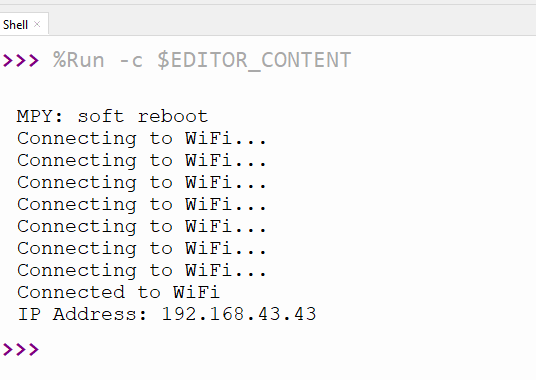

# 4.15 ESP32-S3 Wi-Fi Basics

## 4.15.1 Lesson Introduction

Have you ever wondered why mobile phones can stream cartoons without plugging in any cables, or why the smart speaker in your home can understand what you say? The secret lies in the fact that they are all connected to an invisible network called "Wi-Fi." Today, we are going to teach the ESP32S3 Pro development board in our hands (which can be understood as a microcomputer motherboard) this superpower!

In this lesson, we will no longer just control flashing lights or rotating motors; instead, we will open a door to the internet world. We will learn how to make the development board search for surrounding Wi-Fi signals like a mobile phone, connect to the network, and obtain an IP address (an IP address is like a "house number" for a device in the network world). This is like equipping your development board with a "clairvoyant eye" and a "clairaudient ear," allowing it to perceive and integrate into the surrounding wireless network environment.

After completing this lesson, you will master the core networking skills of the ESP32-S3. Although we won't be sending complex web page data today, this is the starting point for all smart home and remote control projects. Are you ready? Let's wake up the network potential of the development board together!

## 4.15.2 Lesson Objectives

*   Understand what an SSID is (what we usually call the Wi-Fi name), and be able to connect to Wi-Fi or scan all surrounding Wi-Fi hotspots through code.
*   Learn to use the Serial Monitor (a "dialogue window" on the computer used to view information sent back by the development board) to view the IP address assigned after connecting to Wi-Fi.
*   Understand simple web page display code and the working principle of an HTTP server (which can be understood as a "waiter" dedicated to providing web page content to the browser).

## 4.15.3 Lesson Equipment

| Equipment Name     | Specification/Model           | Quantity | Remarks                                             |
| :----------------- | :---------------------------- | :------- | :-------------------------------------------------- |
| Main Control Board | ESP32S3 Pro Development Board | 1        | Core brain, comes with built-in Wi-Fi functionality |
| Data Cable         | Type-C Data Cable             | 1        | Used for power supply and uploading code            |
| Computer           | Windows / Mac                 | 1        | With Arduino IDE and ESP32 drivers installed        |

**Note**: This lesson does not require extra sensors or jumper wires (jumper wires are connection wires with plugs on both ends) because the ESP32S3 Pro development board has a built-in Wi-Fi chip. However, please make sure to **snap the Wi-Fi antenna onto the antenna port of the development board**, otherwise, the network signal will become extremely poor, resulting in failure to connect! We only need a data cable to connect to the computer to start the experiment.

*Why do we need to snap on the antenna?* Because Wi-Fi signals are transmitted and received through the antenna. Not attaching the antenna is like a mobile phone without an antenna—signals cannot be sent out or received, so naturally, it cannot connect to the network.

## 4.15.4 Lesson Principles

### 4.15.4.1 What is Wi-Fi?

Imagine Wi-Fi as an invisible "air post office." In the past, transmitting letters required writing letters, attaching stamps, and dropping them into a mailbox (this is like wired networking, which requires a network cable). Wi-Fi, on the other hand, turns letters into radio waves that fly directly through the air. As long as your device (such as a mobile phone or our development board) is within the coverage area of this "post office" and knows the post office's "secret code" (password), it can send and receive information.

### 4.15.4.2 ESP32-S3 Wi-Fi Capabilities

The ESP32S3 Pro development board we use is very powerful; it has a dedicated wireless communication module built-in. The Arduino IDE (the software where we write code) provides the `<WiFi.h>` library file (a library file is like a "toolbox" written by someone else that we can use directly), which supports configuring and monitoring ESP32's Wi-Fi networking functions. This module supports the 2.4GHz frequency band (currently the most popular home Wi-Fi frequency band), which is the same as most home routers. It can play several roles:

*   **Station Mode (STA Mode / Wi-Fi Client Mode)**: In this mode, the ESP32 acts as a client and connects to an existing Wi-Fi hotspot (AP, i.e., a router), just like a mobile phone connecting to a home router.
*   **AP Mode (Soft-AP Mode / Wi-Fi Hotspot Mode)**: In this mode, the ESP32 itself acts as a hotspot, allowing other Wi-Fi devices (such as mobile phones and computers) to connect to it. It is just like turning on a phone's "Personal Hotspot" for others to use.
*   **AP-STA Coexistence Mode**: The ESP32 acts simultaneously as a Wi-Fi hotspot and as a Wi-Fi device connecting to another Wi-Fi hotspot—"being both the boss and an employee."
*   **Security Mode**: The above modes support multiple security encryption modes (such as WPA, WPA2, and WEP, etc.), which means adding a password lock to Wi-Fi to prevent unauthorized users from piggybacking on your network.
*   **Network Scanning**: Can search for Wi-Fi hotspots (including active and passive scanning), just like opening a mobile phone's Wi-Fi list to see what networks are around.
*   **Promiscuous Mode**: Supports promiscuous mode to monitor IEEE 802.11 Wi-Fi data packets. This is an advanced feature that can "eavesdrop" on all Wi-Fi signals in the air, usually used for professional analysis.

For more Wi-Fi technical details, please refer to the official Espressif documentation: [ESP32 Wi-Fi API Guide](https://docs.espressif.com/projects/esp-idf/en/latest/esp32/api-reference/network/esp_wifi.html)
Espressif Official Website: [https://www.espressif.com.cn/en/home](https://www.espressif.com.cn/en/home)


## 4.15.5 Wi-Fi Connection Example Program

### 4.15.5.1 Introduction

This example sets the Wi-Fi network name (SSID) and password in the code. After uploading the code, the ESP32S3 will attempt to connect to the specified Wi-Fi network and print the assigned IP address via the serial monitor upon successful connection.

### 4.15.5.2 Code

First, you need to ensure that the Wi-Fi connection for the ESP32S3 is correctly configured. You can use the following code to connect your ESP32S3 to Wi-Fi:

*(Note: The following code is written in MicroPython, with comments optimized specifically for beginners)*

```python
# Import the network module, akin to taking out the "Wi-Fi settings" toolbox from a phone, used to manage Wi-Fi connections
import network
# Import the time module, used to pause/wait (delay) execution, much like counting seconds
import time

# Please modify "your_SSID" to your Wi-Fi name (be sure to keep the English double quotes)
SSID = "your_SSID"
# Please modify "your_PASSWORD" to your Wi-Fi password (be sure to keep the English double quotes)
PASSWORD = "your_PASSWORD"

# Create a WLAN (Wireless Local Area Network) object with interface type STA (Station mode, which connects to a router)
wlan = network.WLAN(network.STA_IF)

# Activate the WLAN interface, equivalent to turning on the phone's Wi-Fi switch
wlan.active(True)

# Print a connection prompt message, which will be displayed in the computer's serial monitor
print("Connecting to WiFi...")

# Connect to the specified Wi-Fi network, providing the previously set name and password to the development board
wlan.connect(SSID, PASSWORD)

# Loop to check the Wi-Fi connection status
# If not connected successfully (isconnected() returns False), it will stay in this loop waiting
while not wlan.isconnected():
    # Delay for 1 second, giving the development board a moment to "handshake" with the router
    time.sleep(1)
    # Print a connecting prompt message so you know it is still trying to connect
    print("Connecting to WiFi...")

# Connection successful, exit the waiting loop above, and the program proceeds downwards
print("Connected to WiFi")

# Retrieve network configuration information; ifconfig() returns a tuple containing 4 items: (IP address, subnet mask, gateway, DNS server)
# We only need the first element (index 0), which is the IP address, and store it in the ip_address variable
ip_address = wlan.ifconfig()[0]

# Print the obtained IP address so you can see the development board's "network house number" on your computer
print("IP Address:", ip_address)

```

### 4.15.5.3 Code Explanation

> The core logic of this code is divided into three steps:
>
> 1. **Prepare Tools**: Import the `network` and `time` modules, and set up the Wi-Fi name and password you want to connect to.
> 2. **Attempt Connection**: Turn on the Wi-Fi switch and send a connection request. Since connecting takes time, we use a `while` loop to make the development board check every 1 second whether it is connected; if not, it continues to wait.
> 3. **Get Results**: Once connected, immediately ask the router: "What is my IP address?" and print the result on the screen.

### 4.15.5.4 Experimental Phenomenon

In this code, you need to replace `SSID` and `PASSWORD` with your actual Wi-Fi name and password.

```cpp
# Please modify "your_SSID" to your Wi-Fi name (be sure to keep the English double quotes)
SSID = "your_SSID"
# Please modify "your_PASSWORD" to your Wi-Fi password (be sure to keep the English double quotes)
PASSWORD = "your_PASSWORD"
```

<p style="color:red;">Note: The ESP32 can only connect to 2.4GHz Wi-Fi networks. If your router is on the 5GHz band, it will not be able to connect. Please ensure you are connecting to a 2.4G network.</p>

*Why can it only connect to 2.4G?* Because during the hardware chip design of the ESP32, in order to balance cost and signal penetration, it only supports the 2.4GHz frequency band. Although 5GHz is fast, its wall-penetration capability is weak, and the chip does not support it.

This code will connect to the Wi-Fi network and print the connection status and IP address in the serial monitor.



## 4.15.6 Web Page Display Code

### 4.15.6.1 Introduction

Use the HTTP server library of the ESP32-S3 to provide web services. In the following example, we will create a simple Web server (web page server). When accessing the development board's IP address via a browser, the web page will display "Hello, World".

### 4.15.6.2 Code

```python
# Import the network module to manage Wi-Fi connections
import network
# Import the socket module to create a TCP server (equivalent to establishing a communication channel)
import socket
# Import the time module for delays
import time

# Please replace the following information with your network credentials (your Wi-Fi name and password)
SSID = "your_SSID"          # Change to your Wi-Fi name
PASSWORD = "your_PASSWORD"  # Change to your Wi-Fi password

# Define the HTML page content to be displayed, using triple quotes to preserve multi-line formatting; this is akin to the "letter content" we want to send to the browser
HTML = """<!DOCTYPE html>
<html>
  <head>
    <meta charset="UTF-8">
    <title>ESP32 Web Server</title>
  </head>
  <body>
    <h1>Hello World</h1>
    <p>This is a web page provided by ESP32S3 Pro.</p>
  </body>
</html>
"""

# ==================== Connect to Wi-Fi ====================
# Create a WLAN object with interface type STA (Station mode, i.e., connecting to a router)
wlan = network.WLAN(network.STA_IF)
# Activate the WLAN interface, turning on the Wi-Fi switch
wlan.active(True)
# Connect to the specified Wi-Fi network
wlan.connect(SSID, PASSWORD)

# Print connection prompt
print("Connecting to WiFi...")
# Loop to check connection status until successfully connected
while not wlan.isconnected():
    # Delay for 500 milliseconds (0.5 seconds) to allow faster feedback during the connection process
    time.sleep(0.5)
    # Print a dot to indicate an ongoing connection attempt, without a newline
    print(".", end="")

# Connection successful, print a newline and message
print()
print("WiFi connected")
# Get and print the IP address; ifconfig()[0] extracts the IP address
print("IP Address:", wlan.ifconfig()[0])

# ==================== Start HTTP Server ====================
# Create a TCP socket using IPv4 and TCP protocols, akin to getting a telephone
s = socket.socket(socket.AF_INET, socket.SOCK_STREAM)
# Set address reuse to avoid port occupation after restart, akin to allowing a phone to be called right after hanging up
s.setsockopt(socket.SOL_SOCKET, socket.SO_REUSEADDR, 1)
# Bind to port 80 (the default HTTP port) across all network interfaces. Port 80 is the "default front door" for web access
s.bind(('', 80))
# Start listening with a maximum backlog of 5 connections, akin to waiting by the phone with a maximum queue of 5 people
s.listen(5)

# Print server startup information
print("HTTP server started")

# Main loop to continuously handle client requests. This is an infinite loop that keeps the server running without resting
while True:
    # Wait for a client connection, returning the connection object (conn) and client address (addr), akin to answering a phone call
    conn, addr = s.accept()
    # Print the client address to see who is visiting us
    print("Client connected from", addr)
    try:
        # Receive client request data (up to 1024 bytes), listening to what the other party said over the phone
        request = conn.recv(1024)
        # Construct the HTTP response header, specifying the content type as HTML, encoding as UTF-8, and appending our HTML web content
        response = 'HTTP/1.1 200 OK\r\nContent-Type: text/html; charset=UTF-8\r\nConnection: close\r\n\r\n' + HTML
        # Send the response content encoded in UTF-8, "speaking" the web content to the browser
        conn.send(response.encode('utf-8'))
    except Exception as e:
        # If an exception occurs (e.g., a sudden network drop), print the error message
        print("Error:", e)
    finally:
        # Close the client connection, akin to hanging up the phone and getting ready for the next call
        conn.close()
```

```markdown
### 4.15.6.3 Code Explanation

> Building upon the Wi-Fi connection, this code adds a "web waiter" (an HTTP server):
> 1. **Buy a phone and put up a house number**: Create a communication pipe via `socket` and bind it to port 80 (the default port browsers look for when visiting a webpage).
> 2. **Wait for calls and answer the phone**: Inside the `while True` infinite loop, `listen` and `accept` are responsible for waiting for and answering access requests sent by the browser.
> 3. **Read lines and hang up**: After answering, first listen to the browser's request (`recv`), then combine our pre-written `HTML` webpage content with standard HTTP response headers, send them together to the browser (`send`), and finally close the connection (`close`).

### 4.15.6.4 Code Results

In this code, you need to replace `SSID` and `PASSWORD` with your actual Wi-Fi name and password.

```cpp
# Please replace the following information with your network credentials (your Wi-Fi name and password)
SSID = "your_SSID"          # Change to your Wi-Fi name
PASSWORD = "your_PASSWORD"  # Change to your Wi-Fi password
```

<p style="color:red;">Note: ESP32 can only connect to 2.4GHz Wi-Fi frequencies; it will fail to connect if the frequency is incorrect. Also, when using Wi-Fi features, make sure to attach the antenna, otherwise the network signal will become very poor, causing the webpage to fail to load.</p>

After successfully uploading the code, open the Serial Monitor, and you will see the IP address of the ESP32S3 Pro development board after connecting to Wi-Fi (if you don't see it, press the board's reset button). Use a device on the same local area network as the development board (such as a mobile phone or computer connected to the same Wi-Fi), type this IP address into a web browser, and you will see the webpage display.


## Common Issues (Common Errors and Solutions)

For zero-foundation beginners, these are the most common "pitfalls" encountered when tinkering with Wi-Fi. Don't panic, just look them up and resolve them accordingly:

1.  **Error: The Serial Monitor keeps printing "Connecting to WiFi..." and fails to connect to the internet.**
    *   **Cause 1**: The Wi-Fi name or password was entered incorrectly. *Solution*: Check `SSID` and `PASSWORD` in the code, pay attention to case sensitivity, and make sure there are no extra spaces.
    *   **Cause 2**: Connected to a 5GHz Wi-Fi band. *Solution*: ESP32 only supports 2.4G. Please enable the 2.4G band in your router settings, or use a phone connected to 2.4G Wi-Fi to turn on a "Personal Hotspot" for the development board to connect to.
    *   **Cause 3**: The antenna is not plugged in! *Solution*: Check whether the Wi-Fi antenna on the development board is securely snapped into the antenna connector.

2.  **Error: Connected to Wi-Fi and obtained an IP address, but typing the IP into the browser shows "This site can't be reached".**
    *   **Cause 1**: The phone/computer and the development board are not on the same network. *Solution*: Ensure that the Wi-Fi your computer or phone is connected to is emitted by the same router as the one filled in the development board code.
    *   **Cause 2**: Incorrect IP address entered. *Solution*: Carefully verify the IP address printed in the Serial Monitor (e.g., `192.168.1.105`), ensuring no digits are missed or mistyped.
    *   **Cause 3**: The browser automatically added `https://`. *Solution*: Our simple server does not support encrypted https. Please manually type `http://` followed by your IP address in the browser's address bar, for example, `http://192.168.1.105`.

3.  **Error: Code upload failed, prompting that the board cannot be found.**
    *   **Cause**: The data cable can only charge and cannot transmit data, or the wrong port was selected. *Solution*: Switch to a Type-C cable confirmed to support data transmission; re-select the correct COM port in Arduino IDE under "Tools" -> "Port".

## Safety Tips

*   **Electrical Safety**: When using a data cable to connect the computer and the development board, ensure that the computer's USB port provides stable power. Do not use inferior or damaged data cables to avoid short circuits.
*   **Antenna Plugging Safety**: When attaching or detaching the Wi-Fi antenna, gently pinch the base of the antenna connector and **do not pull directly on the antenna cable**, as this may break the internal fine wires and ruin the antenna.
*   **Anti-Static**: In dry seasons, it is best to touch a metal water pipe or wash your hands before touching the development board to discharge static electricity from your body, preventing static charges from damaging sensitive chips on the board.

Congratulations on completing this lesson! Your development board has now successfully "gone online." Go ahead and try viewing the webpage you wrote in your browser!