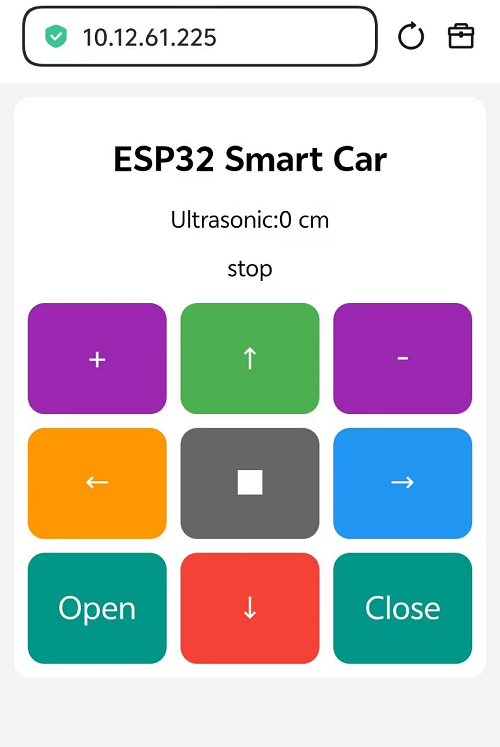

# 4.16 WiFi Controlled Smart Car

## 4.16.1 Lesson Introduction

Hello! Welcome to the super fun smart car lesson! Previously, we learned how to connect the ESP32S3 (the "brain" of our car) to WiFi and implemented a simple webpage display. Next, we will comprehensively upgrade the features to make the car truly "move"!

In this lesson, we will use the ESP32S3 Pro development board as the car's "brain" and leverage its powerful WiFi capabilities to build a dedicated web-based remote control. You don't need to download any complicated apps; just open your phone's browser, enter an address, and you'll see control buttons. When you click "Forward" or "Backward" on the screen, the car will immediately execute the action. Does that sound like magic? Don't worry, follow me step-by-step, and you too can become a "magician"!

## 4.16.2 Lesson Objectives

*   **Implement Remote Control**: Be able to write code to send commands via mobile webpage buttons to control the car's motion state (forward, backward, left turn, right turn, stop).
*   **Extended Peripheral Control**: Learn to control "peripherals" via the webpage (i.e., external devices such as a servo, which you can imagine as the car's "mechanical arm" or "camera gimbal", used to control the opening and closing of a mechanical claw) and read distance data from an ultrasonic sensor (the "eyes" used to measure distance).
*   **Debug Network Issues**: Learn to check the "Serial Monitor" (the window where the computer and development board "chat" to display text messages sent back by the development board) and resolve common WiFi connection failures or webpage access issues.

## 4.16.3 Lesson Equipment

Before getting started, let's take inventory of our "gear." Please make sure the following items are fully prepared:

| Component Name | Specification/Model | Quantity | Notes (Layman's Explanation) |
| :--- | :--- | :--- | :--- |
| Main Control Board | ESP32S3 Pro Development Board | 1 | Core controller with built-in WiFi and Bluetooth, serving as the car's "brain." |
| Expansion Board | ESP32S3 Pro Expansion Board | 1 | The "neural hub" plugged into the main board, integrating motor drives, infrared receivers, and other interfaces for easier wiring. |
| Battery Case | 6-slot AA battery case or 2-slot 18650 case | 1 | Bring your own batteries to power the motors and development board, acting as the car's "energy source." |
| Geared Motor | TT Motor with wheels | 2 | The "legs" that drive the car forward. |
| Ultrasonic Module | HC-SR04 or compatible module | 1 | Used for ranging (optional), emitting and receiving sound waves like a bat to perceive obstacles ahead. |
| Servo | SG90 or MG90S | 1 | Used to control camera angles or mechanical claws (optional), a small motor that can precisely control rotation angles. |
| Car Chassis | Acrylic or metal chassis | 1 | The "skeleton" supporting all electronic components. |

## 4.16.4 Lesson Principles

Before getting our hands dirty, let's understand the underlying principles so we have a clear grasp when writing code.

### 1. WiFi Connection Principle: Equipping the Brain with "Ears"

The ESP32S3 Pro development board has a built-in WiFi chip, which is like equipping the car's brain with a pair of sensitive "ears." When we tell it our home WiFi name (technically called SSID) and password, it sends a request to the router: "Hello, I am ESP32, I want to join your network." After verifying that the password is correct, the router assigns it a unique "house number," which is the **IP address** (for example, `192.168.1.105`). With this IP address, other devices on the same WiFi network (such as your phone) can find it.

### 2. Networking Protocol Explanation: HTTP is a Universal "Language"

In this lesson, we use the **HTTP protocol**. You can think of HTTP as a standard "letter format." When you type the IP address into your phone's browser, your phone acts like a postman, sending a "letter" (request) to the ESP32. Upon receiving the letter, the ESP32 replies with a "letter" (response) containing the webpage content. Because HTTP is the most fundamental language of the internet, any phone, tablet, or computer can understand it without requiring special software installation.

### 3. Application Scenario: The Webpage is the Remote Control

Traditional remote controls require infrared rays and dedicated receivers, which have short ranges and directional limitations. By using a Web Server (a "micro-website host" that provides webpage content), the ESP32S3 Pro transforms into a tiny website host. We write the HTML page in the code (HTML is the "layout language" used to write webpage content, containing elements like buttons), and when a phone visits, the ESP32 sends this page to the phone. When you click a button on the webpage, your phone sends a specific URL (such as `/cmd?move=forward`) back to the ESP32. Detecting this URL, the ESP32 knows you want it to move forward, thereby controlling the motor rotation.


## 4.16.5 Wiring Instructions

Before starting the wiring, **make sure all devices are powered off** (disconnect the battery or USB cable) to prevent short circuits from burning out components. We will focus on connecting the motor driver module, ultrasonic module, and servo to the ESP32S3 Pro development board (or via an expansion board).

> **💡 Terminology Tips**:
> *   **Pin**: Metal interfaces on a chip or module used to connect wires for transmitting signals or electricity.
> *   **GPIO**: General-Purpose Input/Output pins, which are the interfaces on the development board that can be freely programmed and controlled.
> *   **PWM**: Pulse Width Modulation. Popularly speaking, it is "simulating voltage regulation by turning the power supply on and off extremely fast," used to control motor speed or servo angles.
> *   **Common Ground (GND)**: Connecting the negative terminals of all devices together to serve as a shared "zero-potential" reference point. Without a common ground, signals will be like "speaking different languages."

### Detailed Wiring Table

| Module Name | Module Pin | ESP32S3 Pro Pin | Description (Why make this connection) |
| :--- | :--- | :--- | :--- |
| **Left Motor (Channel A)** | Direction Control (AIN) | GPIO 40 | Controls the forward/reverse rotation of the left motor, telling it which way to turn. |
| | Speed Control (AEN) | GPIO 41 | Uses a PWM signal to control the speed of the left motor, determining how fast it spins. |
| **Right Motor (Channel B)** | Direction Control (BIN) | GPIO 38 | Controls the forward/reverse rotation of the right motor. |
| | Speed Control (BEN) | GPIO 21 | Uses a PWM signal to control the speed of the right motor. |
| **Ultrasonic Module** | Trigger Pin (TRIG) | GPIO 12 | Sends out the ultrasonic signal, acting like the mouth "shouting" out a sound. |
| | Echo Pin (ECHO) | GPIO 13 | Receives the reflected ultrasonic signal, acting like the ear "hearing" the echo. |
| **Servo** | Signal Line (Signal) | GPIO 42 | Receives the PWM control signal, telling the servo what angle to turn to. |
| **Power Supply** | Positive (VCC/VM) | Battery Box Positive | Provides power for the motor driver, giving the motors the strength to spin. |
| | Negative (GND) | Battery Box Negative / Board GND | **Must share a common ground**, ensuring consistent signal reference voltage levels, otherwise control signals cannot be recognized. |

> **⚠️ Precautions (Why pay attention to these?)**:
>
> 1. The GND of the motor driver module must be connected to the GND of the ESP32S3 Pro (common ground), otherwise the control signals cannot be recognized. Signals require a reference voltage; if not connected together, both sides will have a different understanding of "0V".
> 2. It is recommended that the servo's power be supplied by the 5V/4.3V pin on the expansion board; if the current is too high, supply power separately. Because servos draw a large instantaneous current when turning, sharing power with the development board may cause unstable voltage and trigger a reboot.

## 4.16.6 Example Code

This code will achieve the following functions: connect to WiFi, start a Web server, and display a control panel on your phone featuring buttons for "Forward," "Backward," "Turn Left," "Turn Right," "Stop," and servo control.

```python
# ==================== Import Modules ====================
# Import the network module to connect to Wi-Fi
import network          
# Import the socket module to create an HTTP server (i.e., a tiny website)
import socket           
# Import the time module to pause the program (delay)
import time             
# Import the car control class and webpage code from our own ESP32S3_4WD_Car file
from ESP32S3_4WD_Car import Keyes_ESP32S3_4WD, INDEX_HTML
#from webpage import INDEX_HTML               # Import webpage content from webpage.py (this line is commented out and not used for now)

# Create a "car" object, equivalent to naming the car 'car', which will be used to control it from now on
car = Keyes_ESP32S3_4WD()

# ==================== WiFi Configuration ====================
# Fill in the name of the WiFi you want to connect to, e.g., "FKS0008"
SSID = "FKS0008"         
# Fill in the password of the WiFi you want to connect to, e.g., "88888888"
PASSWORD = "88888888"   

# ==================== Motor Pin Definitions ====================
# Define the interface number connected to the left wheel direction control as 40
MOTOR_AIN = 40          
# Define the interface number connected to the left wheel speed control as 41
MOTOR_AEN = 41          
# Define the interface number connected to the right wheel direction control as 38
MOTOR_BIN = 38          
# Define the interface number connected to the right wheel speed control as 21
MOTOR_BEN = 21          

# Tell the car the 4 interface numbers defined above to initialize the motors
car.Motor_init(MOTOR_AIN,MOTOR_AEN,MOTOR_BIN,MOTOR_BEN)

# Speed parameter: set the base driving speed of the car, ranging from 0 to 255, set to 220 here
BASE_SPEED = 220  

# ==================== Ultrasonic Pin Definitions ====================
# Define the interface number connected to the ultrasonic trigger signal as 13
TRIG_PIN = 13           
# Define the interface number connected to the ultrasonic echo signal as 12
ECHO_PIN = 12           

# Tell the car the ultrasonic interface numbers to initialize the ultrasonic module
car.Ultrasonic_init(TRIG_PIN,ECHO_PIN)

# ==================== Servo Pin and State ====================
# Define the interface number connected to the servo signal line as 42
SERVO_PIN = 42          

# Tell the car the servo interface number to initialize the servo
car.Servo_init(SERVO_PIN)

# ==================== Command Handling Function ====================
# Define a "handle command" function to execute corresponding actions based on the received move parameter
def handle_cmd(move):
    """Execute corresponding actions based on the move parameter"""
    # If the received command is "forward"
    if move == "forward":
        # Make the car move forward at a speed of 200, 200
        car.forward(200, 200)
    # If the received command is "backward"
    elif move == "backward":
        # Make the car move backward at a speed of 200, 200
        car.back(200, 200)
    # If the received command is "left"
    elif move == "left":
        # Make the car turn left at a speed of 200, 200
        car.left(200, 200)
    # If the received command is "right"
    elif move == "right":
        # Make the car turn right at a speed of 200, 200
        car.right(200, 200)
    # If the received command is "stop"
    elif move == "stop":
        # Stop the motor rotation
        car.stop_motor()
        # Return the servo to the 90-degree middle position when stopping
        car.Servo_set_angle(90)                      
    # If the received command is "servo_plus" (increase servo angle)
    elif move == "servo_plus":
        # Turn the servo to the maximum angle of 180 degrees
        car.Servo_set_angle(180)                     
    # If the received command is "servo_minus" (decrease servo angle)
    elif move == "servo_minus":
        # Turn the servo to the minimum angle of 0 degrees
        car.Servo_set_angle(0)                       
    # If the received command is "claw_open" (open mechanical claw)
    elif move == "claw_open":
        # Turn the servo to 0 degrees to open the mechanical claw
        car.Servo_set_angle(0)                       
    # If the received command is "claw_close" (close mechanical claw)
    elif move == "claw_close":
        # Turn the servo to 180 degrees to close the mechanical claw
        car.Servo_set_angle(180)                     

# ==================== Connect to WiFi ====================
# Create a Wi-Fi Station (STA) interface, meaning the development board acts as a device to connect to a router
wlan = network.WLAN(network.STA_IF)              
# Activate this Wi-Fi interface to make it work
wlan.active(True)                                
# Print a prompt message on the screen telling the user which WiFi is being connected to
print("Connecting to WiFi:", SSID)
# Connect to WiFi using the name and password defined earlier
wlan.connect(SSID, PASSWORD)                     
# Keep looping and waiting as long as it is not successfully connected
while not wlan.isconnected():                    
    # Pause for 0.5 seconds each time to prevent the program from running too fast and freezing
    time.sleep(0.5)
    # Print a dot on the screen indicating that it is trying hard to connect
    print(".", end="")

# Print a newline so that subsequent text appears on the next line
print()
# Print a prompt that connection was successful
print("WiFi connected successfully!")
# Print the IP address acquired by the development board (its house number in the network)
print("IP address:", wlan.ifconfig()[0])

# ==================== Start HTTP Server ====================
# Create a network socket (equivalent to establishing a communication channel) using IPv4 and TCP protocols
s = socket.socket(socket.AF_INET, socket.SOCK_STREAM)
# Set socket options to allow address reuse and prevent errors when restarting the program
s.setsockopt(socket.SOL_SOCKET, socket.SO_REUSEADDR, 1)
# Bind the socket to port 80 (80 is the default port number for web pages)
s.bind(('', 80))                                 
# Start listening, allowing a maximum of 5 devices to connect simultaneously
s.listen(5)                                      
# Print a prompt telling the user that the web server is ready
print("Web server started!")

# ==================== Main Loop ====================
# This is an infinite loop that keeps the server running and constantly waiting for requests from phones
while True:
    try:
        # Wait for a phone connection; once connected, get the connection object conn and the phone address addr
        conn, addr = s.accept()                              
        # Read data sent by the phone from the connection (up to 1024 bytes) and decode it into text
        request = conn.recv(1024).decode('utf-8')            

        # Parse the first line of the request, e.g.: GET /cmd?move=forward HTTP/1.1
        first_line = request.split('\r\n')[0]
        # Split the first line by spaces into multiple parts
        parts = first_line.split(' ')
        # Extract the requested path (e.g., "/" or "/cmd?move=forward")
        path = parts[1] if len(parts) >= 2 else "/"

        # Route matching: If the requested path is the root path (homepage)
        if path == "/" or path == "/index.html":
            # Assemble an HTTP response containing the webpage content (INDEX_HTML)
            response = ('HTTP/1.1 200 OK\r\n'
                        'Content-Type: text/html; charset=UTF-8\r\n'
                        'Connection: close\r\n\r\n' + INDEX_HTML)
            # Encode the response and send it to the phone
            conn.send(response.encode('utf-8'))

        # Route matching: If the requested path is a control command path (starting with /cmd)
        elif path.startswith("/cmd"):
            # Initialize an empty move variable to store the action command
            move = ""
            # If the path contains a question mark (indicating parameters are attached)
            if "?" in path:
                # Extract the parameter part after the question mark
                query = path.split("?", 1)[1]
                # Split parameters by the & symbol and check them one by one
                for param in query.split("&"):
                    # If the parameter starts with "move="
                    if param.startswith("move="):
                        # Extract the specific action (e.g., forward) after "move="
                        move = param.split("=", 1)[1]
            # Call the function defined earlier to execute the extracted action
            handle_cmd(move)
            # Assemble a successful text response telling the phone that the command has been executed
            response = ('HTTP/1.1 200 OK\r\n'
                        'Content-Type: text/plain\r\n'
                        'Connection: close\r\n\r\nOK')
            # Send the response to the phone
            conn.send(response.encode('utf-8'))

        # Route matching: If the requested path is the distance measurement path (/distance)
        elif path == "/distance":
            # Call the ultrasonic module to measure distance and store the result in the dist variable
            dist = car.Ultrasonic_measure_distance()
            # Assemble a text response containing the distance data
            response = ('HTTP/1.1 200 OK\r\n'
                        'Content-Type: text/plain\r\n'
                        'Connection: close\r\n\r\n' + str(dist))
            # Send the response to the phone
            conn.send(response.encode('utf-8'))

        # Route matching: If any other unrecognized path is requested
        else:
            # Assemble a 404 Not Found error response
            response = ('HTTP/1.1 404 Not Found\r\n'
                        'Content-Type: text/plain\r\n'
                        'Connection: close\r\n\r\nNot Found')
            # Send the error response to the phone
            conn.send(response.encode('utf-8'))

    # Catch any errors that occur during the above execution process
    except Exception as e:
        # Print the error message on the screen for troubleshooting
        print("Error:", e)
    # Execute this step finally, regardless of success or failure
    finally:
        # Close this connection, release resources, and get ready for the next connection
        conn.close()

```

## 4.16.7 Code Explanation

To help you better understand the running mechanism of the code, we have divided it into the following core parts for a detailed explanation:

1.  **Module Import and Initialization**: At the very beginning of the program, we "invite" tools such as network and time (importing modules) and assign specific interface numbers (pin definitions) to the smart car, motors, ultrasonic sensor, and servo. This is like getting your tools ready before starting work and telling each tool which part it is responsible for.
2.  **Connecting to WiFi**: Next, the program instructs the development board to connect to your home WiFi. It will keep trying until the connection is successfully established, and then print out the assigned "house number" (IP address). This is a prerequisite for the smart car to receive commands from your phone.
3.  **Starting the HTTP Server**: After connecting to WiFi, the program sets up a "micro-website" on port 80 (the default web port). This website will keep its doors open, waiting for your phone to visit.
4.  **Main Loop and Routing Processing**: This is the core brain of the program. It constantly listens for requests sent by your phone.
    *   If the phone requests the homepage (`/`), it sends a nice control web page to the phone.
    *   If the phone requests a control command (such as `/cmd?move=forward`), it extracts `forward` and passes it to the `handle_cmd` function to execute the corresponding smart car action.
    *   If the phone requests distance measurement (`/distance`), it triggers the ultrasonic distance measurement and sends the result back to the phone.

## 4.16.8 Experimental Results

Now, the exciting moment has arrived! Let's see the effect:

1.  **Monitor**: After uploading the code, open the monitor (Serial Monitor). You will see a string of dots `Connecting to WiFi...`, followed by "WiFi connected successfully!" and a line similar to `IP Address: 192.168.1.105`. **Be sure to write down this IP address!** (Why? Because this is the only credential for your phone to find the smart car; without it, your phone won't be able to find the car.)
2.  **Mobile Access**: Make sure your phone is connected to the **same WiFi network**. (Why? Because the development board and the phone must be in the same "neighborhood" to visit each other.) Open a mobile browser (such as Safari or Chrome), enter the IP address you just wrote down in the address bar, and click go.
3.  **Webpage Display**: You should see a page titled "🚗 My WiFi Smart Car", with five colorful directional buttons and servo/mechanical claw control buttons below.
4.  **Control Test**:
    *   Click "Forward", and both wheels of the smart car should rotate forward simultaneously.
    *   Click "Stop", and the smart car will stop immediately.
    *   Click "Turn Left", the right wheel rotates while the left wheel stops, and the smart car turns to the left.
    *   Click the servo control button to observe whether the servo rotates to the specified angle.
    *   If the smart car's action is reversed (e.g., it moves backward when you click forward), simply swap the corresponding motor direction pin definitions in the code (such as swapping the pin numbers of `MOTOR_AIN` and `MOTOR_BIN`), or physically swap the signal wires on the motor driver module.

That's awesome! You just controlled real hardware with code! Give yourself a round of applause!



## 4.16.9 Common Errors and Solutions

It is normal to encounter minor setbacks on the path of exploration. Here are some frequently encountered problems and their solutions:

**Problem: The serial monitor keeps printing dots and cannot connect to WiFi**

*   **Cause**: Incorrect WiFi name or password, or the WiFi signal is too weak.
*   **Solution**: Check whether `ssid` and `password` in the code are completely correct (pay attention to case and spaces). Make sure the ESP32S3 Pro is close to the router. **Note: ESP32 only supports 2.4GHz WiFi and does not support 5GHz WiFi.** (Many new routers enable 5G by default; remember to turn on the 2.4G band in your router settings.)

**Problem: The mobile browser displays "Cannot access this site" or "Connection timed out"**

*   **Cause**: The phone and the development board are not on the same WiFi network, or AP isolation is enabled on the router, or the phone is using mobile data.
*   **Solution**: Confirm that the WiFi name connected by the phone is exactly the same as the one connected by the development board. Try turning off mobile data on your phone and keep only WiFi. Check the router settings and disable the "AP isolation" function. (AP isolation forbids devices connected to the same WiFi from accessing each other, just like locking the door to every room.)

**Problem: The webpage displays garbled text or weird button styles**

*   **Cause**: Character encoding is not set in the HTML header, or the `webpage.h` file is missing/malformed.
*   **Solution**: Check if `<meta charset="UTF-8">` exists in the code. The sample code already includes this line, so this usually doesn't happen. Ensure that the `webpage.h` file is in the same directory as the `.ino` file.

**Problem: After clicking a button, the smart car doesn't respond, but the webpage is normal**

*   **Cause**: Wiring error, mismatched pin definitions, or motor power is not turned on.
*   **Solution**: Check whether IN1-IN4 of the motor driver module are securely connected to the corresponding GPIOs of the ESP32S3 Pro. Check whether the GND of the motor driver module is connected to the GND of the ESP32S3 Pro (common ground). Check if the battery pack has power. You can use a simple LED to test whether the pins have high/low level outputs.

### 🚨 Common Pitfalls for Beginners (Additional Notes)

1.  **Forgetting to turn on the power**: The code was uploaded successfully and the webpage opened, but the smart car just won't move. Look closely—the battery box switch isn't turned on! Motors require an independent power supply; having power on the development board does not mean the motors have power.
2.  **Remembering the IP address incorrectly**: Every time the development board restarts, the IP address assigned by the router may change. If you could control it before, but suddenly can't, first check if the new IP address in the serial monitor has changed.
3.  **Mobile data interference**: Sometimes when the phone's WiFi signal is poor, it will automatically switch to 4G/5G mobile data. At this point, the phone and the development board are no longer on the same network. It is recommended to temporarily turn off mobile data on your phone during testing.

## Safety Tips

Finally, safety always comes first! Please make sure to follow these rules:

*   **Avoid short circuits**: Be very careful when wiring. Do not let the positive and negative power terminals touch directly, otherwise, it will burn out the development board or the motor driver module. (A short circuit is like connecting a water pipe directly; the current will instantly become extremely large, generating high heat.)
*   **Power supply safety**: Do not use a power supply exceeding 12V to directly power the motor driver module. Never connect high voltages (such as 12V/24V) directly to the GPIO pins of the ESP32S3 Pro, otherwise, it will instantly break down the chip. (The development board pins are very delicate and can only withstand 3.3V.)
*   **Debugging suggestion**: When debugging code and testing motion logic for the first time, it is strongly recommended to prop up the smart car (with the wheels off the ground) to prevent it from suddenly running out of control and causing damage or injury. (Let it do a "virtual drive" in the air first, and once you confirm that the direction and control logic are both fine, put it on the ground to run!)

Congratulations on completing this lesson! You have mastered the core skills of controlling hardware via WiFi. Keep up the good work, there are many more interesting projects waiting for you in the future!
```