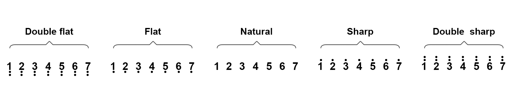

# 4.4 Buzzer

## 4.4.1 Lesson Introduction

Have you ever noticed the "beep" of a microwave telling you your food is ready, or an alarm clock going "beep beep beep" to wake you up? These sounds are all produced by a small component called a **buzzer**. Just like our mouths can speak, a buzzer is the "little loudspeaker" of the electronic world, specifically responsible for making sounds to remind us.

Today, we are going to make the ESP32-S3 Pro development board (your "main control board," which is the brain of the entire circuit) learn how to "sing"! We will connect a buzzer module and write simple code to make it emit sounds of different frequencies (which means the pitch or height of the sound). You can think of this as teaching your development board to whistle; as long as you control the rhythm and tone, it can play simple melodies.

After completing this lesson, you will not only be able to make the buzzer sound, but also control it to emit sounds of varying pitches. Congratulations, you are about to master the magic of making hardware "speak"! Are you ready? Let's get started!

## 4.4.2 Lesson Objectives

*   **Correctly connect the buzzer module to the ESP32-S3 Pro development board**: Learn to recognize hardware interfaces and understand how to connect components to the brain (development board).
*   **Understand what "frequency" is and know how to change the pitch of the sound through code**: Understand the physical essence of sound pitch and learn to control it using code.
*   **Write a program to make the buzzer emit a "beep-beep" alarm sound**: Master the time rhythm for controlling when the sound "turns on" and "stops."
*   **Write a program to make the buzzer play a simple musical scale (such as Do Re Mi)**: Learn to combine different frequencies using code to play real music.

## 4.4.3 Lesson Equipment

| Name               | Specification/Model             | Quantity | Remarks                                                      |
| :----------------- | :------------------------------ | :------- | :----------------------------------------------------------- |
| Main Control Board | ESP32-S3 Pro Development Board  | 1        | Based on the ESP32-S3 chip, this is our "brain" responsible for running code and controlling everything. |
| Expansion Board    | ESP32-S3 Pro Motor Driver Board | 1        | The "deck" plugged underneath the main control board. This expansion board has an onboard passive buzzer, saving us the trouble of wiring. |

## 4.4.4 Lesson Principles

### 4.4.4.1 How Does a Buzzer Make Sound?

Imagine holding a plastic ruler in your hand, pressing it against the edge of a desk, and plucking the protruding part. The ruler will vibrate and make a "humming" sound. Inside a buzzer, there is a similar metal piece (professionally called a piezoelectric ceramic sheet or electromagnetic coil). When we supply power to the buzzer, the internal metal sheet vibrates rapidly, pushing the surrounding air. The air waves travel to our ears, and we hear sound.


*Figure: The vibrating diaphragm inside the buzzer is like a ruler; the faster it vibrates, the higher the pitch of the sound.*

### 4.4.4.2 Active vs. Passive: What's the Difference?

Buzzers are divided into two types: **Active** and **Passive**. Here, "source" does not refer to power supply (electricity), but rather to "oscillation source" (whether it can generate a vibration signal on its own).

*   **Active Buzzer**: Comes with an internal oscillation circuit (equivalent to having a built-in small motor). As long as you power it on (give it a high level, meaning turn on the power), it will continuously emit a sound of a fixed frequency (usually a long "beep—"). It is simple, but can only make one sound, like a silly loudspeaker that only knows how to shout "help."
*   **Passive Buzzer**: Does not have an internal oscillation circuit. If you only supply steady power to it, it will not make a sound; you need to send it rapidly changing electrical signals (professionally called a square wave, which is a signal where the voltage level rapidly switches between "high" and "low"). **The key point is: by changing the speed of signal variation (frequency), we can control it to emit sounds of different pitches!** Just like playing a piano, pressing different keys produces different pitches.

In this lesson, we use a **passive buzzer**, which lets you experience the fun of controlling pitch and playing music.

### 4.4.4.3 Programming Logic

In MicroPython (a simple programming language specially written for hardware), the core programming logic for controlling a passive buzzer to make sound is as follows:

1.  **Pin Initialization**: Configure the GPIO pin connected to the buzzer (the small metal legs protruding from the chip used as interfaces to connect external components) into PWM (Pulse Width Modulation) output mode.
2.  **Frequency Setting**: Depending on the note you want to play, call the PWM object's frequency setting method (such as `.freq()`) to change the frequency of the output square wave (the rapidly changing high and low electrical signal), thereby determining the pitch of the tone.
3.  **Duty Cycle Control**: Call the duty cycle setting method (such as `.duty_u16()`) to set the duty cycle (the ratio of power-on time to total time in one cycle) to 50% (meaning the square wave's high and low level durations are equal). At this time, the buzzer's vibration amplitude is maximized, and the sound is loudest; to mute it, set the duty cycle to 0 (completely powered off).
4.  **Time Control**: Use a delay function (such as `time.sleep_ms()`) to control the duration of each note and the pause time between notes, thereby forming a rhythm.

### 4.4.4.4 Working Principle of `.freq` in PWM

PWM (Pulse Width Modulation) is a technology that simulates continuously varying signals by "switching the power supply" extremely fast. You can imagine flipping a light switch on and off extremely fast; if you flip it fast enough, the human eye will perceive the light as half-bright. In the ESP32-S3 MicroPython environment, the `.freq(hz)` method is used to set the frequency of the PWM signal (measured in Hertz, Hz, where 1 Hertz represents 1 change per second).

*   **Relationship Between Frequency and Pitch**: The pitch of a sound is determined by the frequency of the sound wave. When the value set by `.freq()` is large (such as 1000Hz, vibrating 1000 times per second), the pin voltage flips extremely fast, the piezoelectric ceramic sheet inside the buzzer vibrates at a high frequency, and the resulting sound has a high pitch (sharp); when the set value is small (such as 262Hz), the vibration frequency is low, and the resulting sound has a low pitch (deep).
*   **Relationship Between Frequency and Volume**: It should be noted that `.freq()` only changes the pitch, not the volume. Volume is determined by the Duty Cycle. Usually, when the duty cycle is set to 50% (32768 under 16-bit resolution), the buzzer receives the most balanced energy and sounds the loudest.

## 4.4.5 Wiring Instructions

The passive buzzer used in this experiment is already integrated on the motor driver board (expansion board), so **no extra buzzer wiring is required**. You only need to ensure that the main control board and expansion board are plugged together correctly. Why is it designed this way? Because the expansion board acts like a "base," helping you pre-wire complex connections in advance, greatly reducing the risk of beginners miswiring.

For ease of understanding, the following is the pin assignment and wiring description table related to the buzzer:

| Module Name        | Pin/Interface        | Main Control Board Pin | Remarks                                                      |
| :----------------- | :------------------- | :--------------------- | :----------------------------------------------------------- |
| Main Control Board | Pin Header Interface | -                      | Align and plug the main control board into the corresponding female header interface of the expansion board (pin headers are protruding pins, female headers are recessed holes; they lock together like a puzzle to transmit signals). |
| Expansion Board    | Onboard Buzzer       | IO10                   | The onboard buzzer of the expansion board is fixedly connected to the IO10 pin of the ESP32-S3 (IO10 means input/output interface number 10). |

**Precautions:**

1.  Make sure the main control board and expansion board are aligned before plugging them in. Do not plug them in backward or out of alignment to avoid damaging the pins (small metal legs).
2.  The buzzer is powered by the expansion board. Please ensure that the expansion board is powered on before the experiment (via USB or DC power interface), otherwise it will not have the energy to make sound.

## 4.4.6 Example Program

This code will achieve two functions: first, make the buzzer emit a "beep-beep-beep" alarm-like sound, and then play a simple "Do-Re-Mi-Fa-Sol-La-Si" musical scale.

```python
# Import the "control toolbox" written specifically for this car development board, which encapsulates ready-made commands for controlling hardware such as the buzzer
from ESP32S3_4WD_Car import Keyes_ESP32S3_4WD
# Import the "time" toolbox, used to make the program wait (delay) to control the rhythm of the sound
import time

# Create an object named car, which is equivalent to waking up our development board car, ready to receive commands
car = Keyes_ESP32S3_4WD()

# Define a variable buzzer_pin, telling the program that the buzzer is connected to pin number 10 (IO10)
buzzer_pin = 10

# Initialize the onboard buzzer, preparing the development board to send control signals to the buzzer through pin 10
car.Buzzer_init(buzzer_pin)

# Start an infinite loop, making the code below repeat continuously until you manually stop the program
while True:
    
    # Print a prompt line of text "Playing Alarm..." on the computer, making it easy for you to know which step the program is running
    print("Playing Alarm...")
    # 1. Alarm stage: emit a short, sharp "beep-beep-beep" sound
    # Use a for loop to make i go from 0 to 2, executing a total of 3 iterations
    for i in range(3):
        # Call the play command: set frequency to 1000Hz (sharp sound), continuous sound duration 200 milliseconds (0.2 seconds)
        car.Buzzer_play(1000, 200)
        # Pause the program for 200 milliseconds to form the pause interval between "beeps"
        time.sleep_ms(200)

    # 2. Rest stage
    # Print the prompt text "Resting..." on the computer, indicating that the alarm has ended and rest begins
    print("Resting...")
    # Pause the program quietly for 1000 milliseconds (which is 1 second); during this time, the buzzer does not sound
    time.sleep_ms(1000)

    # 3. Music stage: play the Do-Re-Mi-Fa-Sol-La-Si scale
    # Print the prompt text "Playing Scale..." on the computer, indicating the start of playing the scale
    print("Playing Scale...")
    # Call the ready-made function to play low Do (frequency about 262Hz)
    car.Buzzer_play_Do()  # Low Do
    # Call the ready-made function to play low Re (frequency about 294Hz)
    car.Buzzer_play_Re()  # Low Re
    # Call the ready-made function to play low Mi (frequency about 330Hz)
    car.Buzzer_play_Mi()  # Low Mi
    # Call the ready-made function to play low Fa (frequency about 349Hz)
    car.Buzzer_play_Fa()  # Low Fa
    # Call the ready-made function to play low Sol (frequency about 392Hz)
    car.Buzzer_play_Sol() # Low Sol
    # Call the ready-made function to play low La (frequency about 440Hz)
    car.Buzzer_play_La()  # Low La
    # Call the ready-made function to play low Si (frequency about 494Hz)
    car.Buzzer_play_Si()  # Low Si

    # 4. Long rest before looping
    # Pause the program quietly for 2000 milliseconds (which is 2 seconds), preparing to restart the next round of the loop
    time.sleep_ms(2000)
```

## 4.4.7 Code Explanation

To help you better understand the above code, let's break down the key parts in detail:

1.  **Import Modules**: Import the `ESP32S3_4WD_Car` module, which contains the "shortcuts" written by the manufacturer for controlling the buzzer; import the `time` module for precise time delays (to give the sound rhythm).
2.  **Hardware Initialization**: Define the buzzer pin as IO10 and call `Buzzer_init` to create the control object. Initially, the duty cycle is set to 0 internally to ensure the buzzer won't accidentally make a sound and startle you when the program first boots up.
3.  **Encapsulated Playback Function**: In the underlying library, the manufacturer has already packaged complex operations like "setting frequency, setting duty cycle, and delaying" into a function called `Buzzer_play`. We only need to tell it the "pitch (frequency)" and "duration," and it will automatically generate the sound for us, greatly simplifying the code. This is what we call "standing on the shoulders of giants."
4.  **Main Loop Logic**:
    *   **Alarm Stage**: Loop 3 times, playing a high-frequency sound of 1000Hz for 200ms each time, followed by a 200ms pause, simulating a rapid alarm sound.
    *   **Rest Stage**: Mute for 1000ms (1 second).
    *   **Music Stage**: Sequentially call `Buzzer_play_XX` to play the 7 standard frequencies of the C major scale (Do to Si), with the duration of each note automatically controlled by the library function (usually about 500ms).
    *   **Long Rest**: After muting for 2000ms (2 seconds), because of the `while True` loop, the program returns to the beginning and restarts the next round of the loop.

## 4.4.8 Experimental Phenomena

After successfully uploading the code, please carefully observe and listen:

1.  **Alarm Stage**: You will hear the buzzer make three short, sharp "Beep! Beep! Beep!" sounds, with a brief pause between each sound. This is just like a fire alarm.
2.  **Rest Stage**: After the alarm ends, it will be quiet for about 1 second.
3.  **Music Stage**: Next, the buzzer will emit seven tones in sequence, from low to high: Do, Re, Mi, Fa, Sol, La, Si. Each note lasts for about half a second, sounding like a small piano testing its keys.
4.  **Loop**: After playing the scale, it will be quiet for 2 seconds, and then loop again starting from the alarm sound.

If you hear a continuous long sound "Beep————" instead of a rhythmic sound, please check whether the code was uploaded successfully or whether the buzzer module is an active buzzer (active buzzers cannot change their pitch by changing the PWM frequency; they can only be turned on and off).

## 4.4.9 Extended Tutorial

### 4.4.9.1 Introduction to the Extended Tutorial

Now that you've learned how to use the buzzer to play the Do, Re, Mi, Fa, Sol, La, Si pitches, let's use it to play a song! I've decided to play "Happy Birthday". Ready to give your friends a surprise?

### 4.4.9.2 Finding Corresponding Pitch Frequencies from Numbered Musical Notation

**Numbered Musical Notation:**


**Low, Medium, and High Pitch Comparison Chart:**

Compare with the numbered notation to figure out whether the corresponding pitch is a low, medium, or high note? (In numbered notation, there are small dots above or below the numbers: dots below indicate low pitch, no dots indicate medium pitch, and dots above indicate high pitch).



**C Major Note and Frequency Comparison Table:**

Find the low, medium, and high pitches by referring to the chart above, and then find the corresponding pitch frequencies using the numbers along with their low, medium, or high status.

|    Note     | Frequency(Hz) |      Note      | Frequency(Hz) |     Note     | Frequency(Hz) |
| :---------: | :-----------: | :------------: | :-----------: | :----------: | :-----------: |
| Flat  1  Do |      262      | Natural  1  Do |      523      | Sharp  1  Do |     1047      |
| Flat  2  Re |      294      | Natural  2  Re |      587      | Sharp  2  Re |     1175      |
| Flat  3  Mi |      330      | Natural  3  Mi |      659      | Sharp  3  Mi |     1319      |
| Flat  4  Fa |      349      | Natural  4  Fa |      698      | Sharp  4  Fa |     1397      |
| Flat  5  So |      392      | Natural  5  So |      784      | Sharp  5  So |     1568      |
| Flat  6  La |      440      | Natural  6  La |      880      | Sharp  6  La |     1760      |
| Flat  7  Si |      494      | Natural  7  Si |      988      | Sharp  7  Si |     1967      |

### 4.4.9.3 Code

```python
# Import the "control toolbox" written specifically for this car development board
from ESP32S3_4WD_Car import Keyes_ESP32S3_4WD
# Import the "time" toolbox for delays
import time

# Create an object named car to wake up the development board
car = Keyes_ESP32S3_4WD()

# Define the buzzer control pin as IO10, because the buzzer is soldered to this pin
BUZZER_PIN = 10

# Initialize the onboard buzzer, preparing pin 10 to output control signals
car.Buzzer_init(BUZZER_PIN)


# Define a list (which can be thought of as a row of boxes) containing the note indices for "Happy Birthday"
# Numbers represent Do=1, Re=2, Mi=3... These numbers correspond to the preset scale positions in the underlying library
HAPPY_BIRTHDAY = [
    5, 5, 6, 5, 8, 7,       # Wish you a happy birthday
    5, 5, 6, 5, 9, 8,       # Wish you a happy birthday
    5, 5, 12, 10, 8, 7, 6,  # Wish you a happy birthday (climactic part)
    11, 11, 10, 8, 9, 8     # Wish you a happy birthday
]

# Define a list containing the beat length (duration of the sound) corresponding to each note
# Values represent relative beat lengths, where the base beat is 200ms (0.2 seconds), e.g., 2 means 400ms
METER = [
    1, 1, 2, 2, 2, 4,       # Duration corresponding to the first phrase
    1, 1, 2, 2, 2, 4,       # Duration corresponding to the second phrase
    1, 1, 2, 2, 2, 2, 2,    # Duration corresponding to the third phrase
    1, 1, 2, 2, 2, 4        # Duration corresponding to the fourth phrase
]

# Start an infinite loop to keep playing the song
while True:
    # Call the underlying encapsulated music playback function, passing the note list and meter list to it for automatic performance
    car.Buzzer_play_Music(HAPPY_BIRTHDAY,METER)
    # After the entire song finishes playing, pause the program for 2000 milliseconds (2 seconds) before looping to play it again
    time.sleep_ms(2000)
        
```

### 4.4.9.4 Code Results

After uploading the code, the buzzer will loop the "Happy Birthday" song. You can adjust the playback speed of the song by modifying the values in the `METER` array (for example, making the numbers larger will slow down the song), or modify the `HAPPY_BIRTHDAY` array to try playing other songs. Unleash your creativity and turn your development board into your personal jukebox!

## 4.4.10 Common Errors and Troubleshooting

When beginners make hardware produce sound for the first time, they are bound to encounter a few minor setbacks. Don't worry, here are the most common pitfalls and their solutions:

**Error 1: The buzzer emits a continuous, single long tone with no rhythm changes**

*   **Cause Analysis**:
    1.  You may have mistakenly used an **active buzzer**. An active buzzer has a built-in oscillating source, meaning it will emit a long tone at a fixed frequency as soon as power is applied, and it cannot change tones or rhythms through code.
    2.  The delay in the code is not set correctly, or the duty cycle is not zeroed out, causing the buzzer to sound continuously without "pause" intervals.
*   **Solution**: Please confirm that you are using a **passive buzzer** (the expansion board included with this lesson has a passive one built-in, which is usually fine). Also, check the code to ensure that there is a mute operation after playing each note (handled by the underlying library) as well as a `time.sleep_ms()` delay operation.

**Error 2: No sound at all**

*   **Cause Analysis**: You may not have turned on the power switch of the expansion board, or the expansion board is not powered. Because the buzzer is integrated into the expansion board, its power supply is handled by the expansion board. Naturally, it won't make a sound without power.
*   **Solution**: Connect an external DC power supply and turn on the physical switch on the expansion board, or make sure the Type-C power cable is plugged in securely and supplying power properly.

**Error 3: The buzzer stops working after changing the pin number in the code**

*   **Cause Analysis**: Our buzzer is directly soldered and integrated onto the expansion board at the factory, and its hardware wiring is permanently fixed to the "IO10" pin of the main control board. If you change `10` to `11` in the code, the program will look for the buzzer on pin 11, which naturally won't work.
*   **Solution**: Ensure that the pin defined in the code is `10` (`BUZZER_PIN = 10`), and keep the main control board properly plugged into the expansion board.

**Error 4: The sound is extremely quiet, or there is audio distortion**

*   **Cause Analysis**: A quiet sound may be caused by insufficient power supply; audio distortion might be due to the frequency setting exceeding the physical tolerance range of the buzzer, or an improper duty cycle setting.
*   **Solution**: Make sure to use an original or adequately powered power adapter. If there is distortion, check whether the frequency parameter in the code is within a reasonable range (usually between 200Hz - 2000Hz for the best listening experience).

**Safety and Operation Tips:**

*   Do not allow the buzzer to work continuously at maximum volume for a long time (such as looping without a break) to avoid overheating and damaging the module.
*   Although the buzzer's working voltage is very low (usually 3.3V or 5V), it is very important to develop the good habit of "powering off before wiring or modifying wires" to protect your ESP32-S3 Pro development board from accidental short circuits.
*   If you are sensitive to sound, it is recommended to gently cover the buzzer with your hand during early experiments, or lower the sounding frequency in the code to protect your hearing.

Congratulations on completing this lesson! You have successfully made a cold circuit board sing a pleasant song, taking a very interesting step into embedded development. Keep your curiosity alive, and see you in the next lesson!