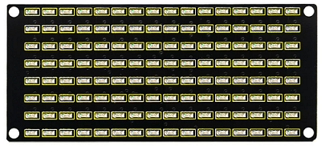
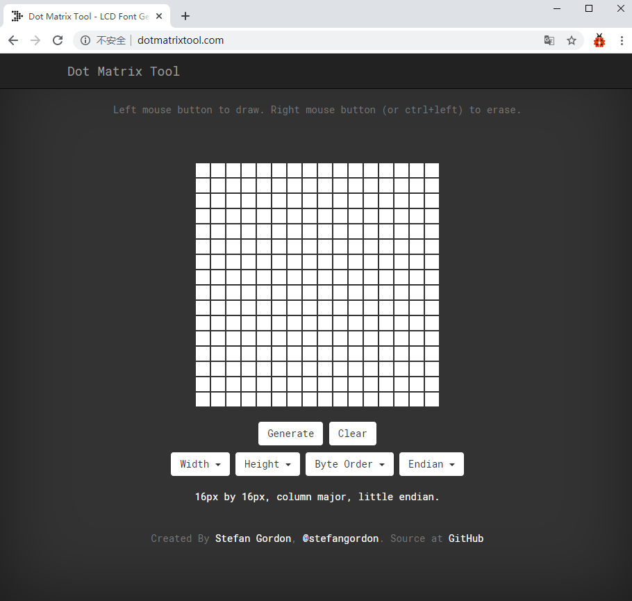
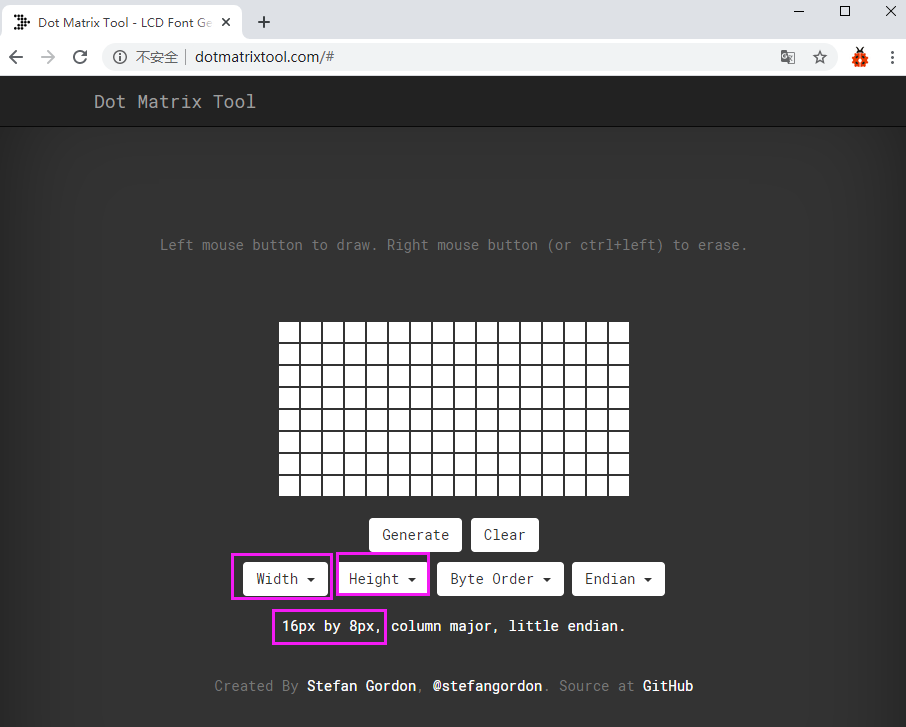

# 4.5 LED Matrix: Light Up Your Exclusive Pixel Art

## 4.5.1 Lesson Introduction



Imagine if you had a box of small colored light bulbs and arranged them neatly into a square grid—wouldn't you be able to spell out various patterns and text? This is the "LED Matrix" we are going to explore today! The scrolling advertising screens you see in shopping malls and the bus arrival notice boards are actually composed of countless such small light beads (LEDs).

Although they look dense and complex, the principle is identical to lighting up a single LED lamp that we learned previously. However, this time we are going to control many lights at once, making them obediently form a heart shape, a smile, or even your name!

In this lesson, we will use the **ESP32S3 Pro development board** (a microcomputer motherboard with a built-in "brain" and wireless functions) to control an 8x16 LED matrix module. Don't be intimidated by the number "8x16"; it simply tells us that this screen has 8 rows, 16 columns, and a total of 128 small light beads. After learning this lesson, you will be able to make this small screen come alive with your own hands and become a true "lighting magician"!

## 4.5.2 Lesson Objectives

*   Correctly connect the 8x16 LED matrix module to the ESP32S3 Pro development board.
*   Understand what "rows" and "columns" are, and how they work together to light up specific light beads.
*   Master the communication protocol (the "secret code" rules for communication between the development board and the housekeeper) and working principle of the **AiP1640 driver chip** (a "little housekeeper" chip specifically designed to manage our light beads).
*   Write **MicroPython** programs (an easy-to-understand programming language like English, specially designed for microcomputers) to display static patterns (such as a heart) on the matrix and achieve simple text or pattern scrolling effects.

## 4.5.3 Lesson Equipment

| Name               | Specification/Model             | Qty  | Notes (Layman's Explanation)                                 |
| :----------------- | :------------------------------ | :--- | :----------------------------------------------------------- |
| Main Control Board | ESP32S3 Pro Development Board   | 1    | Our "commander-in-chief", based on the ESP32-S3 chip, supports Wi-Fi and Bluetooth, running MicroPython programs. |
| LED Matrix Module  | 8x16 AiP1640 Driver Module      | 1    | Our "display screen", blue light emission, with a serial interface (transmitting data using only two wires), built-in AiP1640 driver chip. |
| Connection Wire    | HX2.54 Double-ended DuPont Wire | 4    | Also known as "wires", used to connect the module and the development board. The connectors feature a reverse-proof design, making plugging and unplugging very convenient. |
| USB Data Cable     | Type-C Interface                | 1    | Used to supply power to the development board and upload code. **Note: You must buy a cable with "data transmission" function**, as a pure charging cable cannot transfer code! |

## 4.5.4 Lesson Principles

### 4.5.4.1 How Does the LED Matrix Work?

You can think of the LED matrix as a giant chessboard. A small LED light soldier lives at each intersection. If we want to light up the light soldier at the 3rd row and 5th column, we need to supply power to the 3rd row (**High level**, which can be understood as "turning on the faucet to let water flow"), and simultaneously ground the 5th column (**Low level**, which can be understood as "opening the drain"), thereby forming a **current loop** (water flows out of the faucet, passes through the light soldier, and flows into the drain, making the light soldier light up).

However, if we want to light up many lights at once, direct wiring would turn the wires into a tangled mess (128 lights theoretically require 128 control lines, plus power and ground, making an alarming number of wires). Therefore, smart engineers hired a "head housekeeper" for this matrix module—the **AiP1640 chip**.


*The AiP1640 chip acts like a head housekeeper, helping us manage all the light beads. We only need to give it instructions through a simple serial interface (requiring just two wires), which greatly simplifies the wiring.*

### 4.5.4.2 AiP1640 Driving Principle

AiP1640 is a chip specifically designed to drive LED matrices. It internally includes **video memory** (a "small blackboard" for temporarily storing screen data), a **decoder** (a "translator" that translates digital commands into light on/off states), and a **dynamic scanning circuit** (a "switch operator" that rapidly and alternately lights up the lights), which greatly simplifies the control logic of the microcontroller (our development board).

*   **Video Memory Mapping**: The chip has 16 bytes (Bytes, the basic unit of computer data storage, 1 byte = 8 bits) of video memory internally, with each byte controlling one column (8 light beads). We only need to modify the data of these 16 bytes to change the display content of the screen.
*   **Dynamic Scanning**: The human eye's **persistence of vision effect** (just like reading a flipbook, where the brain perceives rapid screen switching as continuous) makes us feel that all lights are on at the same time, but in reality, AiP1640 is lighting up the light beads column by column at an extremely fast speed. As long as the scanning frequency is high enough (usually greater than 50Hz, i.e., flashing more than 50 times per second), the human eye will not perceive any flicker, and will only see a stable picture.

*   **Communication Protocol**: The AiP1640 uses an I2C-like two-wire **serial communication protocol** (data transmits through a single wire sequentially, like standing in a queue). It works via two pins: **CLK (Clock)** and **DIN (Data In)**.
    *   **CLK (Clock Line)**: Acts like a conductor's baton. Each time it pulses (voltage level changes), it tells the data pin that "data can be read now."
    *   **DIN (Data Line)**: Responsible for actually transmitting 0 and 1 data.
    *   **LSB First**: When transmitting a byte (8 bits of data), the least significant bit (bit 0 on the right) is transmitted first, followed by bit 1, and so on. Just like writing from right to left.

## 4.5.5 Wiring Instructions

Before wiring, **be sure to unplug the USB cable of the ESP32S3 Pro development board and ensure power is cut off**! This is to protect our hardware friends and prevent accidental short circuits or chip damage during hot-plugging.

This 8x16 dot matrix module usually has 4 valid **pins** (small metal pins on the chip or module used to connect wires), which we need to connect to the ESP32S3 Pro development board. Please read the following table carefully to avoid incorrect connections:

| Dot Matrix Module Pin | ESP32S3 Pro Development Board Pin | Electrical Characteristics | Functional Description (Plain Language Explanation)          |
| :-------------------- | :-------------------------------- | :------------------------- | :----------------------------------------------------------- |
| VCC                   | 5V                                | 5V Power Input             | Module positive power supply, providing sufficient operating voltage (equivalent to feeding the LED bulbs well). |
| GND                   | GND                               | Power Ground               | Module negative power supply, sharing a "common ground" with the development board (everyone stands on the same starting line) to form a complete current loop. |
| DIN (Data In)         | IO8                               | 3.3V/5V Compatible         | Serial data input pin, transmits display data and commands (equivalent to a "megaphone"). IO8 represents the 8th input/output pin on the development board. |
| CLK (Clock)           | IO9                               | 3.3V/5V Compatible         | Serial clock input pin, synchronizes the data transmission rhythm (equivalent to a "conductor's baton"). IO9 represents the 9th pin. |

⚠️ **Hardware Connection Precautions**:

1.  **VCC must connect to 5V**: The AiP1640 module usually requires 5V to ensure sufficient LED brightness, which the 5V pin of the ESP32S3 Pro can directly provide. Do not connect it to 3.3V, otherwise the lights will be extremely dim or fail to light up (because the "food" is not enough).
2.  **Strict Pin Correspondence**: The default hardware I2C pins of the ESP32S3 Pro may differ. This tutorial uses a **software-simulated serial protocol** (using code to force regular pins to simulate communication functions) to drive the AiP1640. Please connect strictly according to the table; incorrect wiring may cause the screen to stay dark or display garbled characters.
3.  **Orientation Check**: The direction of text or patterns on the dot matrix module should match your viewing direction. If the characters are upside down after wiring, try rotating the module 180 degrees and reinstalling it, or modify the order of the data array in the code.
4.  **Anti-Static & Short-Circuit Prevention**: Touch a metal object (such as a door handle or water pipe) before operation to discharge static electricity from your body. Ensure that the exposed metal parts of the jumper wires do not touch each other during wiring to prevent short-circuits from burning out the development board.


## 4.5.6 Dot Matrix Font/Pattern Generation Tool (Modulus Tool)

**What is "Font/Pattern Generation (Modulus)"?** Computers don't understand graphics; they only understand numbers. Modulus generation is using a tool to "translate" the patterns we draw into a string of digital passwords that the computer can understand (hexadecimal data).

The online dot matrix generation tool is used here. Link: [http://dotmatrixtool.com/#](http://dotmatrixtool.com/#)

**Step ①: Open the online generation tool**
Open the link to enter the initial interface of the tool, as shown in the figure below:



**Step ②: Adjust dot matrix size parameters**
Our dot matrix is 8 rows by 16 columns, so adjust the Height to 8 and Width to 16 in the tool.
*Why do this?* Because the tool needs to know how large our "canvas" is to generate the correct amount of data. If the size is wrong, the generated pattern will be stretched or truncated, as shown below:



**Step ③: Draw the pattern and generate data**
Generate hexadecimal data from the pattern (hexadecimal is a compact numerical representation, such as using `0x1C` to represent binary `00011100`, making it shorter to write).

*   Press the **left mouse button** to select a grid and draw (turn on a light).
*   Press the **right mouse button** to deselect (turn off a light).
    After drawing your desired pattern, click the "Generate" button, and the hexadecimal data we need will be generated below. Copy it into your code.


💡 **Pitfall Avoidance Guide for Modulus Generation**:
When generating data, pay close attention to the **Byte direction** and **Bit order** settings on the right side. For the code in this tutorial, it generally needs to be set to "Column-major" and "LSB first".
*Why pay attention to this?* Because different settings result in different data arrangement orders. If set incorrectly, the pattern displayed on the dot matrix will be mirrored (left-right reversed), rotated (skewed), or turned into garbled characters.

## 4.5.7 Experimental Operation Steps

**Step ①: Hardware connection check**
Before powering on, refer back to the table in "4.5.5 Wiring Instructions" to confirm that the four wires VCC, GND, DIN, and CLK are connected correctly and securely.
*Why do this?* Developing the good habit of checking before powering on can prevent 90% of hardware failures.

**Step ②: Open programming software**
Open **Thonny IDE** on your computer (an IDE is an Integrated Development Environment, acting as our "notepad + runner" for writing code), ensure the ESP32S3 Pro development board is connected to the computer via a USB cable, and select the correct **Serial Port** (the "virtual channel" for communication between the computer and the development board) in the lower right corner of the software.

**Step ③: Create and write code**
Click "File" -> "New" to create a blank MicroPython script file. Copy and paste the complete code from "4.5.8 Sample Program" into the editor.
*Why do this?* Creating a new file allows you to write code in a clean environment, avoiding conflicts with previous code.

**Step ④: Save and run the program**
Click the "Run" button (or press the F5 key on your keyboard). If running for the first time, the software will prompt you to save the file. You can name it `main.py` and save it to the development board. Once you click run, the code will execute immediately on the development board.
*Why name it main.py?* Because many development boards automatically look for and run a file named `main.py` upon startup, allowing it to run automatically whenever powered on in the future.

**Step ⑤: Observe the experimental phenomenon**
Observe the display effect of the LED dot matrix module to confirm whether it sequentially displays hearts, smiles, and scrolling animations as expected.

## 4.5.8 Sample Program

This code implements two functions: first, it displays a static "heart" pattern for 3 seconds; then, it displays a "smile" pattern and a simple scrolling effect on the screen.

```python
# From the pre-prepared "toolbox" (ESP32S3_4WD_Car library), grab the "magic book" specifically designed to control this development board (Keyes_ESP32S3_4WD class)
from ESP32S3_4WD_Car import Keyes_ESP32S3_4WD

# Import the "time" toolbox so we can make the program "wait" or "sleep for a while" (delays)
import time

# Create a variable named matrix, granting it superpowers to control the development board
matrix = Keyes_ESP32S3_4WD()

# Define communication pins, keeping them completely consistent with our physical wiring table
CLK_PIN = 9   # Clock pin, connects to the CLK pin on the module (conductor's baton)
DIN_PIN = 8   # Data pin, connects to the DIN pin on the module (megaphone)

# Tell the "magic book" which two pins we want to use to communicate with the dot matrix module
matrix.Matrix_init(CLK_PIN, DIN_PIN)


# Define data for the "smile" pattern (16 bytes, corresponding to 16 columns, where each byte's 8 bits correspond to 8 rows)
# These numbers starting with 0x are the "pattern passwords" we generated in the modulus tool
smile = bytes([
    0x00, 0x00, 0x1C, 0x02, 0x02, 0x02, 0x5C, 0x40,
    0x40, 0x5C, 0x02, 0x02, 0x02, 0x1C, 0x00, 0x00
])

# Define data for the "heart" pattern
heart = bytes([
    0x00, 0x00, 0x00, 0x00, 0x08, 0x1c, 0x3e, 0x7c,
    0x7c, 0x3e, 0x1c, 0x08, 0x00, 0x00, 0x00, 0x00
])


# Initialize screen-clearing operation, sending 16 zero-bytes to turn off all lights and prevent garbled displays upon initial power-up
matrix.Matrix_display(bytes(16))       

# Main loop: makes the code run in circles, continuously repeating the following content
while True:
    # 1. Display the heart pattern for 3 seconds
    matrix.Matrix_display(heart)       # Send the "heart password" to the dot matrix module to display a heart
    time.sleep(3)               # Make the program "sleep" for 3 seconds (during which the heart stays lit)

    # 2. Display the smile pattern for 2 seconds
    matrix.Matrix_display(smile)       # Send the "smile password" to the dot matrix module, replacing the heart
    time.sleep(2)               # Make the program "sleep" for 2 seconds (during which the smile stays lit)

    # 3. Simple scrolling effect demonstration (calls the built-in scroll function to cyclically shift the smile data to the left)
    matrix.Matrix_Scroll_display(smile)
```


## 4.5.9 Code Explanation

To help everyone thoroughly understand how the code works, let's break down the code above and explain it in plain terms:

1.  **"Seeking Helpers" Stage (Importing Modules)**:
    *   `from ESP32S3_4WD_Car import Keyes_ESP32S3_4WD`: This line of code means going to the "big warehouse" named `ESP32S3_4WD_Car` to fetch the "control tool" called `Keyes_ESP32S3_4WD` for our use. Since the code controlling the underlying hardware is very complex and has already been written by our predecessors, we can just adopt the "take-and-use" approach.
    *   `import time`: Bringing in the "time management" tool. Without it, the code would execute faster than lightning, and we wouldn't be able to see the changes on the screen at all. With it, we can make the program "pause" for a moment.

2.  **"Establishing Connection" Stage (Initialization)**:
    *   `matrix = Keyes_ESP32S3_4WD()`: Giving this control tool a short code name `matrix`, making it convenient to call later.
    *   `CLK_PIN = 9` and `DIN_PIN = 8`: Telling the program that our "conductor's baton" is connected to pin 9, and the "messenger" is connected to pin 8.
    *   `matrix.Matrix_init(...)`: Formally activating the control tool and telling it: "Hey, get ready to chat with the dot matrix module using pins 9 and 8!"

3.  **"Preparing the Draft" Stage (Defining Data)**:
    *   `smile = bytes([...])` and `heart = bytes([...])`: Storing the "digital passwords" obtained from our dot-matrix encoding tool into variables. `bytes` is a data type specifically used to store such numbers from 0 to 255. The data for each column is packed into a single byte (8 bits), and 16 columns make 16 bytes.

4.  **"Cleaning the Canvas" Stage (Clearing the Screen)**:
    *   `matrix.Matrix_display(bytes(16))`: `bytes(16)` generates 16 `0`s. Sending 16 zeros to the dot matrix means "turning off all lights from column 1 to column 16." This ensures that the screen is clean every time we run the program.

5.  **"Start the Show" Stage (Main Loop)**:
    *   `while True:`: This is an "infinite loop", meaning "as long as the development board is powered on, keep executing the code below continuously."
    *   `matrix.Matrix_display(heart)`: Sending the heart password over, and the screen instantly turns into a heart shape.
    *   `time.sleep(3)`: Pausing the program for 3 seconds. Note that during the pause, the heart on the screen **stays lit continuously** because the dot matrix module has internal "memory" (video memory), eliminating the need for the development board to send signals constantly.
    *   `matrix.Matrix_display(smile)`: Sending the smile password over, overwriting the heart.
    *   `matrix.Matrix_Scroll_display(smile)`: This is an advanced function that internally shifts the smile data to the left bit by bit. Combined with delays, it creates the "scrolling left" animation effect we see.

## 4.5.10 Experimental Phenomenon

After uploading the code and running it successfully, you should observe the following phenomena:

1.  **Instant Lighting**: The dot matrix screen may flash once and then go black (this is due to the screen-clearing operation in code initialization, which clears any previous residual data).
2.  **Heart Appears**: A blue heart pattern will be clearly displayed on the screen and last for 3 seconds.
3.  **Pattern Switching and Scrolling**: After the heart disappears, the screen will display a smile pattern for 2 seconds; then the smile pattern will start scrolling to the left until it moves off the screen.
4.  **Looping**: Afterwards, the program will restart, displaying the heart again, and repeating the cycle continuously.

If the screen is fully lit, completely dark, or shows garbled text, please don't be discouraged. This is usually caused by loose wiring, incorrect pin definitions, or improper encoding settings. Please refer to the "Common Errors and Solutions" below for troubleshooting.

## 4.5.11 Common Errors and Solutions (Beginner's Guide to Avoiding Pitfalls)

When beginners play with dot matrices for the first time, they easily run into the following problems. Don't panic; just fix them accordingly:

**Error 1: The screen does not light up at all and has no response**

*   **Cause Analysis**: The power might not be connected; the pin definitions in the code do not match the actual wiring; VCC might be mistakenly connected to 3.3V resulting in extremely low brightness (making it look unlit to the naked eye); or even a broken internal wire in the jumper cable.
*   **Solutions**:
    1. Check if the USB cable is plugged in properly and whether the computer recognizes the development board.
    2. Confirm that VCC is connected to the **5V** pin of the development board.
    3. Verify whether `CLK_PIN` and `DIN_PIN` in the code are 9 and 8 respectively.
    4. Try swapping two jumper wires; sometimes low-quality jumper wires have internal breaks.

**Error 2: The heart pattern is displayed incompletely, only half is shown, or it is mirrored (left and right are reversed)**

*   **Cause Analysis**: Usually, the "byte order" or "bit order" settings in the encoding tool do not match the code; or DIN and CLK were reversed during hardware wiring.
*   **Solutions**:
    1. Check the settings of the encoding tool to ensure "Column-major" and "LSB first" are selected.
    2. If software settings are confirmed to be correct, try swapping the pin numbers of `CLK_PIN` and `DIN_PIN` in the code (change 9 to 8, and 8 to 9) to see if it returns to normal.
    3. If it is still reversed, try changing the "Bit order" setting in the encoding tool and regenerate the data.

**Error 3: Compilation error, prompting that a related library cannot be found or a SyntaxError occurs**

*   **Cause Analysis**: The MicroPython firmware has not been flashed to the development board; or **the indentation format was corrupted** when copying the code. Python is very strict about indentation (spaces at the beginning of code); one extra or missing space will cause an error.
*   **Solutions**:
    1. Ensure the MicroPython firmware is correctly burned to the development board (if it's a newly purchased board, it usually comes pre-flashed).
    2. Check whether the indentation in the code uniformly uses **4 spaces**. Never mix Tab keys and space keys! In the Thonny software, you can check "Replace tabs with spaces" under "Tools" -> "Options" -> "Editor".

**Error 4: Thonny software prompts "Not Responding" or "Port is busy"**

*   **Cause Analysis**: Another software (like a serial debugging assistant or another Thonny window) might be occupying the COM port; or the USB cable only supports charging and lacks data transmission capabilities.
*   **Solutions**:
    1. Close all other software that might be occupying the serial port.
    2. Unplug and replug the USB cable, or switch to a different USB port.
    3. **Ultimate Trick**: Switch to a Type-C data cable that is verified to transmit data (such as the cable you usually use to connect your phone to transfer photos).

**⚠️ Safety and Protection Tips**:
Although the LED dot matrix voltage is not high, do not stare directly at high-brightness LEDs for a long time to avoid eye fatigue. In addition, **never forcefully plug or unplug jumper wires while powered on**, as this easily damages pins or causes a short circuit that burns out the chip.

Congratulations on completing this lesson! Isn't it a great sense of accomplishment to see the pattern you lit up with your own hands? That is the charm of combining programming and hardware. Keep exploring, and look forward to you creating even cooler patterns!