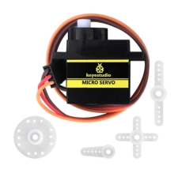
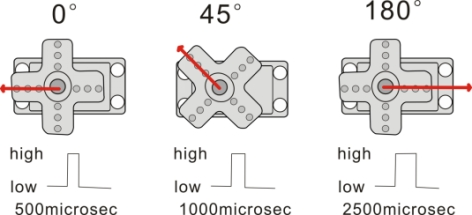

# 4.6 Servo Control

## 4.6.1 Course Introduction



Hey, little inventor! Have you ever played with remote-controlled racing cars or robots? When they turn or wave their mechanical arms, aren't their movements extremely precise and obedient? Behind this, there is usually a magical little helper at work—the "Servo Motor" (a micro motor capable of precise rotational angle control).

If a regular motor (an ordinary motor that spins when powered on and stops when powered off) is like a fan that only knows how to spin frantically, then a servo motor is like an obedient "angle butler." You tell it to turn to 90 degrees, and it obediently stops at 90 degrees; you tell it to turn to 180 degrees, and it turns there and stops. It doesn't spin in circles continuously, but instead stops precisely at any position you want.

In this lesson, we will learn how to use the ESP32S3 Pro development board (a small circuit board integrating a microcontroller "brain" and various interfaces) to control this "angle butler." We will write code to make the servo swing left and right like a pendulum, or point in different directions according to your instructions. Once you master this trick, you can make robot arms, automatic watering devices, or smart door locks move when you build them in the future! Are you ready? Let's get started!

## 4.6.2 Course Objectives

After completing this lesson, you will be able to:

*   **Understand Servo Motors**: Know the difference between a servo motor and a regular motor, and understand its characteristic of precise angle control.

*   **Correct Wiring**: Learn how to correctly and safely connect the three wires of the servo motor (power, ground, and signal) to the pins of the ESP32S3 Pro development board (the "small metal legs" protruding from the chip used to connect to the outside world to transmit electrical signals).
*   **Using Low-Level Control**: Master how to use MicroPython's PWM (Pulse Width Modulation, a technology that controls equipment by rapidly switching the power on and off to change the proportion of "on-time") function to control the servo, and understand the mapping relationship between angles and pulse widths.
*   **Writing a Sweeping Program**: Write a complete control program that allows the servo to rotate from 0 degrees to 180 degrees and then smoothly rotate back.

## 4.6.3 Course Equipment

We need to prepare the following materials. Please check your toolkit:

| Component Name         | Specification/Model                                          | Quantity | Notes and Descriptions                                       |
| :--------------------- | :----------------------------------------------------------- | :------- | :----------------------------------------------------------- |
| **Main Control Board** | ESP32S3 Pro Development Board                                | 1        | Our core control brain                                       |
| **Servo Motor**        | SG90 or MG90S (9g micro servo)                               | 1        | Usually an orange or blue small square box                   |
| **USB Data Cable**     | Type-C                                                       | 1        | Used for power supply and uploading code                     |
| **Jumper Wires**       | Male-to-female or female-to-female (depending on the servo interface) | 3        | Used to connect the development board and the servo ("male" refers to exposed metal pins, "female" refers to wires with plastic holes) |

*Note: If your servo is a blue metal-gear servo (such as MG90S), the wiring method is the same, but its torque (the "strength" of rotation) is a bit larger.*

## 4.6.4 Course Principles

### 4.6.4.1 How Does a Servo Work?

Imagine a very diligent little worker living inside the servo. This little worker holds a potentiometer in their hand (like a rotatable volume knob used to sense the current angle), along with a small motor and a set of reduction gears.

When you tell the ESP32S3 Pro development board through code: "Please turn the servo to 90 degrees!", the board sends out a special string of electrical signals (we call it a PWM signal).

**Supplementary PWM Signal Principles**:
Specifically, the servo requires a PWM signal with a frequency of 50Hz (i.e., a period of 20 milliseconds, repeating 50 times per second). Within this period, the duration of the high level (the "powered" state, such as 3.3V or 5V)—which we call the "pulse width"—determines the target angle of the servo:

*   **Pulse width 0.5 ms** -> Corresponds to **0 degrees**
*   **Pulse width 1.5 ms** -> Corresponds to **90 degrees** (center position)
*   **Pulse width 2.5 ms** -> Corresponds to **180 degrees**

After receiving the signal, the "little worker" inside the servo compares it with the current position of the potentiometer. If it is currently pointing to 0 degrees and the command is 90 degrees, the little worker will start the motor to turn. While turning, it keeps an eye on the potentiometer. As soon as the potentiometer reaches the 90-degree position, the little worker immediately shouts "Stop!", and the motor stops moving completely, holding firmly in this position. Even if you gently push it with your hand, it will resist back. This is why the servo can "lock" at a certain angle.


*Figure: The servo contains a DC motor, a set of reduction gears, and a potentiometer, which work together to achieve precise positioning.*

### 4.6.4.2 Key Parameters: Angle Range

The physical rotation range of most common micro servos (such as SG90) is **0 to 180 degrees**.

*   **0 degrees**: Usually the starting position, where the servo arm (the small plastic arm extending from the servo to connect other parts) leans to one side.
*   **90 degrees**: Middle position, with the arm centered.
*   **180 degrees**: Maximum position, where the arm leans to the other side.

⚠️ **Important Notice**: Never try to use code to forcibly make the servo rotate beyond 180 degrees or less than 0 degrees (such as turning to 200 degrees). This is like twisting a person's arm behind their back to an impossible angle; it will damage the gears inside the servo, and hearing a "click-click" gear-stripping sound means it is crying out for help!




### 4.6.4.3 Programming Logic

When using MicroPython to control a servo, the core task is to convert the angle value into the duty cycle of the PWM signal (the percentage of time the high-level "on-time" accounts for in a total pulse period). Since ESP32's PWM resolution is typically 16-bit (meaning it can represent 0 to 65535 fine-grained levels), we need to establish a linear mapping relationship (like a ruler that proportionally converts one kind of value into another): map the angle range of 0~180 degrees to a pulse width of 500~2500 microseconds, and then further convert it into a 16-bit duty cycle value. By changing this duty cycle value in a loop with appropriate delays, smooth rotation of the servo can be achieved.

## 4.6.5 Wiring Instructions

Wiring is the part where beginners make mistakes most easily, so please double-check carefully! Servos usually have three wires, and while the colors may vary, their functions are identical.

**General Idea**:
We need to provide power to the servo (VCC, the positive power supply) and GND (Ground, the negative power supply, the return path for current), and give it a command signal (Signal). The GPIO42 (General Purpose Input/Output pin, numbered 42) pin of the ESP32S3 Pro development board is very suitable as a signal pin.

**Detailed Wiring Table**:

| Servo Wire Color/Label       | Function     | ESP32S3 Pro Development Board Pin | Wiring Precautions                                           |
| :--------------------------- | :----------- | :-------------------------------- | :----------------------------------------------------------- |
| **Brown** (or Black)         | GND (Ground) | **GND**                           | Must share a common ground (connect the negative terminals of both devices together so they share a common reference zero point), otherwise the signal cannot be recognized and the system will behave erratically |
| **Red**                      | VCC (Power)  | **5V**                            | The starting current of the servo is relatively large; connecting to 5V provides more power |
| **Orange** (or Yellow/White) | Signal       | **GPIO42**                        | The data line for sending angle commands; make sure not to connect it to the power supply by mistake |

⚠️ **Special Notes**:

1.  **Color Confirmation**: Servo wire colors from different brands may vary slightly. Remember the general rule: **darker wire is negative (GND), the middle red wire is positive (VCC), and the remaining lighter wire is the signal line**.
2.  **Power Supply Selection**: Although the ESP32 also has a 3.3V pin, the servo may lack sufficient power or jitter at 3.3V, so please be sure to connect it to the **5V** pin.
3.  **Check Sequence**: After wiring, do not plug in the USB cable yet. Run your fingers along the wires to confirm that the red wire is connected to 5V, the brown wire to GND, and the orange wire to GPIO42. Turn on the power only after confirming everything is correct!


## 4.6.6 Example Program

This code makes the servo slowly rotate from 0 degrees to 180 degrees, pause for a moment, and then slowly rotate back from 180 degrees to 0 degrees, repeating this cycle continuously, just like shaking its head to say "no, no, no."

```python
# Take out a "magic box" (control module) named Keyes_ESP32S3_4WD from the "Car/Robot" toolkit provided by the manufacturer
from ESP32S3_4WD_Car import Keyes_ESP32S3_4WD
# Import the "time" toolkit, because we need the program to "wait" and control the rhythm of time
import time

# Assign a "house number" (pin number) to the servo's signal wire. Here we choose pin 42
SERVO_PIN = 42

# Open the "magic box" just taken out and create a control object named servo
servo = Keyes_ESP32S3_4WD()

# Tell the magic box: "Please initialize (prepare) pin 42, we are going to start controlling the servo!"
servo.Servo_init(SERVO_PIN)

# Issue the first command: make the servo rotate to 90 degrees (the exact middle position) first
servo.Servo_set_angle(90)
# Pause the program for 1 second, giving the servo a little time to slowly rotate to 90 degrees and stand firmly
time.sleep(1)

# Start a magic circle of "infinite loop". As long as the power is not cut off, the code inside will keep repeating execution
while True:
    # First stage: make the angle variable start from 0, add 1 each time, all the way up to 180 (inclusive)
    for angle in range(0, 181, 1):
        # Send the current angle value to the servo, commanding it to rotate to this angle
        servo.Servo_set_angle(angle)
        # After each rotation, pause for 15 milliseconds (15/1000 of a second) to give the servo time to physically rotate for a smooth effect
        time.sleep_ms(15)

    # After reaching 180 degrees, let the servo rest (pause) here for 1 second
    time.sleep(1)

    # Second stage: make the angle variable start from 180, subtract 1 each time, all the way down to 0 (inclusive)
    for angle in range(180, -1, -1):
        # Send the current angle value to the servo, commanding it to rotate in reverse to this angle
        servo.Servo_set_angle(angle)
        # Also pause for 15 milliseconds to maintain the smooth rotation rhythm
        time.sleep_ms(15)

    # After returning to 0 degrees, let the servo rest for another 1 second, then restart the next round of the loop
    time.sleep(1)
```

## 4.6.7 Code Explanation

To make it clearer how the code works, we break down the core logic:

1.  **Module Import and Initialization**:
    *   `from machine import Pin, PWM`: Import hardware control modules. `Pin` is used to specify the pin (telling the system which metal pin we want to use), and `PWM` is used to generate pulse signals.
    *   `servo = PWM(Pin(SERVO_PIN), freq=50)`: Configure GPIO42 as a PWM output and strictly set the frequency to 50Hz (20ms period), which is the basis for the servo to recognize signals.
2.  **Angle Mapping Function `set_angle(angle)`**:
    *   **Boundary Protection**: First, use an `if` statement to limit the input angle between 0 and 180 degrees to prevent incorrect commands from damaging the hardware.
    *   **Pulse Width Calculation**: Use the linear formula `pulse_us = 500 + (angle / 180) * 2000` to convert the angle into a target pulse width of 500~2500 microseconds.
    *   **Duty Cycle Conversion**: The 16-bit PWM maximum value of the ESP32 is 65535. Convert the microsecond-level pulse width into a duty cycle value that the chip can understand via `duty = int(pulse_us / 20000 * 65535)`, and finally output the signal via `servo.duty_u16(duty)`.
3.  **Smooth Motion Control**:
    *   In the main loop, use `for angle in range(...)` to gradually change the angle value.
    *   After each angle change, add a `time.sleep_ms(15)` delay. These 15 milliseconds are crucial as they give the servo time to physically rotate. If the delay is removed, the servo will instantly jump to the final position instead of achieving a "smooth scanning" effect.

## 4.6.8 Experimental Phenomenon

After successfully uploading the code, observe your servo:

1.  **Initial State**: When the USB cable is just plugged in, the servo may twitch slightly, then quickly rotate to the exact middle (90 degrees) position and remain stationary for 1 second.
2.  **Clockwise Scan**: Next, the servo will start to slowly rotate in one direction, from the far left (0 degrees) all the way to the far right (180 degrees). The whole process takes about 3 seconds, with smooth and uniform movement.
3.  **Pause**: After reaching the far right, it will stay there without moving for 1 second.
4.  **Counter-Clockwise Scan**: Then, the servo will rotate in reverse, slowly turning from the far right (180 degrees) back to the far left (0 degrees).
5.  **Loop**: After returning to the far left, it pauses for 1 second and then restarts the next round of swinging.

**How to tell if it's successful?**

*   If the servo keeps spinning in circles continuously (still rotating beyond 180 degrees), it means you might have purchased a 360-degree continuous rotation servo, or the wiring/code is incorrect.
*   If the servo makes a "buzzing" electrical noise but doesn't turn, the mechanics might be jammed or the angle has exceeded its physical limits.
*   If the servo swings smoothly left and right, congratulations! You have successfully controlled the hardware's angle!

## 4.6.9 Common Errors and Troubleshooting

Beginners inevitably run into pitfalls when starting out. Don't be discouraged; here are the most common problems and their solutions:

**Problem 1: The servo keeps twitching, or makes a "clucking" sound, but does not rotate.**

*   **Cause**: Usually caused by insufficient power supply. The USB power supply of the ESP32S3 Pro may cause voltage fluctuations when driving the servo, or the servo load is too large.
*   **Solution**: Check if the red wire is indeed connected to 5V. If it still twitches, try reducing the rotation angle range (e.g., only rotating from 30 degrees to 150 degrees) to avoid the limit positions at both ends of the servo where internal resistance is usually highest.

**Problem 2: The servo only rotates in one direction and does not return.**

*   **Cause**: The loop logic in the code might be reversed, or the `for` loop for reverse rotation was omitted when modifying the code. Additionally, if you are using a 360-degree continuous rotation servo, it lacks angle feedback and can only control direction and speed, making automatic return impossible.
*   **Solution**: Check whether the code has a reverse loop logic like `range(180, -1, -1)`. Confirm that you are using a 180-degree standard servo rather than a 360-degree servo.

**Problem 3: An error occurs when uploading the code.**

*   **Cause**: If you are using MicroPython code, it might be because the development board hasn't had the MicroPython firmware flashed, or the wrong serial port (the communication channel between the computer and the development board) / board model was selected in the IDE (Integrated Development Environment, the software used for writing code).
*   **Solution**: Confirm that the MicroPython firmware has been correctly flashed to the development board. Check whether the serial port selection in the IDE is correct, ensuring no other program is occupying the serial port. If using the Arduino IDE environment, ensure the code syntax is switched to C++ and the corresponding library is installed.

**Problem 4: The servo stops halfway, or the angle is incorrect.**

*   **Cause**: Different brands and batches of servos may have slight differences in the physical limits of their internal potentiometers. The fixed 500~2500 microsecond pulse width in the code may not completely match your servo.
*   **Solution**: You can fine-tune the minimum and maximum values of `pulse_us` in the code (e.g., changing them to 600~2400 microseconds) for personalized calibration until the servo can perfectly cover 0~180 degrees without gear slipping.

**Problem 5: Beginner-exclusive pitfall - Wires plugged backward or into the wrong pins.**

*   **Cause**: Pushing the jumper wires in too hard caused misalignment, or misreading the pin numbers (e.g., mistaking GPIO42 for GPIO24).
*   **Solution**: Cut off the power! Re-verify the "Wiring Instructions" table, checking wire by wire. Remember the mantra: "Brown/Black to ground (GND), Red to power (5V), Orange/Yellow to signal (GPIO42)."

**Problem 6: Beginner-exclusive pitfall - Not saving the code or not clicking "Run" before checking the results.**

*   **Cause**: After modifying the code, you directly unplugged/plugged in the power or forgot to click the "Run/Download" button in the software, which means the old code is still running on the development board.
*   **Solution**: Form a good habit: every time you modify the code, click "Save" first, then click "Run" or "Download to development board". Wait until the software prompts "Success" before observing the servo's movement.

## 4.6.10 Safety Tips

*   **Do Not Force by Hand**: When the servo is powered and holding a certain angle, do not forcefully bend its arm by hand. This will damage the internal plastic gears and may even burn out the motor driver circuit.
*   **Watch Out for Heat**: If the servo is stalled for a long time (i.e., blocked and unable to rotate while still powered), it will heat up rapidly. Once you notice it is hot to the touch, cut off the power immediately and check.
*   **Power Off When Wiring**: Although low-voltage DC is relatively safe, building a good habit of "powering off when wiring, and powering on after checking" will protect your development board from being short-circuited and burned out.

## 4.6.11 Post-Class Expansion and Reflection

Awesome! You have mastered the magic of controlling angles. To consolidate what you have learned, try completing the following small challenges:

1.  **Speed Control Challenge**: Modify `time.sleep_ms(15)` in the code, and try making the servo swing at an extremely slow speed (like a crawling snail, change 15 to 50 or 100) and an extremely fast speed (like lightning, change 15 to 5 or 1). Observe and record the impact of different delay times on the servo's motion state.
2.  **Specific Angle Positioning**: Write a new program so that after powering on, the servo sequentially points to 0 degrees, 45 degrees, 90 degrees, 135 degrees, and 180 degrees, staying at each position for 2 seconds to simulate a multi-position switch.
3.  **Creative Application**: Try sticking the servo onto a piece of cardboard to make a simple radar scanner, or make a nodding head for a doll! Use your imagination and apply the servo to your next invention!