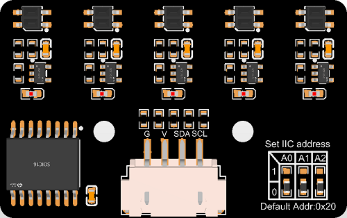
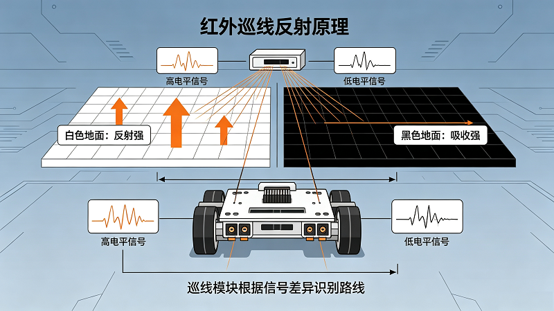
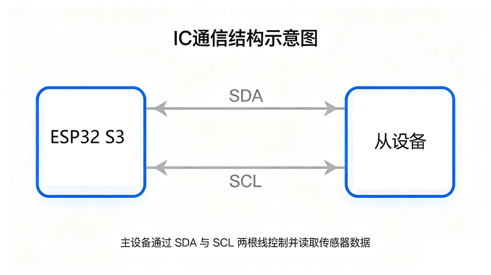

# 4.8 5-Channel Line Tracking Sensor

## 4.8.1 Lesson Introduction



Imagine you are driving a super cool remote-controlled racing car, but the track is black, surrounded by white. If the car veers off course, how does it know to turn back? At this point, we need to equip the car with "eyes"! The **5-channel line tracking sensor** we are learning about today is the robot's "eyes".

This sensor is like a row of neat little detectives that can tell whether the ground is black or white. When this row of little detectives finds that the left side has turned black, it knows the car body is leaning to the right and needs to turn left; if it finds that the right side has turned black, it knows the car body is leaning to the left and needs to turn right. With it, your robot can follow drawn black lines steadily, just like a real autonomous driving car!

In this lesson, we will connect this "five-eyed little detective" to the **ESP32S3 Pro development board** (which is our robot's "brain", a green circuit board integrating a microcomputer chip) and write code to let it tell us what it sees. After finishing this lesson, you will have mastered the secret weapon for autonomous pathfinding, bringing you one step closer to making a fully automatic patrol robot. Awesome, let's get started!

## 4.8.2 Lesson Objectives

*   Correctly identify the **pins** (the small metal feet extending from the edge of the chip or module used for plugging in wires to conduct electricity) of the IIC 5-channel line tracking sensor, and correctly connect them to the ESP32S3 Pro development board.
*   Understand the basic concept of **IIC (also called I2C)** communication, knowing how it allows multiple devices to communicate and interact via "addresses" (just like everyone's phone number).
*   Be able to write **MicroPython** code (a programming language designed specifically for beginners and hardware developers with simple syntax like English) to read sensor data and intuitively view the real-time status of the 5 probes in the **Serial Monitor** (a chat window on the computer used to display what the robot "says").
*   Be able to judge whether the sensor is working properly by observing serial data, and accurately distinguish between black and white areas.

## 4.8.3 Lesson Equipment

| Component Name     | Specification/Model                 | Quantity | Remarks                                                      |
| :----------------- | :---------------------------------- | :------- | :----------------------------------------------------------- |
| Main Control Board | ESP32S3 Pro Development Board       | 1        | Our robot brain                                              |
| Sensor             | IIC 5-Channel Line Tracking Sensor  | 1        | Module with 5 infrared probes                                |
| Connection Wire    | XH2.54 Double-Ended Connection Wire | 1        | Used to connect the sensor and the development board (XH2.54 refers to the standard 2.54 mm spacing between plug pins, commonly known as Dupont wires) |
| Line Tracking Map  | White paper with black lines        | 1        | Used for line tracking function testing                      |

## 4.8.4 Lesson Principles

### 4.8.4.1 How does the sensor "see" the road?

There are 5 small dots at the bottom of this sensor, and an **infrared** (a type of light invisible to our naked eyes, but genuinely existing) transmitting tube and a receiving tube are hidden inside each dot. You can think of them as 5 miniature flashlights and 5 light-sensitive eyes.

*   **When encountering white ground**: White has strong retroreflective properties; the infrared light emitted by the flashlight is reflected back and received by the "eye". The sensor then tells the development board: "It's very bright here!" (Outputs a **High level**, which is a powered state, representing "1" in the digital world).
*   **When encountering black lines**: Black absorbs light, so the infrared light is absorbed, and almost no light is reflected back—the "eye" can no longer see it. The sensor then tells the development board: "It's very dark here!" (Outputs a **Low level**, which is an unpowered state, representing "0" in the digital world).

Because there are 5 such "eyes" arranged in a row, it can observe a wider range simultaneously, making it smarter than a single sensor and less likely to lose the route.



**Diagram Explanation**: On the left, the white ground strongly reflects light, and the sensor returns a high level (1); on the right, the black ground absorbs light, and the sensor returns a low level (0), resulting in different signals received by the receiving end.

### 4.8.4.2 What is IIC (I2C) Communication?

Traditional regular sensors each occupy several **pins** (small metal legs) on the development board, making the wiring extremely messy. However, this sensor is advanced and uses a communication method called **IIC (also known as I2C)**.

IIC is like a dedicated "telephone line." On this line, many different devices can be hooked up (such as thermometers, displays, and sensors), but each has its own unique "phone number" (**device address**). The ESP32S3 Pro development board (the **master device**, which acts like the boss giving out orders) only needs to dial this number to chat with the specified sensor (the **slave device**, which acts like an employee doing the work).

IIC only requires two wires to operate:

*   **SDA (Serial Data Line)**: Responsible for transmitting specific content (e.g., "I see black").
*   **SCL (Serial Clock Line)**: Responsible for commanding the rhythm to ensure everyone speaks in an orderly fashion (like a conductor's baton in an orchestra, making everyone send data to the beat).



**Diagram Explanation**: The master device (ESP32) communicates bidirectionally with the slave device (sensor) through two wires: SDA and SCL.

### 4.8.4.3 Programming Logic

In the code, we need to do two things:

1.  **Initialize IIC communication and the PCF8574 chip**: "Initialization" is like "saying hello" and "preparing" before the program runs. **PCF8574** is a "translator" chip (I2C-to-GPIO chip, where GPIO refers to general-purpose switch interfaces). It helps the sensor pack the status of the 5 probes into a single **Byte** of data (a data box containing 8 small compartments/bits), making it easy to transmit via IIC.
2.  **Read and parse data**: Send a read request to the sensor's I2C address, and then receive the data it returns. Although we have 5 probes, the data is usually packed into a single byte (8 bits). Through **bitwise operations** (a mathematical trick to extract a specific compartment out of a data box individually), we can extract the status of each of these 5 probes separately.

## 4.8.5 Wiring Instructions

Before wiring, make sure that the ESP32S3 Pro development board is not connected to computer power to prevent incorrect wiring from causing a **short circuit** (where the positive and negative poles connect directly, instantly generating a high current that burns out the board).

This IIC 5-channel line-tracking sensor usually has 4 pins: VCC, GND, SDA, and SCL. We connect them correspondingly to the dedicated IIC pins on the ESP32S3 Pro development board. According to the specifications of the ESP32S3 Pro, the default hardware IIC pins are io8 (SDA) and io9 (SCL).

| Sensor Pin | ESP32S3 Pro Development Board Pin | Description                                                  |
| :--------- | :-------------------------------- | :----------------------------------------------------------- |
| VCC        | 5V                                | Power positive pole, provides energy (VCC stands for voltage input) |
| GND        | GND                               | Power negative pole, ground (GND stands for common reference ground, i.e., the 0V reference point of the circuit) |
| SDA        | io8                               | Data line, transmits sensor readings                         |
| SCL        | io9                               | Clock line, synchronizes communication rhythm                |

⚠️ **Special Note**:

1.  **VCC connects to 5V**: Although the internal logic of the ESP32 is 3.3V, most IIC line-tracking modules have internal voltage regulators or **level shifting** (circuits that convert high voltages to low voltages). For such general IIC sensor modules, it is usually recommended to connect to 5V to ensure sufficient infrared transmitting power. If connecting to 3.3V causes unstable readings, be sure to switch it to 5V.
2.  **Do not cross SDA and SCL**: SDA must be connected to io8, and SCL must be connected to io9. Reversing them will not burn out the module, but it will result in failure to read data because the "telephone line" is plugged into the wrong place.
3.  **Check connections**: Dupont wires (our connection wires) must be plugged in tightly. Loose wires can cause intermittent data or communication failure.


## 4.8.6 Sample Program

This code will initialize IIC communication, read sensor data every 500 milliseconds, and print it to the serial monitor. You can clearly observe the state changes of the 5 probes.

```python
# From the car toolkit prepared in advance (ESP32S3_4WD_Car), fetch the "magic book" specifically used to control this car (module Keyes_ESP32S3_4WD)
from ESP32S3_4WD_Car import Keyes_ESP32S3_4WD
# Import the time module, as it contains many tools to control time, such as making the program "wait"
import time

# Create a "clone" for the car (called instantiating an object in programming), and name it line. From now on, we will command the car's line-tracking function through line
line = Keyes_ESP32S3_4WD()

# Tell the program that we want to use pin number 8 (io8) on the development board as the data line (SDA)
SDA = 8
# Tell the program that we want to use pin number 9 (io9) on the development board as the clock line (SCL)
SCL = 9

# Use the SCL and SDA pins defined just now to "wake up" the line-tracking sensor and connect it properly (this process is called initialization)
line.Line_init(SCL, SDA)

# Print a sentence in the computer's serial monitor (chat window) to tell us that the preparation work is done
print("5-channel line-tracking sensor initialization complete!")

# This is an "infinite loop" (while True), meaning that as long as power is not cut off, the indented code below will repeat indefinitely
while True:
    # Have the sensor "look" at the path once, and pack the results of the 5 probes into the 5 variables A, B, C, D, E (little data-storing boxes) respectively
    A, B, C, D, E = line.Line_get_data()

    # Print out the data in the 5 boxes A, B, C, D, E, separated by spaces, and automatically move to the next line after printing
    print(A,B,C,D,E)

    # Let the program rest for 500 milliseconds (half a second) to prevent the data from refreshing too fast for us to see clearly, and also to give the brain (CPU) a short break
    time.sleep_ms(500)
```

## 4.8.7 Code Explanation

To make you completely understand how the code works, let's break down the code above and explain it step by step:

1.  **Import the toolkit**: `from ESP32S3_4WD_Car import Keyes_ESP32S3_4WD`. Just like taking out pots and pans before cooking, you need to bring the required tools before writing code. Here, we brought in the core code library that controls the car.
2.  **Import the time tool**: `import time`. We need the program to learn how to "wait," so we import the time module.

3.  **Create the car object**: `line = Keyes_ESP32S3_4WD()`. This line of code allocates a piece of space in memory specifically for storing the car's control information and tags it as `line`.
4.  **Define pin numbers**: `SDA = 8` and `SCL = 9`. We store the numbers 8 and 9 into the variables `SDA` and `SCL` respectively for later use. Why define variables? Because if we ever need to change the pins in the future, we only need to change the numbers here instead of modifying all the code below.
5.  **Initialize the sensor**: `line.Line_init(SCL, SDA)`. This line calls the `Line_init` function in the toolkit, which configures pins 8 and 9 on the development board to prepare them for IIC communication with the sensor.
6.  **Print a prompt message**: `print("5-channel line tracking sensor initialization complete!")`. This is purely for human readers so you know in the serial monitor that the program has successfully reached this point.
7.  **Start an infinite loop**: `while True:`. In robot control, we usually need the program to run continuously rather than exiting after executing once. `while True` makes the program enter a loop that it can never exit, constantly repeating the actions inside.
8.  **Read sensor data**: `A, B, C, D, E = line.Line_get_data()`. This is the core action! The program asks the sensor via the IIC line: "What do you see?" The sensor packages and sends back the status of the 5 probes, and the program splits them into 5 parts, putting them into the 5 variables A through E respectively.
9.  **Display data**: `print(A,B,C,D,E)`. Prints the 5 data points just obtained onto the computer screen so we can see them intuitively.
10.  **Delay and wait**: `time.sleep_ms(500)`. Pauses the program for 500 milliseconds. Without this line of code, the program would read and print frantically at high speed, instantly flooding the computer screen with data making it impossible to read clearly, while also wasting CPU resources.

## 4.8.8 Experimental Phenomenon

After uploading the code, open the serial monitor:

1.  **Initial state**: You should see the prompt "5-channel line tracking sensor initialization complete!".
2.  **Waving in the air**: When you wave the sensor in the air, you will see the "raw data" constantly changing, and the state sequence composed of 0s and 1s in **binary** (a counting system with only two digits, 0 and 1) will also jump. This is because the ambient light is changing, or the lack of a reference object causes unstable reflected light.
3.  **Black and white test**:
    *   Prepare a piece of white paper and stick a piece of black electrical tape on it.
    *   Place the sensor vertically above the **white area**: You might see data like `1 1 1 1 1` (all ones) or `0 0 0 0 0` (all zeros), depending on whether your sensor module outputs 1 or 0 when encountering black.
    *   Move the sensor above the **black tape**: You will find that certain corresponding bits change to the opposite state. For example, if the middle probe is over the black line, the number in the middle bit will flip.
4.  **Success sign**: If you move the sensor and the numbers in the serial monitor change sensitively, congratulations! You have successfully made the ESP32S3 Pro "see" black and white lines! You are now a little programmer!

## 4.8.9 Common Errors and Solutions

It is completely normal for beginners to encounter problems when doing experiments for the first time! Below are the most common pitfalls and their solutions:

**Error 1: The serial monitor displays "Error: Sensor not detected" or all data are abnormal values (such as throwing an OSError, or all 255)**

*   **Cause**: I2C communication failed. This could be due to an incorrect I2C address, loose/broken wiring, or a missing **pull-up resistor** on the bus (a small resistor component that helps make signals more stable and prevents signal degradation). **OSError** stands for "Operating System Error", which in hardware programming usually means "I can't find the hardware" or "the hardware is not responding".
*   **Solution**:
    1.  After initializing I2C in the code, add the statement `print(i2c.scan())` to check if there are devices on the bus. Confirm whether the scanned address is `0x20` (some modules might have addresses like `0x38`, requiring a modification to `PCF8574_ADDR` in the code).
    2.  Check whether the four wires (SDA, SCL, VCC, GND) are plugged in tightly, ensuring they are not reversed or poorly connected. Unplug them and plug them back in firmly!
    3.  Confirm whether the VCC power supply is stable at 5V; insufficient power supply will prevent the I2C chip from working properly.

**Error 2: The data is always all 0s or all 1s, and does not change with black and white**

*   **Cause**: The sensor is too far from or too close to the ground, or the ambient light is too strong causing interference.
*   **Solution**:
    1.  Adjust the sensor height; usually, a distance of 1-2 centimeters from the ground works best.
    2.  Avoid testing under direct sunlight. Strong sunlight contains a large amount of infrared light, which will severely interfere with the sensor (just like failing to see your phone screen clearly in dazzling sunlight).
    3.  Check if the black tape is dark enough. Ordinary printed black may have a high reflectance rate; it is recommended to use electrical tape with good light absorption.

**Error 3: The binary data display is chaotic and shows no pattern**

*   **Cause**: The sensor is moving too fast, or the serial port refreshes too quickly causing visual persistence.
*   **Solution**:
    1.  Slow down the speed of moving the sensor by hand so your eyes can keep up with the rhythm of the serial data changes.
    2.  Modify the delay parameter in the code, making `time.sleep_ms(500)` smaller (e.g., change to `100`) to increase the data refresh rate for capturing more transient state changes; or make it larger (e.g., change to `1000`) to make the data change slower for easier visual observation.

**Error 4 (Beginner's Exclusive Pitfall): The code runs, but nothing happens in the serial monitor**

*   **Cause**: Usually a software setting issue where the code hasn't actually made it onto the board, or you are looking at the wrong window.
*   **Solution**:
    1.  **Check serial port selection**: In the programming software (such as Thonny or Arduino IDE), check the bottom right corner or settings to see if the correct COM port (serial port number) is selected. If the wrong port is chosen, the data is just sent into thin air.
    2.  **Check baud rate**: The "baud rate" (data transmission speed) of the serial monitor must match the setting in the code, which is usually 115200 by default. If the speeds do not match, what is displayed will be garbled text or nothing at all.
    3.  **Confirm code is saved and uploaded**: After modifying the code, be sure to click "Save" first, and then click "Run" or "Upload". Sometimes we modify the code but forget to save it before running, meaning the board is actually still running the old code.

**Error 5 (Beginner's Exclusive Pitfall): As soon as the USB cable is plugged in, the computer prompts "USB device not recognized"**

*   **Cause**: The computer lacks the USB driver for the development board, or the USB cable can only charge and cannot transmit data.
*   **Solution**:
    1.  **Change the cable**: Many phone charging cables only have two internal power wires and no data wires. Be sure to switch to a USB cable confirmed to be capable of data transmission (such as a cable that successfully connects your phone to the computer to transfer photos).
    2.  **Install drivers**: If it's a Windows computer, you may need to install CH340 or CP2102 drivers (depending on which chip your ESP32S3 Pro board uses). Go to Taobao or the resource package provided by the seller to download and install the corresponding driver.

Programming and hardware debugging are just like a puzzle game. Don't panic when you encounter errors; troubleshoot step by step using the methods above. The sense of achievement when you solve the problem is unparalleled! Keep it up!
